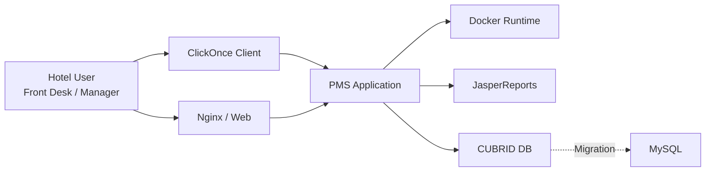
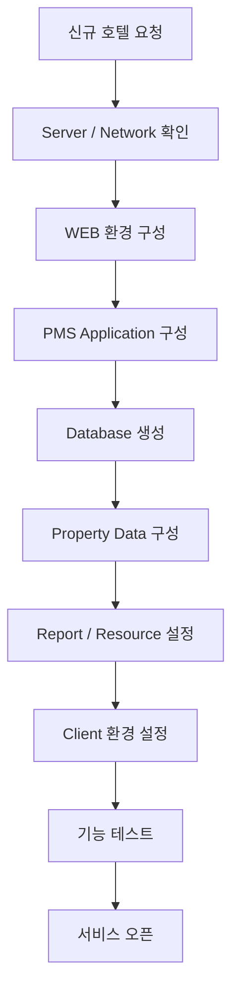
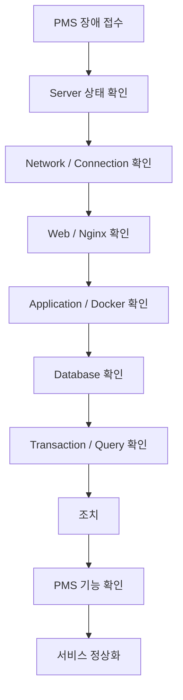
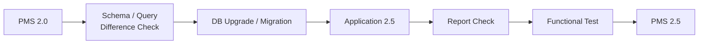

# 코디더매니저

> **Hotel PMS System Operations & Development**  
> 2019.04 — 2020.04

호텔 PMS(Property Management System)를 개발·운영하는 코디더매니저에서 **상용 PMS 시스템의 구축·운영·배포·데이터베이스 관리 및 장애 대응 업무**를 수행했습니다.

다수 호텔에서 실제 사용되는 PMS를 대상으로 Application뿐 아니라 Linux Server, Web, Docker, Database, Report 및 호텔별 Property 설정까지 서비스 전반을 다루었습니다.

## 01. ROLE OVERVIEW

| AREA | RESPONSIBILITY |
| --- | --- |
| PMS Operations | 다수 호텔 PMS 서비스 운영 및 장애 대응 |
| Infrastructure | Linux Server / Web / Docker 환경 운영 |
| Database | CUBRID 운영, SQL, Backup, Volume 관리 |
| Deployment | PMS Application Update 및 Source 반영 |
| New Property | 신규 호텔 PMS 환경 구축 |
| Upgrade | PMS 1.5 → 2.0 / 2.0 → 2.5 Upgrade |
| Migration | CUBRID → MySQL 데이터 전환 지원 |
| Report | JasperReports 및 호텔별 Report 설정 |
| Support | 호텔 운영 담당자 대상 기술지원 |
| Documentation | 운영·구축·Upgrade 절차 문서화 및 인수인계 |

## 02. SERVICE ARCHITECTURE



장애 발생 시 Client → Web → Application → Server → Database 계층을 확인하며 문제 범위를 좁혀갔습니다.

## 03. NEW HOTEL PMS DEPLOYMENT

| STEP | AREA | WORK |
| ---: | --- | --- |
| 01 | Server | 서버 및 서비스 환경 확인 |
| 02 | Web | 호텔별 Web 환경 구성 |
| 03 | Application | PMS Application 배포 |
| 04 | Docker | Application Runtime 구성 |
| 05 | Database | 신규 DB / Schema 구성 |
| 06 | Property | 호텔 운영 기준정보 구성 |
| 07 | Account | 사용자 / 권한 / 메뉴 설정 |
| 08 | Report | Jasper Report / Logo / Stamp 적용 |
| 09 | Client | ClickOnce 환경 설정 |
| 10 | Validation | PMS 주요 기능 정상동작 확인 |



## 04. DATABASE OPERATIONS

- CUBRID Database 운영 및 상태 점검
- Schema 및 운영 데이터 관리
- 신규 호텔 초기 데이터 구성
- SQL을 통한 데이터 확인 및 수정
- 장시간 Transaction / Query 확인
- CUBRID Database Backup 및 Data Volume 증설
- Version Upgrade에 따른 Schema / Query 변경 적용
- CUBRID → MySQL 데이터 전환 지원

### SAMPLE — 신규 호텔 Property 구성

> 아래 SQL은 당시 업무 형태를 설명하기 위해 재구성한 SAMPLE이며 실제 고객사 테이블명이나 데이터는 포함하지 않습니다.

```sql
INSERT INTO hotel_property (
    property_code,
    property_name,
    use_yn,
    created_at
)
VALUES (
    'HOTEL_SAMPLE',
    'Sample Hotel',
    'Y',
    CURRENT_TIMESTAMP
);
```

```sql
INSERT INTO room (
    property_code,
    room_no,
    room_type_code,
    floor
)
VALUES (
    'HOTEL_SAMPLE',
    '1001',
    'DLX',
    '10'
);
```

## 05. INCIDENT RESPONSE

| CHECK | AREA | EXAMPLE |
| ---: | --- | --- |
| 01 | Server | CPU / Memory / Disk |
| 02 | Network | Server Connection |
| 03 | Web | Nginx / Web Service |
| 04 | Application | PMS Process |
| 05 | Container | Docker 상태 |
| 06 | Database | CUBRID Connection |
| 07 | SQL | Transaction / Slow Query |
| 08 | Service | Login / Reservation / Folio |



## 06. APPLICATION OPERATIONS

- PMS 2.0 / 2.5 Source 변경사항 확인
- 운영환경 최신 Source 반영
- PMS Application Update
- Master / Slave 환경 업데이트
- 호텔별 PMS Update
- 업데이트 이후 PMS Login 및 주요 기능 확인
- SVN 기반 Source Version 확인 및 동기화

## 07. PMS VERSION UPGRADE

### PMS 1.5 → 2.0

Database Backup, Schema 확인, Upgrade SQL 적용, Application Update 및 기존 데이터 검증을 수행했습니다.

### PMS 2.0 → 2.5



Database 구조와 Query 차이를 확인하고 환경에 따라 CUBRID → MySQL 데이터 전환 작업도 지원했습니다.

## 08. HOTEL CHAIN & REPORT

- PMS Chain 정보 및 호텔별 공통 데이터 구성
- Menu / Menu Metadata / Category / Node 데이터 구성
- JasperReports 기반 호텔별 출력 Report 수정 및 적용
- Registration Card / Reservation / Folio 관련 Report 설정
- 호텔별 Logo / Stamp / Property 리소스 적용

## 09. HANDOVER & DOCUMENTATION

퇴사 전 담당 업무를 후임자가 수행할 수 있도록 실제 운영 절차를 문서화하여 인수인계를 진행했습니다.

| NO | HANDOVER AREA |
| ---: | --- |
| 01 | 서버 / 네트워크 구성 |
| 02 | 신규 호텔 PMS 구축 |
| 03 | 최신 Application Source 반영 |
| 04 | 호텔 Chain 구성 |
| 05 | CUBRID Backup |
| 06 | PMS 장애 대응 |
| 07 | CUBRID Data Volume 추가 |
| 08 | PMS 1.5 → 2.0 Upgrade |
| 09 | PMS 2.0 → 2.5 Upgrade |

## 10. TECHNICAL STACK

| CATEGORY | TECHNOLOGY |
| --- | --- |
| OS / Server | Linux |
| Web | Nginx |
| Runtime | Docker |
| Database | CUBRID / MySQL / SQL |
| Application | Java / PMS 1.5 / 2.0 / 2.5 |
| Report | JasperReports |
| Client | ClickOnce |
| SCM | SVN |
| Operations | Deployment / Backup / Migration / Incident Response |

## 11. EXPERIENCE SUMMARY

코디더매니저에서는 특정 개발 기능 하나를 담당하기보다 **실제 사용자가 존재하는 상용 시스템을 구축하고 운영하며 장애를 해결하는 경험**을 쌓았습니다. Application만 보는 것이 아니라 Server, Web, Container, Database, Deployment 영역을 함께 확인하는 현재 Platform Engineering 관점으로 이어진 초기 시스템 운영 경험입니다.

## NOTE

본 페이지의 SQL, Architecture Diagram 및 운영 시나리오는 당시 실제 수행 업무와 인수인계 자료를 기반으로 경력 이해를 돕기 위해 재구성한 예시입니다. 고객사명, 서버 주소, 계정, 실제 운영 데이터 및 보안정보는 포함하지 않습니다.

## RELATED PROJECTS

- **신규 호텔 PMS 서비스 구축** — WEB/DB/WAS/PMS/Property/Report 구성 및 서비스 오픈 Validation
- **호텔 PMS 운영 및 장애 대응** — Linux, Database, Application 계층 운영 및 Troubleshooting
- **PMS 버전 업그레이드 및 Database 전환** — PMS 1.5→2.0→2.5, SVN/Query/Report 확인 및 CUBRID/MySQL 환경 대응

