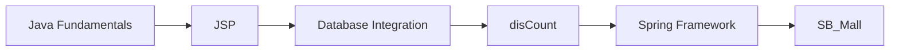

# disCount · JSP 기반 Web Project

## Overview
비트캠프 자바기반 앱&웹 구직자과정에서 Java/JSP와 Database를 연동하여 Server-side Web Application의 기본 구조를 학습하기 위해 수행한 프로젝트입니다.

## Learning Scope
- Java 기반 Server-side 개발
- JSP를 이용한 동적 화면 처리
- HTTP 기반 Web Application 구조 이해
- Database 연동과 데이터 처리
- HTML/CSS/JavaScript와 Server Logic 연결

## Repository
`SpringWebProject` Repository 내부의 `disCount` 프로젝트로 관리했습니다. 이 프로젝트 이후 Spring Framework 기반 `SB_Mall`로 학습 범위를 확장했습니다.
