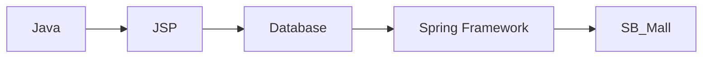

# SB_Mall · Spring 기반 Shopping Mall

## Overview
Java Web 개발 교육과정에서 JSP/Database 기반 Web Application 학습을 Spring Framework 구조로 확장하며 수행한 Shopping Mall 프로젝트입니다.

## Learning Context

## 주요 학습 영역
- Java 기반 Web Application
- Spring Framework 기반 Application 구조
- JSP View와 Server Logic 연계
- Database 연동
- Shopping Mall 도메인을 통한 기능 단위 구현

## Repository
`SpringWebProject` Repository 내부의 `SB_Mall` 프로젝트입니다. 비트캠프 교육에서 JSP 중심 Web 개발에서 Spring 기반 구조로 확장한 프로젝트로 정리합니다.
