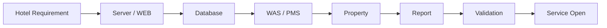

# 신규 호텔 PMS 서비스 구축

## Overview
신규 호텔이 PMS(Property Management System)를 사용할 수 있도록 WEB, Database, WAS, PMS Application과 호텔별 Property/Report 설정을 구성하고 서비스 오픈 전 기능을 검증했습니다.

## Deployment Scope
| Layer | 수행 범위 |
| --- | --- |
| Linux Server | 서비스 운영환경 확인 |
| WEB / WAS | Web 및 Application 실행환경 구성 |
| Database | DB 생성·설정 및 연결 확인 |
| PMS | 호텔별 Application 설정 |
| Property | 호텔 운영정보 및 환경 설정 |
| Report | JasperReports 관련 설정 및 확인 |
| Client | 사용자 실행환경 및 기능 확인 |

## Validation
Application 실행 여부만 확인하는 것이 아니라 DB 연결, PMS 기능, Report, 사용자 실행환경까지 확인했습니다. 이를 통해 서비스 구축은 여러 구성요소가 실제 업무 가능한 상태로 연결되는 과정이라는 점을 경험했습니다.
