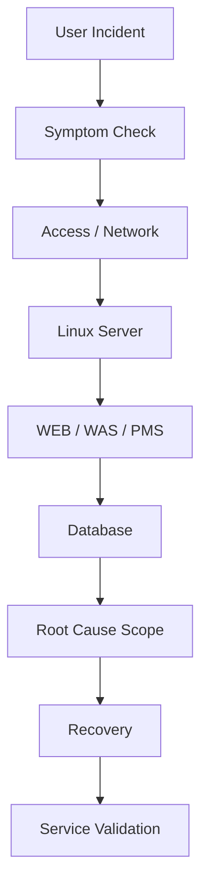

# 호텔 PMS 운영 및 장애 대응

## Overview
실제 호텔에서 사용되는 PMS의 Linux Server, Database, Application 상태를 운영하고 장애 및 사용자 문의에 대응했습니다. 특정 계층을 바로 원인으로 단정하기보다 증상을 기준으로 Client/접근, Server, Application, Database 순으로 범위를 좁혀 확인했습니다.

## Operations Scope
- Linux Server / Process 상태 확인
- Memory / Disk 및 서비스 상태 확인
- CUBRID / MySQL Database 상태 확인
- SQL 기반 데이터 및 장애 관련 정보 조회
- PMS Application 상태 확인 및 Service Restart
- 사용자 장애 문의 및 기술지원
- 복구 후 실제 서비스 정상 여부 확인

## Experience
Application만 보는 것이 아니라 **User → Network → Server → Application → Database**를 하나의 서비스 체인으로 추적하는 Troubleshooting 방식을 경험했습니다. 이후 Enterprise Cloud 장애 분석 방식의 기반이 된 경력입니다.
