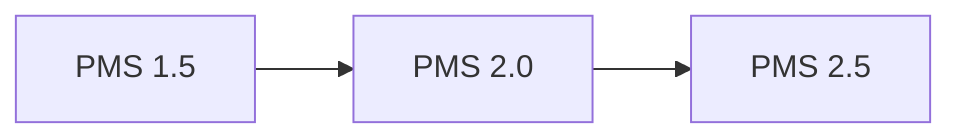
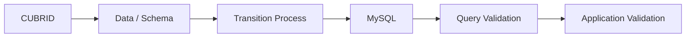

# PMS 버전 업그레이드 및 Database 전환

## Overview
PMS Version Upgrade와 Database 환경 변화 과정에서 Source, Query, Application, Report 및 사용자 실행환경을 함께 확인했습니다.

## PMS Upgrade Path

## 주요 확인사항
- SVN Source 동기화 및 Version 확인
- Application Update 및 설정 확인
- Database Query Test
- JasperReports 관련 확인
- Client 실행환경 확인
- 변경 후 기능 및 서비스 Validation

## CUBRID / MySQL
CUBRID 운영, Backup, Volume 확인 업무와 함께 MySQL 환경 및 Database 전환 관련 절차를 다뤘습니다. Database 변경 시 Query와 Application 연결 설정까지 함께 영향을 받을 수 있어 서비스 전체 관점에서 확인했습니다.

