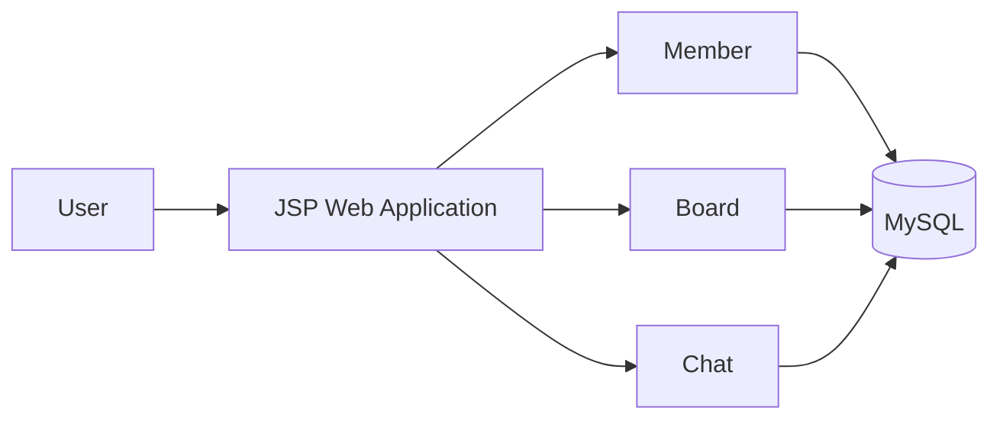

# WEB 기반 코로나 정보공유 서비스

## Overview
대한상공회의소 서울교육센터의 자바기반 빅데이터플랫폼 전문가과정에서 수행한 팀 프로젝트로, 코로나19 관련 정보를 공유할 수 있는 Web Service를 Java/JSP 기반으로 구현했습니다.

## Development Environment
| Category | Technology |
| --- | --- |
| OS | Ubuntu 18.04 |
| Language | Java |
| Server-side | JSP |
| Frontend | JavaScript / HTML / CSS |
| Database | MySQL |
| IDE | Eclipse |
| DB Tool | MySQL Workbench |

## 담당 영역
당시 포트폴리오에 기록된 범위를 기준으로 **프로젝트 설계, Database 설계, 채팅 기능, 게시판, 회원관리** 영역에 참여했습니다.

## Result
교육과정 내 프로젝트 평가에서 **우수상**을 수상했습니다. Java/JSP 기반 Web Application을 팀 단위로 설계하고 Database와 여러 사용자 기능을 하나의 서비스로 통합해본 프로젝트입니다.

## Repository
GitHub: `min-ser/KCCIST_2TH_JSP`
