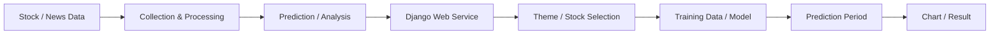

# 세·나·주 · 딥러닝 기반 주가 예측 서비스

## Overview
대한상공회의소 서울교육센터 과정의 Final Project로 수행한 주가 예측 Web Service입니다. 주식 데이터를 수집·가공하고 Deep Learning 예측 결과를 Django Web Service에서 사용자가 조건을 선택해 조회할 수 있도록 구성했습니다.

## Team Technology
Python 3.8.5, Django 3.1.5를 중심으로 TensorFlow, Keras, pandas, scikit-learn, BeautifulSoup, Mecab, FinanceDataReader 등을 사용했습니다. 팀 프로젝트 전체 모델 범위에는 RNN, LSTM, GRU, Bi-LSTM/DNN 등이 포함되었습니다.

> 모델 설계·구현은 팀 프로젝트 전체 기술 범위이며 김민서 개인 담당으로 표현하지 않습니다.

## My Responsibilities
발표자료에 기록된 개인 담당 영역은 **웹 서비스 설계 및 구현 / 데이터 동기화 구현**입니다.

- Django 기반 Web Service 구조 설계 및 구현
- 분석/예측 결과를 사용자에게 제공하는 Web Interface 구성
- 서비스에서 사용하는 데이터 동기화 기능 구현
- 분석 결과와 Web Application 연결

## Service Flow

## Result
Final Project 평가에서 **대상**을 수상했습니다. Java Web 중심의 이전 경험에서 Python/Django, Data Processing, AI 결과를 Web Service에 연결하는 방향으로 기술 범위를 확장한 프로젝트입니다.

## Repository
GitHub: `min-ser/KCCIST_FINALPROJECT`
