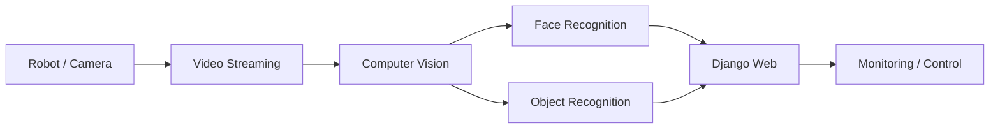

# Autonomous Surveillance Robot

## Final Project
한국품질재단 프로젝트기반 인공지능 개발자 양성과정에서 수행한 Final Project입니다. AI/Computer Vision 기술과 Camera 영상, Web Interface 및 Robot 기능을 연결하는 팀 프로젝트 형태로 진행했습니다.

## 주요 기능
당시 포트폴리오에서 확인되는 범위를 기준으로 다음 기능을 구현 범위로 정리합니다.

- 실시간 영상 Streaming
- Face Recognition
- Object Recognition
- Robot 관련 제어 기능
- Django 기반 Web Interface

## System Concept

## Technical Scope
| Area | 내용 |
| --- | --- |
| AI | Recognition 기능 |
| Computer Vision | 영상 기반 분석 |
| Streaming | 실시간 영상 처리/전달 |
| Web | Django 기반 Interface |
| Robot | 감시 기능 및 제어 연계 |

## Experience
Web Application에 AI 결과를 단순 표시하는 수준에서 더 나아가 Camera/영상, Computer Vision, Web 및 실제 Device/Robot이 연결되는 시스템을 경험한 Final Project입니다.

## Repository
GitHub: `min-ser/autonomous-surveillance-robot`
