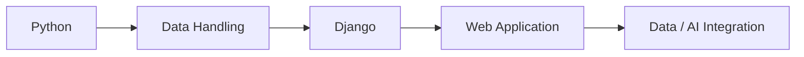

# Django 기반 Web Project

## Overview
한국품질재단 프로젝트기반 인공지능 개발자 양성과정에서 Python/Django를 이용해 수행한 Web Application 프로젝트입니다. Python 기반 데이터/AI 학습 결과를 서비스 형태로 연결하기 위한 Web 개발 역량을 확장하는 과정에서 수행했습니다.

## Learning Flow

## Scope
- Python 기반 Application 개발
- Django Web Application 구조
- URL / View / Template 기반 Web 처리 흐름
- Database와 Web Application 연계
- 이후 AI/Computer Vision Final Project를 위한 Web 기반 확장

## Repository
GitHub: `min-ser/KFQ_AI_2TH_DJANGO`

세부 기능은 Repository 원본에서 확인되지 않은 내용을 임의로 과장하지 않고, 교육 당시 확인된 Python/Django Web Project 범위로 기록합니다.
