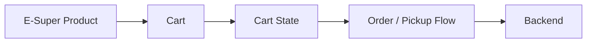

# 현대백화점 식품관 투홈 E-슈퍼 개발

## Project Overview

| 항목 | 내용 |
| --- | --- |
| 수행기간 | 2022.03 ~ 2022.05 |
| 소속 | 지호아이앤씨 |
| 대상 서비스 | 현대백화점 식품관 투홈 E-슈퍼 |
| 직책 | 선임 / 프로 |
| 역할 | Front End / Back End 개발 |

현대백화점 식품관 투홈의 E-슈퍼 관련 기능 개발을 수행했다. 정기구독 프로젝트 이후 이어진 Commerce Web 개발 업무로, 상품을 탐색한 사용자가 장바구니와 픽업/주문 흐름으로 연결되는 기능을 Front End와 Back End 양쪽에서 구현했다.

> 개인 작업자료에는 기간이 다르게 기록된 사본도 있으나, 경력 타임라인은 본인이 확인한 **2022.03 ~ 2022.05**를 기준으로 관리한다.

## 01. Confirmed Development Scope

개인 작업자료에서 명확히 확인되는 Front End 개발 범위는 다음과 같다.

- **MD E-슈퍼 장바구니**
- **MD 픽업리스트**
- Back End 개발

확인되지 않은 세부 구현을 임의로 개인 담당으로 확장하지 않고 위 범위를 기준으로 경력을 기술한다.

## 02. MD E-Super Cart

E-슈퍼 상품을 구매 흐름으로 연결하는 장바구니 영역의 Front End 기능을 개발했다.

Commerce 장바구니는 상품 선택 상태, 수량, 배송/수령 방식, 주문 가능 여부 등 여러 상태가 다음 주문 단계와 연결되는 영역이므로 화면 상태와 Server-side 데이터의 일관성이 중요하다.

## 03. MD Pickup List

MD 픽업리스트 Front End 기능을 개발했다.

픽업 대상 정보가 사용자 또는 운영 흐름에서 식별될 수 있도록 List 형태로 제공하는 기능 영역을 담당했다. 구체적인 내부 처리 규칙은 현재 확보된 개인 자료에서 확인되지 않으므로 실제 확인 가능한 범위를 넘어서는 설명은 추가하지 않는다.

## 04. Back End Development

개인 작업자료에는 E-슈퍼 프로젝트에서 Back End 개발을 수행한 사실이 명시되어 있다.

Front 화면과 연결되는 Server-side 기능을 개발했으며, 이전 정기구독 프로젝트에서 경험한 Java/Spring 기반 Web Application 개발 경험을 E-슈퍼 서비스로 이어갔다.

## 05. Commerce Context

당시 현대식품관 투홈 서비스는 새벽배송, 브랜드직송, E-슈퍼 등 여러 상품/배송 유형을 Web 서비스에서 제공하고 있었다. 제공된 기획자료에는 장바구니, 주문서, 결제, 마이페이지, 검색 UI 등 Commerce 전반의 고도화 흐름이 포함되어 있다.

다만 해당 전체 기획범위를 모두 개인 담당으로 주장하지 않고, 개인 작업자료로 확인되는 **E-슈퍼 장바구니 / MD 픽업리스트 / Back End 개발**을 본 프로젝트의 핵심 수행범위로 기록한다.

## 06. Experience Summary

정기구독 고도화에서 반복 주문과 회차 기반 Commerce 기능을 경험한 뒤, E-슈퍼에서는 장바구니와 픽업 관련 기능을 개발하며 일반 상품 구매 흐름에 대한 실무 경험을 확장했다.
