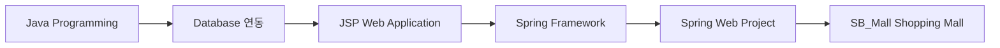
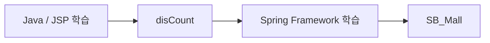

# 비트캠프 · 자바기반 앱&웹 구직자과정

**교육기간:** 2018.06 ~ 2018.12  
**교육기관:** 비트캠프  
**교육과정:** 자바기반 앱&웹 구직자과정

Java 기반 애플리케이션과 웹 서비스 개발에 필요한 기본 구조를 학습하고, JSP 기반 Web Project에서 Spring Framework 기반 프로젝트까지 단계적으로 구현한 개발자 교육과정입니다.

## 01. 교육 개요

소프트웨어 애플리케이션과 솔루션 개발을 목표로 프로그램의 설계와 구현 과정을 학습했습니다. Java 언어를 중심으로 Web Application의 동작 구조와 Database 연동을 익히고, JSP 및 Spring 기반 프로젝트를 통해 Server-side Web Application을 구현했습니다.

| 구분 | 내용 |
| --- | --- |
| 개발 언어 | Java |
| Web | JSP / Server-side Web Application |
| Framework | Spring Framework |
| Data | Database 연동 및 데이터 처리 |
| 실습 방식 | 기능 구현 및 Web Project |
| Repository | `SpringWebProject` |

## 02. 학습 흐름

단순 문법 학습에 머무르지 않고 Java Application → JSP Web → Spring Framework로 개발 범위를 확장하는 형태로 학습했습니다.

## 03. 주요 학습 내용

### Java / Application

- Java 기반 애플리케이션 개발 구조 학습
- 객체와 기능을 분리하여 프로그램을 구성하는 기본 개발 방식 습득
- Web Application 구현에 필요한 Java Server-side 개발 기반 확보

### Web / JSP

- JSP를 이용한 동적 Web Page 구현
- 사용자 요청과 Server-side 처리 흐름 학습
- 화면과 Database를 연결하는 Web Application 구현

### Spring Framework

- Spring 기반 Web Application 구조 학습
- JSP 방식에서 Framework 기반 애플리케이션 구조로 확장
- 쇼핑몰 형태의 프로젝트를 통해 여러 기능을 하나의 Web Service로 구성

### Database

- Java 및 Web Application과 Database 연동
- 서비스 데이터의 저장·조회 흐름 학습
- Web 기능과 Data Layer를 연결하는 기본 구조 실습

## 04. 교육 프로젝트

| TYPE | PROJECT | DESCRIPTION | SOURCE |
| --- | --- | --- | --- |
| JSP Project | `disCount` | JSP 기반 Web Project | SpringWebProject 내부 |
| Spring Project | `SB_Mall` | Spring 기반 Shopping Mall | SpringWebProject 내부 |

### disCount · JSP Web Project

JSP를 기반으로 Web Application의 화면과 Server-side 로직을 연결하는 프로젝트입니다. Java/JSP 기반 웹 개발 흐름을 실제 프로젝트 구조로 적용한 단계입니다.

### SB_Mall · Spring 기반 쇼핑몰

Spring Framework 기반으로 구성한 쇼핑몰 프로젝트입니다. JSP 단계에서 학습한 Web 개발 경험을 Framework 기반 구조로 확장한 프로젝트입니다.

## 05. GitHub 학습 기록

- Repository: https://github.com/min-ser/SpringWebProject
- `disCount`와 `SB_Mall`은 하나의 Repository 내부에 있는 교육 프로젝트입니다.
- Repository 단위와 Project 단위를 분리하여 Career Site에서는 각각의 프로젝트 이력으로 연결합니다.

## 06. Career 연결

이 과정은 이후 PMS 시스템 운영 및 개발 업무를 수행하기 전 Java/Web/Application 개발 기반을 정리한 교육 이력입니다. Career Timeline의 **경력 + 교육이수** 보기에서 2018년 기술 학습 구간으로 함께 표시합니다.

> 이 문서는 당시 교육과정 설명과 보존된 GitHub Repository를 기준으로 정리했으며, 확인되지 않은 세부 구현 기술은 임의로 추가하지 않습니다.
