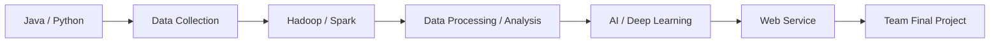
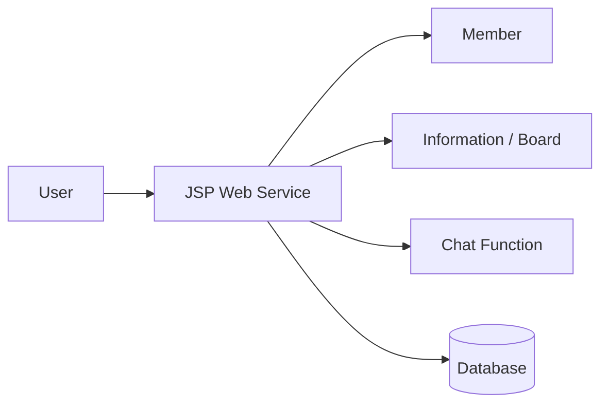
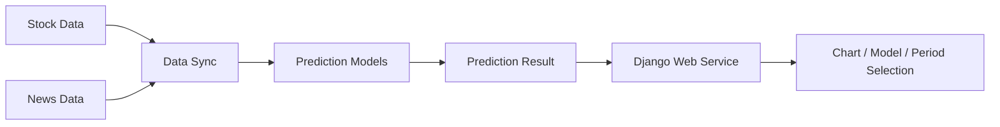
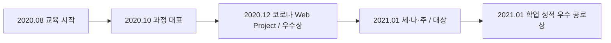

# 대한상공회의소 서울교육센터 · 자바기반 빅데이터플랫폼 전문가과정

**교육기간:** 2020.08 ~ 2021.01  
**교육기관:** 대한상공회의소 서울교육센터  
**교육과정:** 자바기반 빅데이터플랫폼 전문가과정

빅데이터와 AI 융합 기술을 중심으로 Java, Python, Hadoop/Spark, 데이터 수집·가공·분석 및 AI Programming을 학습하고 Web Project와 딥러닝 Final Project를 수행한 전문교육 과정입니다.

## 01. 교육 개요

4차 산업혁명 핵심 분야인 빅데이터와 AI 융합 기술을 중심으로 Cloud, IoT 등 연관 기술의 흐름을 함께 이해하고, Big Data 분석·활용과 AI Programming에 필요한 개발 기반을 학습했습니다.

Java와 Python을 사용하고 Hadoop/Spark 및 주요 Library를 활용하여 데이터 수집·가공·분석과 AI Algorithm 구현을 학습했으며, 과정 중 팀 프로젝트를 통해 서비스 기획과 협업 경험을 쌓았습니다.

| 영역 | 학습 내용 |
| --- | --- |
| Programming | Java / Python |
| Big Data | Hadoop / Spark |
| Data | 데이터 수집 / 가공 / 분석 |
| AI | AI Programming / Deep Learning Project |
| Web | JSP / Django 기반 Web Service |
| Project | 코로나 정보공유 Web Project / 딥러닝 기반 주가 예측 Final Project |

## 02. Learning Journey

## 03. GitHub 학습 기록

| ROLE | REPOSITORY | DESCRIPTION |
| --- | --- | --- |
| Learning | `www.kccistc.net` | 교육 수업내용 및 실습 기록 |
| Web Project | `KCCIST_2TH_JSP` | WEB 기반 코로나 정보공유 서비스 |
| Final Project | `KCCIST_FINALPROJECT` | 딥러닝 기반 주가 예측 서비스 `세·나·주` |

- 수업 내용 정리: https://github.com/min-ser/www.kccistc.net
- 코로나 Web Project: https://github.com/min-ser/KCCIST_2TH_JSP
- Final Project: https://github.com/min-ser/KCCIST_FINALPROJECT

## 04. Web Project · 코로나 정보공유 서비스

JSP 기반으로 코로나 관련 정보를 공유하는 Web Service를 구현한 팀 프로젝트입니다. 기존 포트폴리오에서는 **WEB 기반 코로나 정보공유 챗봇 서비스**로 정리되어 있으며, 프로젝트 설계·Database 설계와 Web 기능 구현 경험이 포함되어 있습니다.

이 프로젝트는 교육기간 중 수행되었으며 **JSP 웹 제작 프로젝트 우수상**과 연결됩니다.

## 05. Final Project · 세·나·주

딥러닝 기반 주가 예측 서비스 프로젝트로, 주가 데이터와 뉴스 데이터를 활용하고 여러 예측 모델의 결과를 Web Service에서 확인할 수 있도록 구성했습니다.

### 담당 역할

- **웹 서비스 설계 및 구현**
- **데이터 동기화 구현**

프로젝트 전체에서는 RNN, LSTM, GRU, Bi-LSTM/DNN 등 예측 모델을 다루었으며, 개인 담당 역할과 팀 전체 모델 개발 범위는 구분하여 기록합니다.

### 개발 환경 / 활용 기술

- Python 3.8.5
- Django 3.1.5
- TensorFlow / Keras
- pandas / scikit-learn
- BeautifulSoup / Mecab
- FinanceDataReader

사용자가 학습 데이터, 예측 모델, 예측 기간을 선택하고 결과를 Chart 형태로 확인할 수 있는 Web Service 형태로 구현했습니다.

## 06. Awards & Recognition Timeline

교육기간과 프로젝트 및 수상 시기를 하나의 Timeline으로 연결합니다.

| DATE | TYPE | DESCRIPTION | RELATED PROJECT |
| --- | --- | --- | --- |
| 2020.10 | 임명장 | 2020년 하반기 과정 대표 | 교육과정 |
| 2020.12 | 우수상 | JSP 웹 제작 프로젝트 우수상 | 코로나 정보공유 Web Project |
| 2021.01 | 대상 | 딥러닝 프로젝트 대상 | 세·나·주 |
| 2021.01 | 공로상 | 학업 성적 우수 | 교육과정 |

## 07. 교육을 통해 확보한 경험

- Java 중심 Web 개발 경험을 Python/Data/AI 영역으로 확장
- Hadoop/Spark를 포함한 Big Data 기술 학습
- 데이터 수집·가공·분석에서 Web Service까지 연결되는 흐름 경험
- 팀 프로젝트 기획·수행 및 협업 경험
- AI 결과를 실제 사용자가 확인할 수 있는 Web Application 형태로 연결

## 08. Career 연결

이 과정은 Java/Web 중심의 기존 경험에서 **Data / AI / Python** 영역으로 기술 범위를 확장한 시기입니다. 이후 AI·Cloud Platform 관련 업무로 이어지는 기술 전환 구간으로 Career Timeline의 **경력 + 교육이수** 보기에서 함께 표시합니다.

> 프로젝트 역할과 수상 정보는 보존된 포트폴리오/발표자료 및 GitHub 기록을 기준으로 작성하며, 팀 전체 구현 범위를 개인 담당 역할로 확대하여 표현하지 않습니다.
