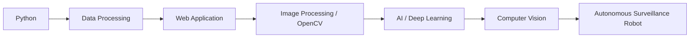
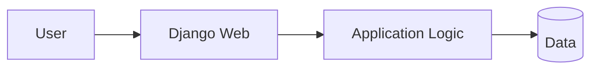
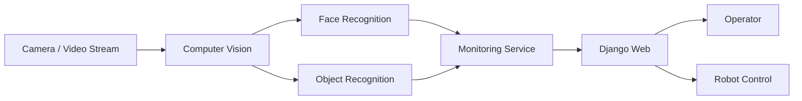
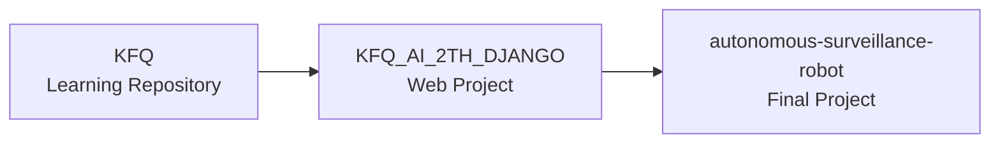

# 한국품질재단 · 프로젝트기반 인공지능 개발자 양성과정

**교육기간:** 2021.04 ~ 2021.10  
**교육기관:** 한국품질재단  
**교육과정:** 프로젝트기반 인공지능 개발자 양성과정

빅데이터 활용 및 분석과 인공지능 개발에 필요한 기술을 프로젝트 중심으로 학습하고, Python 기반 데이터 처리·Web Application·Computer Vision 및 AI Project까지 단계적으로 수행한 전문교육 과정입니다.

## 01. 교육 개요

교육이수 기록에 명시된 **빅데이터 활용 및 분석 등을 수행할 수 있는 전문기술을 보유한 인재로 성장**하는 것을 목표로 한 과정으로, Python 기반 학습과 프로젝트를 통해 Data와 AI 기술을 실제 서비스 형태로 구현하는 경험을 쌓았습니다.

| 영역 | 학습 / 프로젝트 범위 |
| --- | --- |
| Programming | Python |
| Data | 데이터 처리 / 분석 |
| Web | Flask / Django 기반 Web Application |
| Computer Vision | OpenCV 기반 영상처리 |
| AI | Deep Learning / Recognition / Detection 관련 프로젝트 |
| Final Project | Autonomous Surveillance Robot |

## 02. Learning Journey

## 03. GitHub 학습 기록

| ROLE | REPOSITORY | DESCRIPTION |
| --- | --- | --- |
| Learning | `KFQ` | 수업 내용 및 실습 기록 |
| Web Project | `KFQ_AI_2TH_DJANGO` | Django 기반 Web Project |
| Final Project | `autonomous-surveillance-robot` | AI 기반 자율 감시 로봇 Final Project |

- 수업 내용 정리: https://github.com/min-ser/KFQ
- Web Project: https://github.com/min-ser/KFQ_AI_2TH_DJANGO
- Final Project: https://github.com/min-ser/autonomous-surveillance-robot

## 04. 주요 실습 영역

보존된 포트폴리오에는 이 교육 시기의 Python 기반 프로젝트들이 다음과 같이 정리되어 있습니다.

### Python 영상처리

- Python / OpenCV / numpy 기반 영상처리 실습
- Image Processing 기능을 구현하며 Computer Vision 기초 학습

### Python 데이터 처리

- Python과 Database를 연결한 데이터 처리 프로그램 구현
- 데이터 저장·조회와 Application 처리 흐름 학습

### Python / Flask 기반 맛집추천 Web

- Python과 Flask 기반 Web Service 구현
- Database와 Web Application을 연결하는 프로젝트 수행

### 차선 인식

- Python / OpenCV 기반 영상에서 차선을 탐지하는 프로그램 구현
- ROI와 Line Detection 등 Computer Vision 처리 흐름 경험

이러한 실습을 거쳐 Django Web Project와 Final AI Project로 학습 범위를 확장했습니다.

## 05. Django Web Project

`KFQ_AI_2TH_DJANGO` Repository에 교육 중 수행한 Django 기반 Web Project를 보존하고 있습니다.

AI/Data 실습 결과를 Web Application과 연결하는 중간 단계의 프로젝트로 Career Site에서는 별도의 Project Markdown과 연결합니다.

## 06. Final Project · Autonomous Surveillance Robot

교육과정의 Final Project로 **Autonomous Surveillance Robot**을 수행했습니다. 기존 포트폴리오에는 실시간 영상 스트리밍, 얼굴 인식, 객체 인식 및 Robot 제어와 Web Service 요소를 결합한 프로젝트로 정리되어 있습니다.

### 프로젝트 기술 범위

- Python 기반 AI Application
- Computer Vision / 영상처리
- 얼굴 및 객체 인식
- 실시간 영상 기반 Monitoring
- Django 기반 Web Service 연계
- Robot Control과 서비스 기능의 통합

## 07. Repository → Project 관계

단순 교육 수료 기록이 아니라 학습 Repository → Web Project → Final Project로 발전한 과정을 GitHub 기록과 함께 보존합니다.

## 08. 교육을 통해 확보한 경험

- Python 기반 Data Processing 및 Web 개발 경험
- OpenCV 기반 영상처리와 Computer Vision 학습
- AI/Deep Learning 기술을 프로젝트 형태로 적용
- Django를 활용해 AI/Data 기능을 Web Service와 연결
- 여러 기술 요소를 하나의 Final Project로 통합하는 경험

## 09. Career 연결

대한상공회의소 과정에서 확장한 Data/AI 학습을 실제 AI Project 중심으로 심화한 시기입니다. Career Timeline의 **경력 + 교육이수** 보기에서 2021년 전문교육 이력으로 표시하며, 이후 Enterprise Cloud/AI Platform 업무로 이어지는 학습 구간으로 정리합니다.

> 세부 내용은 교육이수 기록, 당시 포트폴리오 및 보존된 GitHub Repository에서 확인 가능한 범위를 중심으로 작성했습니다.
