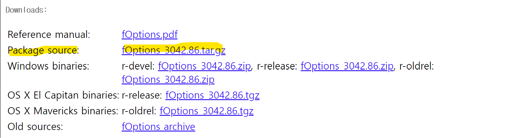

fOptions 패키지 설치방법	관리자	2024.05.21 19:59
과목명	확률의이해
안녕하세요, 학우님

fOptions 패키지 설치방법 안내 드립니다.

R에는 매우 다양한 패키지가 있지만 유지되지 않은 경우도 많습니다.

이 경우 패키지의 소스 파일을 이용하여 인스톨해서 이용할 수 있습니다.

1. 소스파일을 인스톨하려면 Rtools를 설치해야 합니다.

Rtools 다운로드 링크 에 접속해서 다운로드 받아서 설치합니다(파일이 커서 시간이 좀 걸립니다).

2. 패키지 소스파일(fOptions_3042.86.tar.gz)을 아래 링크에서 다운로드 받으신 후

패키지 소스파일 다운로드 페이지

2. 아래의 코드를 R에서 동작합니다.

install.packages("다운로드 된 패키지 경로/fOptions_3042.86.tar.gz", repos = NULL, type = "source")

3. library(fOptions)을 수행하여 패키지를 사용하실 수 있습니다.

아래 출처를 참고하고 일부 보완하여 작성하였습니다.

이상입니다.

감사합니다.

[출처] [확률의 개념과 응용] prob 패키지 이용 (통계와 데이터과학) | 작성자 DSRG