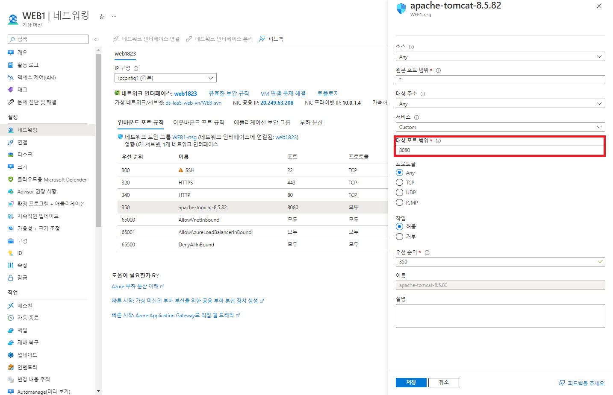

1. 리눅스 환경 구성
    - Azure VM 생성
    - 인바운드 보안 규칙 추가
    
        - 아파치에서 설정한 내부 포트 지정(8080)

---

2. 우분투 자바 설치
```
sudo apt-get update
sudo apt-get upgrade
sudo apt-get install openjdk-8-jre
```

---

3. 리눅스 서버에 아파치 톰켓파일 FTP 전송
    - 압축풀기 :` tar -xvf [파일명]`

---

4. bin 파일에 서버 start.sh 경로로 이동 후 서버 실행
```
~/apache-tomcat-8.5.82/bin$ sh start.sh
```

---

5. VM Public IP를 통해 서버 접근
