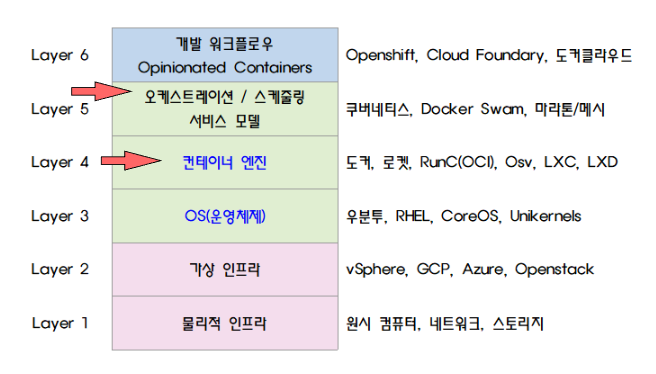

<iframe width="560" height="315" 
src="https://www.youtube.com/embed/Sj9Z6-w1VUE?list=PLApuRlvrZKohaBHvXAOhUD-RxD0uQ3z0c" 
title="[따배쿠] 1. Kubernetes (쿠버네티스)소개" 
frameborder="0" allow="accelerometer; autoplay; clipboard-write; encrypted-media; gyroscope; picture-in-picture; web-share" allowfullscreen></iframe>

---

# 가상머신 VS 컨테이너

> 출처: https://hwanine.github.io/web/Container-vs-VM/

- 가상머신
    - 서비스를 올리기위해 개별적으로 각각 OS설치가 필요하다
    - OS설치를 위한 공간낭비가 있다.
- 컨테이너
    - 필요한 App만 Container에 올리면된다.
    - 공간낭비가 없어 효율적이며 가볍다.
    - 확장과 축소가 빠르다.
    - 컨테이너의 주 목적 : deploy(배포)

# 멀티호스트 도커 플랫폼

    멀티호스트 도커 플랫폼은 도커 컨테이너를 여러 호스트에 걸쳐 관리하고 실행하는 데 사용되는 솔루션입니다. 이를 통해 여러 호스트에서 컨테이너를 쉽게 배포하고 관리할 수 있습니다.

    멀티호스트 도커 플랫폼을 구성하려면 다음과 같은 요소가 필요합니다:

1. 도커 엔진: 멀티호스트 도커 플랫폼을 사용하려면 모든 호스트에 도커 엔진이 설치되어 있어야 합니다. 도커 엔진은 컨테이너를 실행하고 관리하는 데 사용됩니다.

2. 도커 스웜 또는 쿠버네티스: 멀티호스트 도커 플랫폼을 구성할 때 컨테이너 오케스트레이션 툴이 필요합니다. 도커 스웜 또는 쿠버네티스를 사용하여 여러 호스트 간에 컨테이너를 배포하고 관리할 수 있습니다.

3. 네트워크 및 스토리지 설정: 멀티호스트 도커 플랫폼을 구성할 때 호스트 간에 통신할 수 있는 네트워크 설정이 필요합니다. 또한 컨테이너의 데이터를 저장할 스토리지도 구성해야 합니다.

4. 보안 및 인증: 멀티호스트 환경에서는 보안 및 인증이 중요합니다. 각 호스트 및 컨테이너에 대한 액세스 제어 및 보안 정책을 설정해야 합니다.
멀티호스트 도커 플랫폼을 구성하려면 이러한 요소를 고려하여 설계하고 구현해야 합니다. 이를 통해 컨테이너 기반 애플리케이션을 효율적으로 관리하고 확장할 수 있습니다.

# 컨테이너 오케스트레이션

    컨테이너 오케스트레이션은 여러 컨테이너를 자동으로 관리하고 조율하는 프로세스입니다. 이는 대규모 컨테이너화된 응용 프로그램을 효과적으로 실행하고 관리하는 데 중요합니다. 주요 기능은 다음과 같습니다:

1. 자동 배포: 컨테이너 오케스트레이션은 응용 프로그램을 여러 호스트에 배포하는 데 사용됩니다. 새로운 컨테이너를 배포할 때 자동으로 적절한 호스트에 배치하여 리소스를 최적화합니다.

2. 자동 확장: 트래픽이 증가하거나 부하가 증가할 때 컨테이너 오케스트레이션은 자동으로 추가 인스턴스를 생성하여 응용 프로그램을 확장합니다. 이렇게 함으로써 응용 프로그램의 가용성을 높이고 성능을 향상시킵니다.

3. 자동 복구: 컨테이너 오케스트레이션은 컨테이너 또는 호스트가 실패할 경우 자동으로 복구할 수 있습니다. 이를 통해 응용 프로그램의 가용성을 유지할 수 있습니다.

4. 서비스 디스커버리 및 로드 밸런싱: 컨테이너 오케스트레이션은 서비스 디스커버리 및 로드 밸런싱을 자동으로 처리합니다. 새로운 컨테이너가 추가되거나 실패할 때 자동으로 업데이트되고 트래픽이 분산됩니다.

5. 리소스 관리: 컨테이너 오케스트레이션은 호스트 리소스를 효율적으로 관리합니다. 각 컨테이너에 필요한 리소스를 동적으로 할당하고 관리하여 리소스를 최적화합니다.
대표적인 컨테이너 오케스트레이션 툴로는 Kubernetes, Docker Swarm, Apache Mesos 등이 있습니다. 이러한 툴은 대규모 컨테이너 환경에서 응용 프로그램을 효과적으로 관리하고 운영하기 위해 사용됩니다.

# 컨테이너 계층구조

> 출처: [url](https://velog.io/@jungmyeong96/Docker-%EC%BB%A8%ED%85%8C%EC%9D%B4%EB%84%88-%EC%98%A4%EC%BC%80%EC%8A%A4%ED%8A%B8%EB%A0%88%EC%9D%B4%EC%85%98)

# [Kubernetes.io]((https://kubernetes.io/))
- 쿠버네티스 공식 웹페이지

    그리스어 : 조타수

# [CNCF](https://cncf.io/)

# Kubernetes 특징
- 워크로드 분리
- 어디서나 실행 가능 - 온프레미스, 퍼블릭 클라우드(AKS, EKS, GKE등)
- 선언적 API

# 선언적 API

    쿠버네티스에게 명령어를 통해 요청
    예)노드 생성 및 실행 명령어 동작

---
---

## 컨테이너 이미지 생성 예시
#### 컨테이너 이미지 생성
    - webserver 컨테이너 생성

#### 1. Local 환경에서 docker파일로 컨테이너 빌드 

    docker build -t smlinux/nodeinfo:v1
    docker images

#### 2. docker hub(public, private)로 업로드(push)

    docker push smlinux/nodeinfo:v1

#### 3. 업로드된 Docker 이미지를 사용할 환경에서 Docker 컨테이너 다운로드

    * 도커 이미지 pull
    docker pull smlinux/nodeinfo:v1

    * 도커 생성, 포트포워딩외부 80 > 내부8080
    docker create --name app -p 80:8080 smlinux/nodeinfo:v1
    
    * Docker 실행
    docker start app

---

## 가상머신 VS 컨테이너 구조 비교

Virtual Machine                         | Container
--------------------------------------- | ---------
App A, App B, App C                     | App A, App B, App C, App D, App E, App F
Guest Operation System                  | Docker
Hypervisor : ex) VMWARE, Virtual box    | Host Operation System [Linux, Windows]
Infrastructure (H/W)                    | Infrastructure (H/W)

---

## 차이점
### - 가상머신

    Application이 돌아가기 위한 Guest Operation System이 필요
    App 크기가 100M라고 할 경우
    App A의 크기는 100M + OS의 크기가 필요

### - 컨테이너 : 주 목적 - 배포

    App 크기가 100M라고 할 경우
    100M의 컨테이너를 웹 기반으로 작동시킴, 가상머신보다 가볍고 빠름

---

## 컨테이너 오케스트레이션
    Application들을 전체적으로 웹 서비스에 가장 적합하게 배치해서 운영 해 주는 것
    
    지위자(Control plan)가 Application Container 적절한곳에 배치
    
    EX)1. 하기와 같은 구성에서 Worker node1이 서비스 다운될 경우
    Worker node1 - WEB1, nodeJS
    Worker node2 - WEB1, WEB2
    
    EX)2. 아래와 같이 다른쪽 노드로 옮겨서 컨테이너 서비스를 유지시켜준다.
    Worker node1 - WEB1, nodeJS
    Worker node2 - WEB1, WEB2, nodeJS

    * 이처럼 컨테이너를 옮기기도 하고 필요하면 확장 및 축소
    * Control Plan을 두고 Work Node를 관리해주는 이러한 구조를
    * 컨테이너 오케스트레이션 이라 함

---

## 컨테이너 계층구조

계층 | 종류 | 설명
---- | ---- | ----
Layer6 | Development Workflow Opinionated Containers | OpenShift, Cloud Foundary, Docker Cloud, Deis, Flynn ...
Layer5 | Orchestration/Scheduling Service Model | `Kubernetes`, Docker Swarm, Marathon/Mesos, Nomad, Diego ..
Layer4 | Container Engine | Docker, Rocket, RunC(OCI), Osv, LXC, LXD
Layer3 | Operating System | Ubuntu, RHEL, CoreOS, Unikernels
Layer2 | Virtual Infrastructure | vSphere, EC2, GCP, Azure, OpenStack
Layer1 | Physical Infrastructure | Raw Computer, Network, Storage

---

## K8S 특징
    - 워크로드 분리
    - 어디서나 실행가능 - 온프레미스, 퍼블릭클라우드(AKS, EKS, GKS등)
    - `선언적 API`

---

## 선언적 API
    DevOps
    NoOps