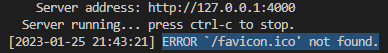

Gitblog를 고치다 보니 계속해서 신경쓰이는 에러가 있다.



크롬의 개발자 도구(F12)를 이용해 콘솔로그를 확인하면 바로 알 수 있다.


개발에 큰 영향을 끼치는것이 아니기에 무시해도 무방하지만...   
뭔가 거슬려서 처리하고자...

이와같은 포스팅을 한다.

과정은 간단하다.

1. 파이콘을 다운받는다.

2. 다운받은 파비콘을 head에 등록시킨다.

---

추천까지는 아니고 그냥 나도 돌아다니다가 발견했다.   
https://icons8.kr/   

들어가다 보면 다양한 이미지의 파비콘을 선택할 수 있다.   

취향것 고른다.   

파비콘을 다운받고.

아래 코드를 head에 추가해준다.
```
<link rel="icon" href="#">
```

무식하게 href="#" 이대로 두지말고

다운로드한 파비콘 경로로 path를 설정한다.

필자의 블로그 템플릿은 정적파일경로가 assets폴더에 있어   

해당폴더 내에 favicon을 생성하고 그 안에 다운받은 이미지를 넣어주었다.

그럼 대충 href="assets/favicon/다운받은파비콘.png"

이런식의 경로가 나온다.


등록이 성공하면 에러가 사라지고


태그에 등록한 이미지가 보여진다.

이러면 완성

응, 없어짐