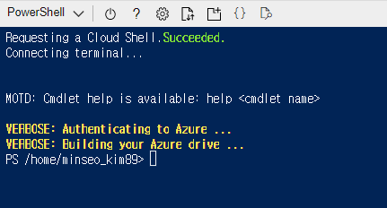

<iframe width="560" height="315" src="https://www.youtube.com/embed/QGF7igBYSEI?list=PLApuRlvrZKohaBHvXAOhUD-RxD0uQ3z0c" title="[따배쿠] 3-2. kubectl command / pod 생성하기" frameborder="0" allow="accelerometer; autoplay; clipboard-write; encrypted-media; gyroscope; picture-in-picture; web-share" allowfullscreen></iframe>

---
```
    안녕하세요, 이성미 강사입니다!
    어렵게만 느껴지는 쿠버네티스,
    따라하면서 배우면 어느새 지식이 되어 있을 겁니다!

    오늘은 3-1강에 이어 kubectl command를 알아보고, 직접 pod 생성까지 !
    영상의 길이가 조금 길지만 그래도 화이팅 해주시기 바랍니다 !!

    이 영상을 보기 전 이전 영상을 꼭 시청해 주세요:)
```
---

- 00:00 오늘 배울 내용 소개
- 00:55 kubectl command 살펴보기
- 09:28 여러 방법으로 nginx pod 생성하기 / 동작 확인하기

---

# *** K8S 명령어 실습전 AKS 환경 준비 ***

## VSCODE에서 Azure Potal 접속
1. VSCode에서 명령어 실행
```
Connect-AzAccount
```

2. 계정 선택 및 로그인 진행


* 아래와 같이 연동작업 

```
PS D:\GIT> Connect-AzAccount
경고: Unable to acquire token for tenant '4aed9820-113d-4f48-9f53-4d91f37ad279' with error 'SharedTokenCacheCredential authentication unavailable. Token acquisition 
failed for user minseo_kim89@megazone.com. Ensure that you have authenticated with a developer tool that supports Azure single sign on.'

Account                   SubscriptionName TenantId                             Environment
-------                   ---------------- --------                             -----------
minseo_kim89@megazone.com kms-limited      xxxxxxxx-xxxx-xxxx-xxxx-xxxxxxxxxxxx AzureCloud
```
3. [AzurePotal] Azure Potal에 접속
    
    1). 상단에 있는 Cloud Shell을 클릭하여 `스토리지 생성`
<br>
    2). 스토리지 만들기 클릭
<br>
    3). Cloud Shell 진입


4. VSCODE에서 Azure Cloud Shell 클릭


5. 상단에 구독 선택


6. VSCode에서 접속 성공한 모습


## VSCode 연동작업 완료

---

# kubectl 명령어 실습

## 1. Nginx컨테이너 생성 명령어
```
kubectl run webserver --image=nginx:1.14 --port 80
```
    - run : 컨테이너 POD를 만듦
    - webserver : pod 이름
    - webserver는 80포트에서 listen
    - -가 하나(-) : system field 계열, 축약어
    - -가 두개(--): 옵션을 풀어서 사용

### [명령어 실행 화면]
```
PS /home/minseo_kim89> kubectl run webserver --image=nginx:1.14 --port 80
pod/webserver created
```

## 2. pod 상태 보기
```
kubectl get pods
```

## 3. 생성한 webserver pod상태 보기
```
kubectl describe pod webserver
```

### [명령어 실행 화면]
```
Events:
  Type    Reason     Age   From               Message
  ----    ------     ----  ----               -------
  Normal  Scheduled  17m   default-scheduler  Successfully assigned default/webserver to aks-agentpool-33010371-vmss000000
  Normal  Pulling    17m   kubelet            Pulling image "nginx:1.14"
  Normal  Pulled     17m   kubelet            Successfully pulled image "nginx:1.14" in 5.857415651s
  Normal  Created    17m   kubelet            Created container webserver
  Normal  Started    17m   kubelet            Started container webserver
```

## 4. pod 상태 자세히 보기
```
kubectl get pods -o wide
```

### [명령어 실행 화면]
```
NAME        READY   STATUS    RESTARTS   AGE   IP            NODE                                NOMINATED NODE   READINESS GATES
webserver   1/1     Running   0          19m   10.244.0.15   aks-agentpool-33010371-vmss000000   <none>           <none>
```

## 5. webserver 접속
```
curl 10.244.0.15
```
- 4번에서 실행한 결과의 IP로 접근 = Nginx에 접근
- [Azure PowerShell로 실행시 접속X]   
    - Azure Potal 환경에서 Shell환경과 네트워크가 달라 표시 안됨
    - 접근한 HTML소스가 콘솔로 표기됨
    

## 6. 배포용 pod 생성
```
kubectl create deployment mainui --image=httpd --replicas=3
``` 
- image=httpd : image를 아파치웹서버로 생성
- latest : 생략하면 latest버전으로 생성됨
- --replicas=3 : httpd라는 웹서버 3개 생성, deploy를 사용하는 이유

### [명령어 실행 화면]
```
PS /home/minseo_kim89> kubectl create deployment mainui --image=httpd --replicas=3 
deployment.apps/mainui created
```

## 7. 생성한 pod 확인
```
kubectl get deployments.apps
```

### [명령어 실행 화면]
```
PS /home/minseo_kim89> kubectl get deployments.apps
NAME     READY   UP-TO-DATE   AVAILABLE   AGE
mainui   3/3     3            3           60s
```

## 8. pod 상세정보 확인
```
kubectl describe deployments.apps mainui
```
### [명령어 실행 화면]
```
PS /home/minseo_kim89> kubectl describe deployments.apps mainui
Name:                   mainui
Namespace:              default
CreationTimestamp:      Wed, 25 Jan 2023 09:25:32 +0000
Labels:                 app=mainui
Annotations:            deployment.kubernetes.io/revision: 1
Selector:               app=mainui
Replicas:               3 desired | 3 updated | 3 total | 3 available | 0 unavailable
StrategyType:           RollingUpdate
MinReadySeconds:        0
RollingUpdateStrategy:  25% max unavailable, 25% max surge
Pod Template:
  Labels:  app=mainui
  Containers:
   httpd:
    Image:        httpd
    Port:         <none>
    Host Port:    <none>
    Environment:  <none>
    Mounts:       <none>
  Volumes:        <none>
Conditions:
  Type           Status  Reason
  ----           ------  ------
  Available      True    MinimumReplicasAvailable
  Progressing    True    NewReplicaSetAvailable
OldReplicaSets:  <none>
NewReplicaSet:   mainui-77fc86948f (3/3 replicas created)
Events:
  Type    Reason             Age    From                   Message
  ----    ------             ----   ----                   -------
  Normal  ScalingReplicaSet  3m20s  deployment-controller  Scaled up replica set mainui-77fc86948f to 3
```

## 9. pod 조회
```
kubectl get pods
kubectl get pods -o wide
```

### [명령어 실행 화면]
```
PS /home/minseo_kim89> kubectl get pods
NAME                      READY   STATUS    RESTARTS   AGE
mainui-77fc86948f-2srr9   1/1     Running   0          4m4s
mainui-77fc86948f-b56k7   1/1     Running   0          4m4s
mainui-77fc86948f-swc2c   1/1     Running   0          4m4s
webserver                 1/1     Running   0          43m
```

## 10. pod 하나만 지정해서 보기
* kubectl get pod `<NAME>`
```
kubectl get pod mainui-77fc86948f-2srr9
kubectl get pod mainui-77fc86948f-2srr9 -o wide
```

## 11. 컨테이너 내부 진입
```
kubctl exec pod webserver -it -- /bin/bash
```

## 12. Nginx의 index.html이 있는 디렉토리로 이동
```
cd /usr/share/nginx/html
```
## *AKS에서는 경로가 다를 수 있음
```
```

## 13. index.html 소스 확인
```
cat index.html
```

## 14. 수정
```
echo "KMS web" > index.html
```

## 15. index.html 소스 확인
```
cat index.html
```

## 16. exit
```
exit
```

## 17. WEB 페이지 확인
```
curl <ip>
```

## 18. 컨테이너 로그 확인
```
kubectl logs webserver
```

## 19. 외부에서 접근할 수 있도록 port를 포워딩 해준다.
해당 명령어는 POD에만 실행하므로 타입지정이 필요없다.
```
kubectl port-forward webserver 8080:80
```
* MASTER의 로컬호스트로 8080을 통해 접근시 내부 80 port로 포워딩 


## 20. 포트포워딩 테스트
```
curl localhost:8080
```

### [명령어 실행 화면]
```
```

## 21. 현재 동작중인 pod 조회
```
kubectl get deployments.app
```

## 22. 동작중인 Object 수정 edit 사용
```
kubectl edit deployments.app mainui
```

## 23. 3개의 파드를 5개로 확장
- spec 하위의 replicas의 수 수정
```
replicas:3 >> 5
```

## 24. 조회
```
kubectl get pods
```

## 25. 웹서버를 실행하지 않고 yaml파일 생성
```
kubectl run webserver --image=nginx:1.14 --port 80 --dry-run -o yaml > webserver-pod.yaml
```
- --dry-run : 실행여부만 체크
- -o yaml : 실행할 수 있는 상태를 yaml 포멧으로 보여줌
- > webserver-pod.yaml : `webserver-pod.yaml`파일로 생성

## 26. 파일이 생성되었는지 확인(생성파일 열기)
```
ls
vi webserver-pod.yaml
```
* VI 명령어
    * 삭제 : dd
    * 삭제 반복 : .

## 27. 생성한 yaml 파일의 필요없는 라인 제거 후 저장
* creationTimestamp: null
* resources: {}
* dnsPolicy: ClusterFirst
* restartPolicy: Always
* status: {}

## 28. 실행중인 webserver pod 삭제
같은 이름으로 실행시 중복 발생
```
kubectl delete pod webserver
kubectl delete deployments.apps mainui
```

## 29. 삭제여부 확인
```
kubectl get pods
```

## 30. 생성한 yaml 파일을 실행하여 pod를 생성
```
kubectl create -f webserver-pod.yaml
kubectl get pods
```
* 쿠버네티스 명령어로 POT 생성
    * -f : 파일로
    * webserver-pod.yaml : 파일을

## run, create 차이 정리
* run : 명령어로 바로 실행해서 pod 생성
* create : yaml 파일로 생성 후 pod 생성

---

## .소제목

```
소스
```

### [명령어 실행 화면]
```
```