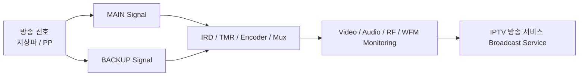
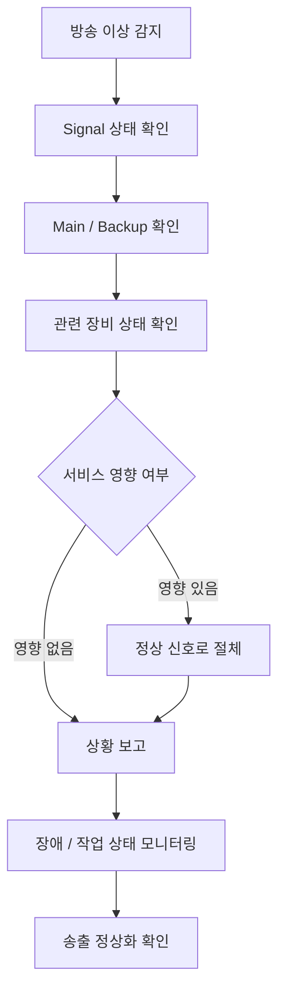

# Broadcast Operations Engineering

> **Broadcast Operations & Equipment Maintenance**  
> 2017.12 — 2018.04

Broadcast Operations Engineering 소속으로 방송 운영 파트너 업무의 IPTV 방송 서비스 방송 운영 업무에 투입되어, 성수 상황실에서 **방송송출 관제 및 방송장비 운영·유지보수 업무**를 수행했습니다.

지상파·PP 등 방송 채널의 Main / Backup 송출 신호와 Video / Audio 상태를 점검하고, TMR·STB·IRD 등 방송장비의 상태와 오류 여부를 모니터링했습니다. 장애나 작업 등 특이 상황이 발생하면 서비스 영향을 최소화할 수 있도록 정상 신호로 절체하고 상황을 보고한 뒤 후속 조치를 수행했습니다.

## 01. EMPLOYMENT STRUCTURE

| CATEGORY | DETAIL |
| --- | --- |
| 소속 회사 | Broadcast Operations Engineering |
| 업무 수행 | 방송 운영 파트너 업무 |
| 담당 환경 | IPTV 방송 서비스 성수 상황실 |
| 담당 업무 | 방송송출 관제 및 방송장비 운영·유지보수 |
| 근무 기간 | 2017.12 — 2018.04 |

> 경력 기간은 실제 근무 기간을 기준으로 기록합니다.

## 02. ROLE OVERVIEW

| AREA | RESPONSIBILITY |
| --- | --- |
| Broadcast Monitoring | 지상파·PP 방송 송출 신호 모니터링 |
| Main / Backup | Main / Backup 송출 경로 및 상태 점검 |
| Video / Audio | 영상 및 주음성·부음성 신호 상태 점검 |
| Equipment | TMR / STB / IRD 등 방송장비 상태 점검 |
| RF Monitoring | RF-IRD 원격 접속 및 RF 신호 점검 |
| Signal Analysis | WFM 기반 Jitter / Timing / Alignment 확인 |
| Incident Response | 순단 / Signal Loss / Ring Open 등 특이상황 대응 |
| Signal Switching | 장애 및 작업 시 정상 신호 절체 |
| Maintenance | Firmware Upgrade 및 신규장비 작업 지원 |

## 03. BROADCAST SERVICE FLOW

Main 신호뿐 아니라 Backup 경로를 함께 확인하여 장애나 작업 발생 시 서비스에 영향을 주지 않는 신호로 절체할 수 있도록 관리했습니다.

## 04. RESPONSIBILITIES

### 방송송출장비 관제 및 유지보수

- 지상파 Main / Backup 및 STB의 Video와 Audio(주음성·부음성) Signal 상태와 TMR 상태 점검
- 지상파 및 PP-IRD(Backup)의 Signal을 WFM으로 확인하고 Jitter(Timing / Alignment) 값 및 Error Status Log 점검
- Web을 통한 RF-IRD(TLView) 원격 접속 및 RF 신호 상태 점검
- Main / Backup 방송 송출 경로 및 절체 상태 점검
- 신규 채널 런칭 시 신규 방송장비 계측 Test 및 송출 상태 점검
- Encoder Firmware Upgrade 시 Encoder / Mux Web 상태 및 부음성 확인

### 장애 및 특이 상황 대응

- 방송 순단, Signal All Loss, Ring Open 및 망 작업에 따른 Ring Open 등 장애·특이 상황 모니터링
- 장애 또는 작업 예정 사항 발생 시 매니저 보고 및 후속 조치
- 상태 이상 발견 시 서비스에 문제가 없는 정상 신호로 절체
- Firmware Upgrade 등 작업 시 서비스 영향을 방지하기 위한 사전 절체
- 작업 및 장애 상황 종료 후 송출 상태 확인

## 05. MONITORING SAMPLE

| CHECK | TARGET | MONITORING |
| ---: | --- | --- |
| 01 | Main Signal | 정상 수신 여부 |
| 02 | Backup Signal | Backup 경로 정상 여부 |
| 03 | Video | 영상 Signal 상태 |
| 04 | Main / Sub Audio | 주음성·부음성 상태 |
| 05 | TMR / STB | 장비 및 실제 출력 상태 |
| 06 | IRD / RF | Input 및 RF 신호 상태 |
| 07 | WFM | Jitter / Timing / Alignment |

## 06. INCIDENT RESPONSE FLOW

## 07. OPERATIONS

방송국 작업, 망 작업 및 장비 이상 상황에서 Main / Backup 신호 상태를 집중적으로 확인하고 서비스 연속성을 유지하기 위한 절체 업무를 수행했습니다. 신규 채널 및 장비 작업 시에는 실제 방송 신호가 정상적으로 전달되는지도 함께 확인했습니다.

## 08. TOOLS & ENVIRONMENT

| CATEGORY | TECHNOLOGY / EQUIPMENT |
| --- | --- |
| Monitoring | TDC |
| Remote Access | Telnet |
| Management | Web Management Interface / 제조사별 관리 S/W |
| Broadcast | Main / Backup / Video / Audio |
| Equipment | TMR / STB / IRD / Encoder / Mux |
| Signal | RF / WFM / Jitter / Timing / Alignment |
| Operations | Signal Switching / Incident Response |

## 09. EXPERIENCE SUMMARY

방송 서비스는 장애나 작업이 실제 서비스에 즉시 영향을 줄 수 있는 환경이었기 때문에 **상태를 지속적으로 관찰하고, 이상 상황을 빠르게 판단하며, 정상 경로를 확보해 서비스를 유지하는 운영의 기본 원칙**을 경험했습니다.

이후 PMS 서버·데이터베이스 운영과 Cloud Platform 운영으로 기술 영역은 변화했지만 서비스 상태를 관찰하고 장애 범위를 판단하여 정상화를 우선하는 운영 관점은 이후 경력에서도 계속 이어졌습니다.

## NOTE

본 페이지의 Architecture Diagram, Signal Flow 및 운영 시나리오는 당시 실제 수행 업무와 관제 기록을 기반으로 경력 이해를 돕기 위해 단순화하여 재구성한 예시입니다. 실제 고객사 내부 구성정보, 장비 주소, 계정 및 보안정보는 포함하지 않습니다.

## RELATED PROJECTS

- **IPTV 방송 서비스 방송송출 관제 및 서비스 연속성 운영** — 방송 신호/장비 상시 모니터링, 장애 감지, 정상 신호 절체 및 서비스 확인
- **방송장비 작업 및 신규 채널 런칭 지원** — 신규 채널 계측, Encoder Firmware Upgrade, 작업 전후 Validation

