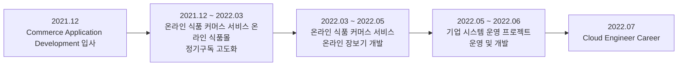
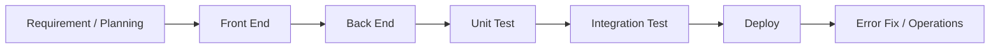

# Commerce Application Development

## Java / Spring 기반 Web Service 개발 및 운영

| 항목 | 내용 |
| --- | --- |
| 재직기간 | 2021.12 ~ 2022.06 |
| 직책 | 선임 / 프로 |
| 주요 영역 | 온라인 식품 커머스 서비스 식품관 온라인 식품몰 개발, 기업 시스템 운영 프로젝트 운영 |
| 역할 | Front End / Back End 개발, 테스트, 배포, 운영 |
| 주요 기술 | Java / Spring / JSP / JavaScript / jQuery / SQL |

## 01. Career Overview

Java / Spring 기반 Web Developer로 근무하며 온라인 식품 커머스 서비스 식품관 온라인 식품몰 서비스의 정기구독 고도화와 온라인 장보기 관련 개발을 수행하고, 이후 기업 시스템 운영 프로젝트 시스템 운영 업무를 담당했다.

재직기간 동안 단순 화면 개발에 한정하지 않고 상품 전시, 정기구독 신청·관리, 회차별 배송상품, 장바구니 및 픽업 기능 등 실제 Commerce 업무 흐름과 연결된 Front End / Back End 기능을 개발했다. 개발 이후에는 단위테스트, 통합테스트, 배포 및 오류 수정까지 수행하면서 Web Application의 개발 생명주기를 경험했다.

마지막 기간에는 기업 시스템 운영 프로젝트의 스케줄관리 시스템과 HR System 운영 업무를 수행하며 형상관리, 서버 인프라 구축, 개발환경 세팅, 유지보수 및 SR 처리 업무를 담당했다.

## 02. Career Timeline

## 03. Hyundai Department Store - ToHome Subscription Enhancement

### 수행기간

**2021.12 ~ 2022.03**

온라인 식품 커머스 서비스 식품관 온라인 식품몰의 정기구독 서비스를 대상으로 Front End와 Back End 개발, 단위테스트, 통합테스트, 배포 및 오류 수정을 수행했다.

기획자료 기준 서비스 범위에는 홈 메인 정기구독 모듈, 구독 메인, 구독 상세, 배송주기 설정, 지난 회차/구매정보, 구독권 관리, Admin 정기구독 옵션 및 주문관리 등이 포함된다.

실제 화면 자료에서는 정기구독 상품 목록, 구독 상세의 회차별 배송상품, 간편결제 간편결제 안내 및 PC/Mobile 화면이 확인되며, 개발 당시 캡처된 Source에는 개인 작업 식별용 주석과 2022년 1~2월 변경 흔적이 남아 있다.

### Development Scope

- Front End 개발
- Back End 개발
- 정기구독 상품/화면 기능 구현
- 구독 회차별 상품정보 처리
- PC / Mobile Web 대응
- 단위테스트
- 통합테스트
- 배포
- TMS 오류 수정 및 안정화

기존 경력자료에는 **TMS 오류건 75/200 처리**가 기록되어 있어 신규 기능 개발뿐 아니라 통합 과정에서 발생한 다수 오류의 수정 및 안정화 작업도 수행했음을 확인할 수 있다.

## 04. Hyundai Department Store - E-Super Development

### 수행기간

**2022.03 ~ 2022.05**

온라인 식품 커머스 서비스 식품관 온라인 식품몰 내 온라인 장보기 관련 Web 기능 개발을 수행했다.

확인 가능한 개인 작업기록에는 Front End 영역의 **MD 온라인 장보기 장바구니**, **MD 픽업리스트**와 Back End 개발이 명시되어 있다. 프로젝트 기간은 본인의 경력 타임라인을 기준으로 2022.03 ~ 2022.05로 관리한다.

Commerce 서비스의 상품 탐색 이후 장바구니와 주문/픽업으로 이어지는 사용자 흐름을 다루면서 기존 정기구독 개발 경험을 일반 상품 구매 흐름으로 확장했다.

## 05. 기업 시스템 운영 프로젝트 Operations

### 수행기간

**2022.05 ~ 2022.06**

기업 시스템 운영 프로젝트 관련 시스템의 운영 및 일부 개발 업무를 수행했다.

### 스케줄관리 시스템

- 운영 및 개발
- 형상관리
- 서버 인프라 구축
- 개발환경 세팅

### HR System

- 운영
- 유지 및 보수
- SR 처리

짧은 기간이지만 Application 개발 중심 업무에서 운영, 형상관리, 서버 인프라 및 개발환경 구성까지 업무 범위를 확장한 구간이다.

## 06. Development Lifecycle Experience

온라인 식품 커머스 서비스 프로젝트에서는 기획서를 기반으로 실제 기능을 구현하고 테스트와 배포까지 수행했다. 이후 기업 시스템 운영 프로젝트에서는 운영 및 SR 처리까지 경험하면서 개발 이후의 서비스 운영 단계까지 업무 범위가 확장되었다.

## 07. Related Projects

### 온라인 식품 커머스 서비스 식품관 온라인 식품몰 정기구독 고도화

2021.12 ~ 2022.03. 정기구독 Front End / Back End 개발, 단위·통합 테스트, 배포 및 오류 안정화를 수행했다.

### 온라인 식품 커머스 서비스 온라인 장보기 개발

2022.03 ~ 2022.05. 온라인 장보기 Web 기능의 Front End / Back End 개발을 수행했으며 확인 가능한 작업 범위에는 MD 온라인 장보기 장바구니와 MD 픽업리스트가 포함된다.

### 기업 시스템 운영 프로젝트 시스템 운영 및 개발

2022.05 ~ 2022.06. 스케줄관리 시스템의 운영·개발 및 형상관리/서버 인프라/개발환경 업무와 HR System 운영·유지보수·SR 처리를 수행했다.

## 08. Experience Summary

Commerce Application Development 경력은 교육 프로젝트 중심의 Java/Python Web 개발 경험을 실제 Commerce 서비스 개발로 전환한 시기다. 사용자 화면과 Back End를 함께 다루고 테스트·배포·오류 수정까지 경험했으며, 마지막에는 시스템 운영과 인프라 구성 업무까지 담당했다.

이후 Cloud Engineer로 직무를 확장하면서 Application 자체뿐 아니라 Infrastructure, Network, Identity, Kubernetes 및 Platform 전체를 다루게 되었으며, 이 시기의 Web Application 개발·운영 경험은 현재 Application과 Infrastructure 사이의 문제를 함께 추적하는 기반이 되었다.
