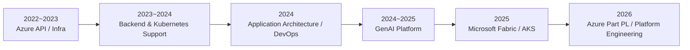
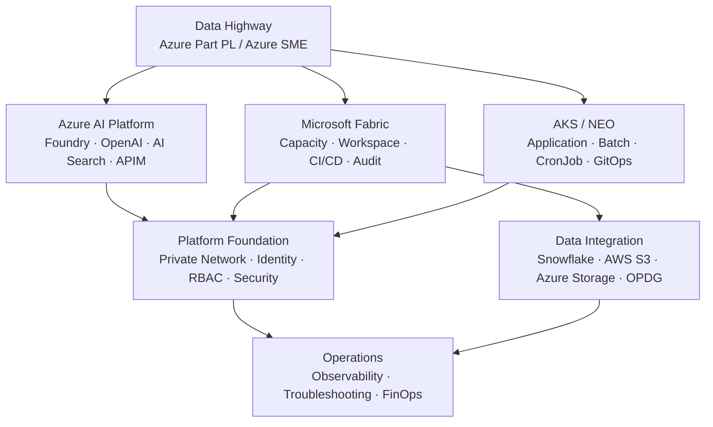
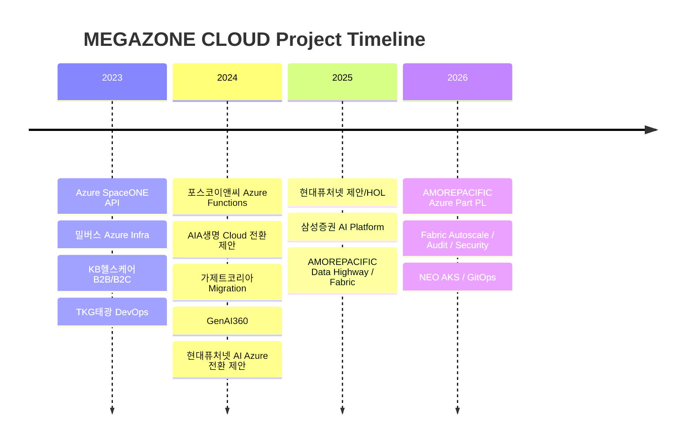

## Overview

Azure 기반 **Cloud / AI / Data Platform의 설계·구축·운영 및 기술지원**을 수행하고 있습니다. 초기에는 Application/Cloud 기술지원과 Azure 개발 가이드를 중심으로 업무를 수행했으며, 이후 Azure AI, AKS/Kubernetes, Microsoft Fabric, Private Network, Security Governance, CI/CD 및 운영 자동화 영역으로 담당 범위를 확장했습니다.

현재 아모레퍼시픽 Data Highway 프로젝트에서는 **Azure AI Platform Engineer / Azure Part PL / Azure SME** 역할로 Azure AI, AKS, Microsoft Fabric 영역의 기술 검토와 구축·운영을 담당합니다. 개발팀뿐 아니라 고객사 인프라·네트워크·보안 조직 및 Microsoft와 협업하며 서비스 도입 검토부터 Private Connectivity, Identity/RBAC, CI/CD, Monitoring, Troubleshooting까지 플랫폼 전반을 지원합니다.

## Career Visual Overview

### Role Evolution

### AMOREPACIFIC Platform Engineering Map

### AMOREPACIFIC Engineering Workstreams

| Workstream | 구현/운영 범위 | 대표 결과 |
| --- | --- | --- |
| Fabric Platform | Capacity, Workspace, DEV/QA/PRD, Runtime | Data Platform 운영 기반 |
| Fabric CI/CD | GitLab, REST API, Service Principal | Artifact 배포 자동화 |
| Private Connectivity | Private Link, MPEP, Private DNS | Azure Resource Private 통신 |
| Capacity FinOps | Event Hub, AKS CronJob, Rolling Utilization | Dynamic Scale Up/Down 운영 |
| Audit & Governance | Activity Events API, Query Log, RBAC | 일일 Audit 수집 및 보안 요구 대응 |
| Multi-Cloud Data | Snowflake, AWS S3, Storage, OPDG | Cloud/Hybrid Data Source 연결 |
| AI Platform | Foundry, OpenAI, AI Search, APIM | 10개 Subscription AI Backend 연계 |
| AKS / NEO | GitLab, ACR, Helm, ArgoCD, Workload Identity | 신규 7개 서비스 구축 |
| Observability | Grafana, Datadog, Log Analytics | Platform/Application 운영 가시성 |

## Core Responsibilities

### Azure Cloud / AI Platform

- Azure OpenAI, Azure AI Search, Microsoft Foundry 등 AI 서비스 구축·운영 및 개발 지원
- Azure API Management 기반 AI API 연결, 인증 및 정책 구성
- Managed Identity / Workload Identity / Service Principal / Azure RBAC 기반 인증·권한 구성
- Private Endpoint / Private DNS / Firewall 등 Private Network 기반 서비스 연결 검토 및 구축
- 신규 Azure 서비스 도입 시 Architecture, Network, Identity, Security, 운영방안 기술 검토
- Azure 서비스 장애 및 API/인증/네트워크 복합 이슈 Troubleshooting

### Microsoft Fabric / Data Platform

- Fabric Capacity / Workspace 및 DEV·QA·PRD 환경 구축·운영
- GitLab CI/CD + Fabric REST API + Service Principal 기반 Fabric CI/CD 구축
- Fabric Private Link / Managed Private Endpoint(MPEP) 기반 Private Connectivity 구성
- Event Hub + AKS CronJob 기반 Fabric Capacity Dynamic Autoscale 구현 및 운영 적용
- Schedule + Utilization 기반 Capacity 제어를 통한 FinOps 운영 자동화
- Fabric Admin Activity Events API + Notebook + Pipeline 기반 Audit Log 일일 수집 자동화
- Query Log, 권한, 접근통제, 환경분리 등 Fabric Security Governance 요구사항 기술 검토
- Snowflake / AWS S3 / Azure Storage / OPDG 기반 Cloud·Hybrid Data Source 연계
- Fabric Capacity 429/Throttling, Network, Identity, 권한 및 Runtime 관련 운영 이슈 대응

### AKS / Kubernetes / DevOps

- AKS 기반 Application / Batch / CronJob 서비스 구축·운영
- GitLab CI/CD + Docker + Helm + ArgoCD 기반 CI/CD 및 GitOps 환경 구성
- Kubernetes Deployment / Service / Job / CronJob / ServiceAccount 등 Resource 구성
- DEV / QA / PRD 환경별 Helm Values 및 배포 설정 관리
- Workload Identity + Azure RBAC 기반 AKS ↔ Azure Resource 인증·권한 구성
- Grafana / Log Analytics / Datadog 기반 서비스 및 Container Log 모니터링
- Pod Scheduling, Taint/Toleration, Resource 부족, Image Pull, Helm/ArgoCD, Network/인증 등 배포·운영 장애 분석

### Technical Leadership / Customer Support

- Data Highway 프로젝트 Azure Part PL로 Azure 영역 기술 검토 및 업무 조율
- 고객 요구사항을 Azure Architecture 및 운영 구성으로 구체화
- 개발팀의 Azure 기술지원 및 신규 서비스 구축·운영 과정의 기술 의사결정 지원
- 고객사 인프라·네트워크·보안 담당자와 Private Network 및 Security 요구사항 협의
- Microsoft와 Fabric/Azure 제품 이슈 및 신규 기능에 대한 기술 협업
- 반복 이슈에 대한 기술 가이드, 샘플 코드, 운영 문서 및 Self-Service 검증 도구 작성

### Engagement Timeline

## Major Engagements

### 1. AMOREPACIFIC — Azure AI / Data Platform 구축 및 운영 고도화

**기간:** 2025.07 ~ 현재  
**소속:** 메가존클라우드  
**역할:** Azure AI Platform Engineer / Azure Part PL / Azure SME / Microsoft Fabric·AKS 담당

Microsoft Fabric 기술지원을 목적으로 프로젝트에 투입되었으며, 프로젝트 진행 과정에서 Azure AI, AKS, Network, Identity, Security, CI/CD 및 운영 자동화 영역으로 담당 범위가 확대되었습니다. 현재는 **Data Highway 프로젝트 Azure Part PL**로 Azure 영역의 기술 검토와 운영방안 수립을 지원하고, Microsoft Fabric 플랫폼과 Data Highway/NEO의 AKS 서비스 구축·운영을 함께 담당하고 있습니다.

단일 Azure Resource의 구축·운영에 국한되지 않고 **Azure AI / Microsoft Fabric / AKS / Private Network / Identity & RBAC / DevOps / Security Governance / Observability / Multi-Cloud Data Integration / FinOps Automation**을 하나의 Enterprise Platform 관점에서 연결하여 업무를 수행했습니다.

#### 담당 역할 — Azure Part PL / Azure SME

- Data Highway 프로젝트 Azure 파트 담당 및 Azure 영역 기술 검토·업무 조율
- Azure AI / AKS / Microsoft Fabric 등 Azure 서비스 Architecture 및 운영방안 검토
- 신규 Azure 서비스 도입 시 Network, Identity, RBAC, Private Connectivity, Security, 운영방안 검토
- 개발팀의 Azure 기술지원 및 구축·운영 과정에서 발생하는 복합 장애 분석
- 고객사 인프라·네트워크·보안 담당자와 Azure 구성 및 보안 요구사항 협의
- Microsoft와 Fabric/Azure 제품 이슈, 기능 제약, 권한·라이선스 및 신규 기능 관련 기술 협업
- 반복되는 기술 문의를 가이드, 샘플 코드, Runbook 및 자동화 방식으로 전환

#### Data Highway 프로젝트 [Main] — Microsoft Fabric / Azure AI / Platform Engineering

**역할:** Azure Part PL / Microsoft Fabric 담당

Microsoft Fabric을 중심으로 Azure AI/Data Platform 구축 및 운영을 지원하고, Azure Resource 간 Private Connectivity, CI/CD, 데이터 연계, Capacity 운영 자동화, Audit/Query Logging 및 Monitoring 환경을 구성했습니다.

##### Microsoft Fabric Platform 구축·운영

- Microsoft Fabric Capacity / Workspace 구축 및 DEV / QA / PRD 환경 분리·운영
- Workspace / Item 권한과 Fabric Admin 권한 범위를 검토하고 운영 권한 모델 지원
- Fabric Environment의 Python Library 설정 및 Publish/Runtime 관련 이슈 대응
- Fabric Capacity 운영 중 발생하는 429 / Throttling, Network, Identity, 권한 및 Runtime 문제 분석
- 신규 Fabric 기능 및 Data Agent의 적용 가능성, 권한 모델, 운영방식 기술 검토

##### Microsoft Fabric CI/CD 구축

- **GitLab CI/CD + Fabric REST API + Service Principal** 기반 Fabric 배포 자동화 구성
- Notebook 등 Fabric Artifact의 소스 관리 및 환경별 배포 흐름 구성
- Service Principal 인증과 Workspace 권한을 기반으로 API 배포 경로 구성
- DEV / QA / PRD 환경별 배포 및 운영 구조 검토
- Publish 과정에서 발생한 404 오류를 분석하고 Artifact/명칭 오타 수정 후 정상 배포 확인
- 반복 가능한 Fabric 배포 프로세스를 구성하여 수동 배포 의존도를 줄일 수 있는 기반 마련

##### Fabric Private Connectivity / Network

- **Fabric Private Link / Managed Private Endpoint(MPEP) / Private DNS** 기반 Azure Resource Private Connectivity 구성
- Fabric ↔ Azure Storage 등 Azure Resource 간 Private 통신 경로 구성 및 MPEP 승인 상태 검증
- Storage Firewall / Private Link / DNS Resolution 등 연결 조건 검토
- Private 환경에서 발생한 `blob.core.windows.net` DNS Resolve 실패를 분석하고 진단 코드 추가
- Fabric Notebook/Runtime에서 Azure Resource 접근 시 Network와 Identity 문제를 분리하여 분석
- AKS / Event Hub 연계 과정에서 AMQP 5671 통신 제한을 확인하고 **WebSocket 443** 방식으로 전환하여 연결 검증

##### Fabric Capacity Dynamic Autoscale / FinOps Automation

- **Event Hub + AKS CronJob** 기반 Microsoft Fabric Capacity Dynamic Autoscale 개발 및 운영 적용
- 기존 Schedule 기반 Capacity 제어와 Utilization 기반 Dynamic Autoscale을 결합한 Hybrid 운영방식 설계
- 업무 시작 시 Schedule 정책으로 Baseline SKU를 적용하고, 업무시간에는 Dynamic Window에서 사용률 기반 Autoscale이 제어권을 갖도록 구성
- STG 기준 평일 **08:15 ~ 17:45** Dynamic Window를 적용하여 기존 Schedule CronJob과 제어구간 분리
- Rolling Utilization 값을 기준으로 Scale Up / Scale Down 조건 판단 로직 구현
- STG 환경 선적용 및 모니터링 후 PRD 환경으로 확대 적용
- PRD `apprdaifabric` Capacity에서 F32 상태와 Rolling 평균을 분석하여 **SCALE_DOWN → F16** 실제 동작 검증
- 기존 Schedule CronJob과 Dynamic CronJob의 충돌 여부를 운영환경에서 모니터링
- 월요일 08:00 Schedule 동작과 Capacity Control CronJob의 실행시간 충돌 가능성을 분석하고 실행시간 분리 방안 검토
- 실제 사용량에 따라 Capacity SKU를 자동 조정할 수 있는 운영체계를 구성하여 **FinOps 관점의 Capacity 운영 자동화** 지원

##### Fabric Audit Log 자동수집

- 보안 요구사항의 사용자 활동 추적을 위해 **Fabric Admin Activity Events API(`activityevents`) + Notebook + Pipeline** 기반 Audit Log 일일 자동수집 구현
- Service Principal 기반 API 인증 및 Fabric Admin/API 접근권한 구성 검토
- 초기 `403 API not accessible` 오류 발생 시 API 접근권한 및 Admin 설정 점검
- 날짜 파라미터 형식으로 발생한 `400 BadRequest`를 수정하여 정상 호출 확인
- Continuation 기반 다중 페이지 수집을 구현하고 수천 건 단위 Activity Event 수집 검증
- 초기 JSON 저장에서 고객 운영 요구에 따라 **CSV 적재 방식으로 전환**하고 기존 JSON을 유지하지 않는 구조로 정리
- `target_date(yyyy-MM-dd)` 파라미터를 지원하고 값이 없을 경우 **KST 기준 D-1**을 자동 수집하도록 구성
- Fabric Notebook → Pipeline → Azure Storage 적재 흐름을 구성하여 일일 자동화 기반 마련
- Storage 적재 과정에서 Authorization, Tenant ID, DNS Resolution 문제를 분석하고 DNS 테스트 로직 추가
- Audit Log 장기 보존 요구와 Storage 보존정책 검토 지원

##### Security Governance / Data Agent / Query Log

- 고객 보안성 검토 요구사항을 **계정·권한 / 접근통제 / Audit Log / DEV·QA·PRD 환경분리 / Data Agent 권한·처리 로그**로 분해하여 기술 검토
- Fabric 계정 생성·수명주기는 Microsoft Entra ID 관리 영역과 구분하고 Fabric 내 Workspace/Item 권한 및 운영통제를 검토
- 조회/변경/다운로드 등 사용자 활동 Audit 요구와 2~3년 장기 보존 요구에 대응할 수 있는 수집 구조 검토
- Data Agent Prompt/Interaction 감사 가능성을 위해 Microsoft와 **Purview DSPM for AI Audit** 및 `Capture interactions...` 기능 검토
- Purview 접근권한, Fabric Admin 필요 여부, 라이선스 및 Prompt Logging 비용 확인
- 제품상 요구사항을 직접 충족하는 감사 API가 제한적인 점을 확인하고 대체 수집방안 검토
- 고객 및 Microsoft와 협의하여 Data Agent Prompt 감사 대신 **Query Log 수집 방식**으로 운영방향 전환
- Query Log를 별도 수집하여 사용자 질의 이력을 추적할 수 있도록 구성 방향 정리
- 보안 요구사항을 단순 문서 검토로 끝내지 않고 실제 Audit/Query Log 수집 및 운영 권한 모델로 구체화

##### Query / Execution History 운영 자동화

- Fabric 실행 이력 수집 Stored Procedure의 시간 기준을 운영 요구에 맞게 개선
- 기존 UTC 기반 `usp_export_exec_requests_history`에서 **KST 기준 수집용 Stored Procedure**로 확장
- KST 날짜 범위를 UTC로 변환하여 00:00~24:00 기준의 일별 실행 이력을 정확히 조회하도록 구성
- NULL 입력 시 KST 기준 기본 날짜가 적용되도록 처리
- 과거 특정 일자 재수집, 파라미터 오타, 장시간 실행(Duration 40h+) 데이터 등 운영 이슈 점검
- 실행 이력의 날짜 표시 및 정렬 요구사항 검토

##### Multi-Cloud / Hybrid Data Integration

- Fabric Pipeline / Copy Activity 기반 **Snowflake / AWS S3 / Azure Storage** 데이터 연계 검토 및 구성
- Fabric Lakehouse ↔ AWS S3 Shortcut 연결 및 Pipeline 데이터 Copy 방식 기술지원
- Azure Storage Private 연결 시 MPEP, Firewall, 인증 및 DNS 상태 검증
- **OPDG(On-premises Data Gateway)** 기반 Hybrid Connectivity 구성 및 외부 Data Source 연결 검증
- OPDG → Azure Storage 연결 시 Service Principal 인증의 `Invalid connection credentials (400)` 문제 분석
- Organization 인증 방식으로 전환하여 실제 연결 성공 확인
- Snowflake 연계 과정에서 발생한 EOF/login-request 오류 등 외부 Data Source 연결 문제 점검
- Cloud / On-prem / Multi-Cloud Data Source의 인증·Network·Gateway 조건을 함께 검토

##### Microsoft Foundry / APIM Private Platform

- **Azure API Management 기반 10개 Azure Subscription의 Microsoft Foundry 연결 지원**
- Subscription별 AI Backend 연결 및 API 접근 구조 기술지원
- **Private Endpoint / Private DNS Zone** 기반 Microsoft Foundry Private 통신 구성 검토 및 지원
- Azure AI Search / Azure OpenAI / Foundry 연계 시 Network, Identity, RBAC 조건 검토
- Workload Identity 기반 Azure AI Search 연결 샘플 코드를 검토·작성하여 개발팀에 제공
- 모델 배포 Forbidden/접속 불가, API 호출, Quota 등 Azure AI 서비스 운영 이슈 대응
- 반복적인 Azure Resource 연결/권한 문제를 개발자가 직접 검증할 수 있도록 FastAPI 기반 Self-Service 검증 도구 및 샘플 제공

##### Observability / Monitoring

- Fabric 운영 로그의 **Datadog 연계 및 로그 송수신** 구현·검증
- Grafana / Log Analytics 기반 AKS Container Log 모니터링 구성 및 Query 점검
- ContainerLogV2 Dashboard에서 환경별 변수 전달 및 LabelValue 조회 문제 분석
- STG Dashboard의 Resource Group / Cluster / Log Analytics Workspace 선택 구조를 점검하여 정상 조회 확인
- PRD Kusto Query의 SyntaxError 및 빈 LabelValue 원인 추적
- Azure Monitor / Log Analytics / Datadog / Grafana를 활용하여 Platform과 Application 운영 가시성 지원

#### NEO 프로젝트 — 신규 AKS Service Platform 구축

**역할:** AKS / Azure 담당

NEO 프로젝트의 Application / Batch / CronJob을 포함한 **총 7개 신규 서비스**를 기존 AKS 환경에 구성하고, CI/CD와 Azure Resource 및 Microsoft Fabric 연계를 담당했습니다.

##### AKS / Kubernetes Resource 구성

- Application / Batch / CronJob 포함 총 7개 신규 AKS 서비스 구성
- Kubernetes Deployment / Service / Job / CronJob / ServiceAccount Resource 구성
- HPA(autoscaling/v2), replicas 조건 및 서비스별 Resource 설정 검토
- DEV / QA / PRD 환경별 Helm Values 및 Kubernetes 설정 관리
- CronJob의 schedule, suspend, concurrencyPolicy, backoffLimit, activeDeadlineSeconds 등 운영 설정 검토
- Application과 Batch/CronJob 유형에 따른 ServiceAccount 및 Kubernetes Resource 생성 구조 확인

##### CI/CD / GitOps

- **GitLab CI/CD + Docker + Azure Container Registry + Helm + ArgoCD** 기반 Build/Deploy 환경 구성
- GitLab Pipeline의 Project/Helm Repository/환경변수와 Helm Chart 연결 구조 검토
- Docker Build → ACR Push → Image Tag → Helm Values → ArgoCD Sync → AKS 배포 경로 점검
- 환경별 Helm Values와 ArgoCD Application 구성 검토
- QA/QA2/QA3 등 환경별 Application 표시 및 Sync 문제 분석
- Ingress / Application Gateway Private 구성과 환경별 Host/WAF/Certificate 설정 검토

##### Workload Identity / Azure Resource 연계

- **Workload Identity + Azure RBAC** 기반 AKS ↔ Azure Storage 인증·권한 구성
- ServiceAccount 생성 조건과 Workload Identity Annotation 구조 검토
- AKS ↔ Microsoft Fabric / OPDG 연계방식 기술 검토 및 적용 지원
- Application과 ServiceAccount가 ArgoCD에서 별도 Resource로 표시되는 구조 확인

##### AKS / CI/CD Troubleshooting

- ACR Image 존재 여부 및 Tag 불일치로 발생한 **ImagePullBackOff / Image NotFound** 분석
- GitLab Pipeline에서 전달된 Image Tag와 Helm Values/Repository 경로 점검
- Deployment fullname 변경으로 발생한 **`spec.selector immutable`** 오류 분석 및 기존 Resource 재생성 방향 검토
- ArgoCD가 Helm Repository 접근 시 발생한 `context deadline exceeded` 문제에서 GitLab/Helm Domain 차이와 Network 경로 분석
- GitLab 인증 변경 이후 발생한 **HTTP Basic Access denied** 문제에서 Token/Repository 권한 및 인증방식 점검
- Gradle Wrapper 부재로 발생한 `GradleWrapperMain ClassNotFound` 및 Build 구조 점검
- `untolerated taint`, `Insufficient cpu`, Preemption 관련 Pod Scheduling 이벤트를 분석하여 Node Taint/Toleration과 Resource 조건 점검
- STG Batch가 Spring Boot Banner 이후 종료되는 문제에서 CronJob/Job/Pod Event와 환경별 Values를 비교하고 `status: stg → qa` 수정 후 정상 실행 확인
- ServiceAccount/HPA/CronJob이 ArgoCD에서 표시되는 방식과 실제 Helm Template 조건 검토

##### AKS Monitoring

- Grafana / Log Analytics 기반 AKS 서비스 및 Container Log 모니터링
- ContainerLogV2 기반 Dashboard Query와 환경변수/Label 필터링 문제 점검
- Kubernetes Event / Pod Log / ArgoCD Sync 상태 / GitLab Pipeline을 함께 확인하여 배포 및 Runtime 문제 분석

#### Engineering Guides / Documentation / Operational Support

- Fabric CI/CD 구성 및 운영 가이드 작성
- Fabric AWS S3 Shortcut / Pipeline Copy 연계 가이드 작성
- Workload Identity 기반 Azure AI Search 연결 샘플 및 인증 가이드 제공
- OPDG 설치·업그레이드 및 Data Source 연결 가이드 지원
- Fabric Audit Log 수집 Notebook / Pipeline 및 운영 절차 문서화
- Fabric Capacity Dynamic Autoscale 운영 Runbook 및 Schedule/Dynamic 제어방식 정리
- Azure / AKS / Fabric의 Network, Identity, Security, CI/CD 관련 반복 이슈에 대한 기술 문서 및 Troubleshooting 기록 축적
- 고객 개발팀이 직접 설정과 연결 상태를 검증할 수 있는 Self-Service 방식 지원

#### 주요 성과

- Microsoft Fabric 단일 기술지원으로 투입된 이후 **Data Highway Azure Part PL / Azure SME**로 역할 확대
- GitLab CI/CD + Fabric REST API + Service Principal 기반 **Microsoft Fabric CI/CD 구축**
- Event Hub + AKS CronJob 기반 **Fabric Capacity Dynamic Autoscale 개발 및 PRD 운영 적용**
- Schedule + Utilization Hybrid 제어를 통해 고객사의 **FinOps 기반 Capacity 자동 Scale Up/Down 운영체계** 구축
- Fabric Private Link / MPEP / Private DNS 기반 **Azure Resource Private Connectivity** 구성
- Fabric Admin Activity Events API + Notebook + Pipeline 기반 **Audit Log 일일 자동수집** 구현
- Audit/Query Log 및 Data Agent 권한을 포함한 **Fabric Security Governance 요구사항을 운영 가능한 수집 구조로 구체화**
- Fabric 운영 로그의 **Datadog 연계** 및 Grafana/Log Analytics 기반 AKS 모니터링 지원
- Snowflake / AWS S3 / Azure Storage / OPDG 등 **Multi-Cloud·Hybrid Data Source 연계**
- APIM 기반 **10개 Azure Subscription의 Microsoft Foundry 연결 및 Private 통신 지원**
- NEO 프로젝트의 Application / Batch / CronJob **총 7개 신규 AKS 서비스 구축**
- GitLab CI/CD + Docker + Helm + ArgoCD 기반 AKS GitOps 배포환경 구성 및 운영
- Workload Identity + Azure RBAC 기반 AKS ↔ Azure Resource 인증·권한 연계
- Fabric 429, DNS, Private Network, ArgoCD, Image Pull, Immutable Selector, Pod Scheduling 등 **Cloud/Data/Kubernetes/Network/Identity가 결합된 복합 장애 분석 및 대응**

#### 기술 환경

**Azure / AI**  
Microsoft Azure, Microsoft Fabric, Microsoft Foundry, Azure OpenAI, Azure AI Search, Azure API Management, Azure Storage, Event Hub

**AKS / DevOps**  
AKS, Kubernetes, Docker, Azure Container Registry, GitLab CI/CD, ArgoCD, Helm

**Network / Security**  
Private Endpoint, Private Link, Managed Private Endpoint(MPEP), Private DNS Zone, VNet, Firewall, Managed Identity, Workload Identity, Service Principal, Azure RBAC, Microsoft Entra ID

**Data / Monitoring**  
Snowflake, AWS S3, Azure Storage, OPDG, Fabric Pipeline, Copy Activity, Grafana, Datadog, Azure Monitor, Log Analytics, ContainerLogV2

**Development / Automation**  
Python, FastAPI, REST API, Fabric Notebook, Stored Procedure, Kusto Query

### 2. 삼성증권 — 해외 투자정보 번역/요약 서비스 구축

**기간:** 2025.03 ~ 2025.07  
**구분:** Delivery / Enterprise AI Platform  
**역할:** Application Architect / Azure AI·Infrastructure Technical Support

제안·기술협상 단계부터 참여한 뒤 2025-03-04 정식 착수하여 실제 구축까지 수행했습니다. Azure OpenAI, APIM Premium/VNet Internal, Private Endpoint, Firewall/Squid Proxy, Managed Identity, Content Safety/PII, Monitoring 및 CI/CD 구조를 금융권 보안요건에 맞게 검토·구성했습니다. 초기 Azure DevOps 검토 후 고객 환경 제약을 반영해 Jenkins 기반 CI/CD로 조정했으며, PTU 운영방안, Active/Standby·Active/Active 가용성, Zone/DR, 전용선 및 Tenant 일정 Risk까지 함께 검토했습니다.

### 3. 현대퓨처넷 — AI 서비스 Azure 전환 제안 기술지원

**기간:** 2024.12 ~ 2025.02  
**구분:** Pre-Sales / Proposal / Technical Documentation  

현대퓨처넷 AI 서비스 Azure 전환 제안 준비 과정에서 Azure OpenAI, Azure AI Search, APIM, Azure Functions, Azure DevOps를 연결하는 **AOAI CI/CD 구축 HOL을 직접 작성**했습니다. Self-hosted Agent/Agent Pool/Pipeline과 Application Test 절차까지 문서화했으나 실제 고객 구축 단계까지 수행한 프로젝트는 아니므로 Delivery 경력과 명확히 구분합니다. Terraform은 문서상 준비도구로 확인되지만 실제 Production IaC 수행으로 기록하지 않습니다.

### 4. GenAI360 — AWS 기반 생성형 AI 플랫폼의 Azure 전환 기술지원

**기간:** 2024.08 ~ 2024.12  
**구분:** Technical Support / Application Architecture / GenAI RAG

AWS 기반 GenAI360을 Azure에서도 제공하기 위한 Application Architecture와 Porting을 지원했습니다. `unstructured.io` 기반 Document Loader/Chunking, LangChain Retriever, AzureAISearchRetriever, Vector·Lexical·Semantic·Hybrid Search를 검토·구현하고 Azure OpenAI/Azure AI Search 기반 RAG 구조를 구체화했습니다. Infra 담당자와 Azure To-Be Architecture를 공동 설계하고 Azure DevOps CI/CD 및 Private Endpoint/VPN 연계 구조도 함께 검토했습니다.

### 5. 가제트코리아 — Azure Sponsorship → CSP Subscription Migration

**기간:** 2024.07 ~ 2024.08  
**구분:** Delivery / Azure Migration

Sponsorship 만료 대응을 위해 Azure Resource Inventory와 Dependency를 분석하고 Subscription Migration을 수행했습니다. 196개 Resource를 검토해 Direct Move와 Redeployment 대상을 분리했으며, Resource Group 재구성, Move Validation, App Service/Functions 종속성 검토, Migration 영향도 Test, 서비스 정상화 및 후속 Architecture Optimization까지 수행했습니다.

### 6. AIA생명 — 클라우드 전환 2차 사업 제안 기술지원

**기간:** 2024.07 ~ 2024.08  
**구분:** Pre-Sales / RFP / Proposal  
**협업:** 삼성SDS

삼성SDS와 공동으로 AIA생명 Cloud 전환 2차 사업 제안에 참여했습니다. 11개 Application의 Azure To-Be Architecture와 AKS/App Service 전환방안, Network/DR/Data 영역을 검토하고 제안서/발표자료 작성 및 Jenkins Build Agent 사전검증을 수행했습니다. 실제 구축 단계에는 참여하지 않았으므로 Pre-Sales 경력으로 구분합니다.

### 7. 포스코이앤씨 — Azure Functions 기술 가이드

Azure Functions의 HTTP/Timer/Blob Trigger와 Managed Identity 등을 대상으로 Hands-on 및 개발 가이드를 지원했습니다.

### 8. 포스코이앤씨 — Azure Functions 개발·배포 기술가이드

**기간:** 2024.04 ~ 2024.05  
**역할:** Azure Functions 개발 / 기술가이드

- HTTP / Timer / Blob Trigger 기반 Functions 샘플 개발
- Managed Identity 기반 Azure Resource 인증 연동
- Hands-On Lab 및 고객 개발팀 실습 지원

### 9. KB헬스케어 — B2B/B2C 통합 플랫폼 구축 기술지원

**기간:** 2023.08 ~ 2024.01  
**역할:** Backend Engineer / Cloud·Kubernetes Technical Support

고객 환경에 상주하며 AKS와 Database 사이의 실제 동작을 검증하고, Network/Proxy 장애를 Application 관점까지 연결하여 분석했습니다. 단순 Infrastructure 설정 확인이 아니라 **Spring Boot Sample Application을 직접 개발해 AKS에 배포하고 MySQL/PostgreSQL HA·Failover를 재현**했습니다.

- 2023.08~10 1차, 2023.11~2024.01 2차 고객사 상주 기술지원
- MySQL Primary/Replica 구성 및 Read/Write DataSource 동작 검증
- Scheduler + Multi Thread 기반 자동 Insert/Select Test Logic 개발
- MySQL Replica Load Balancing 및 Failover Test, Azure Metric/Log 확인
- PostgreSQL Active/Standby, Availability Zone 및 Connection Pool 검증
- Spring Boot + MySQL/PostgreSQL Sample Container 제작 및 AKS 배포
- Kubernetes Pod / Deployment / ClusterIP Service / AGIC Ingress 구성
- WAF 설치 및 AKS Application 연계 지원
- Forward Proxy / Reverse Proxy 요청경로 Troubleshooting
- Spring Boot `X-Forwarded-For` Header 처리 및 Client IP 전달구조 검토
- MySQL/PostgreSQL Replica 개발자 가이드와 Forward/Reverse Proxy 운영 가이드 작성

**핵심 경험:** `Application → Kubernetes → Network/Proxy → Database HA`를 하나의 End-to-End 경로로 직접 재현·검증하면서 Backend 경험을 Cloud Platform Troubleshooting 역량으로 확장했습니다.

### 10. 밀버스 — Azure 인프라 구축·운영 및 서비스 안정화

**기간:** 2023.04 ~ 2024.01  
**역할:** Azure Solution Architect / Cloud Infrastructure Technical Support

Firstmall 및 연계 서비스의 Azure IaaS 환경을 초기 설계부터 구축하고 이후 장기간 운영을 지원했습니다. 초기 요구사항에는 Firstmall WEB/WAS, MyCRM, Tableau, DBMart(MariaDB), Redis, Tracking Server 등 **총 7대 수준의 Server Resource**가 포함됐으며, 구축 후 SSL/Domain, VM Clone, Database Connectivity, Proxy/IP 전달 등 실제 서비스 운영 이슈까지 대응했습니다.

- Azure VM 기반 Firstmall WEB/WAS 및 연계 서비스 Infrastructure 설계·배포
- WAF / Firewall / 고정 IP 등 Network Security 요구사항 검토 및 적용 지원
- Azure Architecture Diagram 및 Resource 구성/견적 검토자료 작성
- Linux Apache / PHP / MySQL Runtime 및 사용자·Directory Permission 운영 지원
- Azure Backup / OS Disk Snapshot 기반 VM 복제 및 복구성 검증
- Firstmall VM Snapshot → Managed Disk → Clone VM 생성/OS Disk 교체 작업
- PC/Mobile Domain SSL Certificate 등록 및 HTTPS 서비스 운영 지원
- Mobile 서비스의 Proxy IP 기록 문제에 대해 `X-Forwarded-For` 기반 Client IP 전달구조 분석
- Firstmall VM 간 MySQL Connectivity Test 및 Application DB 연결 확인
- 구축 결과보고서, Linux 운영가이드 및 고객 기술 질의 대응

**핵심 경험:** Azure IaaS를 `Compute → Network Security → Runtime → Database → SSL/Domain → Backup → Troubleshooting` 관점으로 운영하며 실제 고객 서비스 Lifecycle을 경험했습니다.

### 11. Azure SpaceONE — API 개발 기술지원

**기간:** 2023.05  
**역할:** API Developer

- Azure Cost Management API 개발
- Azure Partner Center API 연동 개발

### 12. TKG태광 — GSCM Apps & DevOps 서비스 구축

**기간:** 2023.08  
**역할:** DevOps 기술지원

- GitHub Actions 기반 CI/CD Pipeline 구축
- Azure App Service 연계 자동 배포 구성

## Key Outcomes

- Microsoft Fabric 단일 기술지원 역할에서 **Azure Part PL / Azure SME**로 역할 범위 확대
- Fabric CI/CD, Private Connectivity, Audit Logging, Multi-Cloud Data Integration 등 Data Platform 운영 기반 구축
- Event Hub + AKS CronJob 기반 **Fabric Capacity Dynamic Autoscale** 구현 및 실제 운영 적용
- AKS Application / Batch / CronJob 신규 서비스 구축과 GitLab CI/CD + Helm + ArgoCD 기반 GitOps 운영
- Managed Identity / Workload Identity / Service Principal / RBAC를 활용한 Enterprise 인증·권한 패턴 적용
- Private Endpoint / Private Link / MPEP / Private DNS 기반 Enterprise Private Architecture 구축 및 장애 대응
- AI, Data, Kubernetes, Network, Identity, CI/CD가 결합된 복합 이슈를 분석하고 고객·Microsoft와 협업하여 해결

## Technology

**Cloud / AI**  
Microsoft Azure, Microsoft Fabric, Microsoft Foundry, Azure OpenAI, Azure AI Search, Azure API Management, Azure Functions, Azure Storage

**Kubernetes / DevOps**  
AKS, Kubernetes, Docker, GitLab CI/CD, ArgoCD, Helm, Jenkins, GitHub Actions

**Network / Security**  
Private Endpoint, Private Link, MPEP, Private DNS Zone, VNet, Firewall, Managed Identity, Workload Identity, Service Principal, Azure RBAC

**Data / Monitoring**  
Snowflake, AWS S3, OPDG, Event Hub, Grafana, Datadog, Azure Monitor, Log Analytics, MySQL, PostgreSQL

**Development**  
Python, FastAPI, Java, Spring Boot, REST API, LangChain

## Career Progression

메가존클라우드 재직 기간 동안 담당 영역은 다음과 같이 확장되었습니다.

- **2023 — Azure Infra / API / DevOps:** Azure Cost/Partner API, IaaS, GitHub Actions, Backend/Infra 기술지원
- **2024 — Application Architecture / Kubernetes / GenAI:** Azure Functions, Jenkins/AKS, Subscription Migration, FastAPI/LangChain/RAG
- **2025 — Enterprise AI Platform:** Azure OpenAI + APIM + Private Endpoint + Managed Identity, Microsoft Fabric 기술지원
- **2026 — Azure Part PL / Platform Engineering:** Fabric CI/CD·Private Connectivity·Autoscale·Audit, NEO AKS/GitOps, Security Governance 및 복합 장애 대응

`Azure API / Infra` → `Backend & Kubernetes Support` → `Application Architecture / DevOps` → `GenAI Platform` → `Microsoft Fabric / AKS` → `Azure Part PL / Platform Engineering`

## Related Detailed Records

별도 상위 디렉토리를 만들지 않고 기존 웹 이력서 IA 안에서 상세 기록을 연결합니다.

- `03_PROJECTS/2025-amore-azure-ai-data-platform.md` — 아모레 Azure AI / Data / AKS Platform Engineering 종합 기록
- `03_PROJECTS/fabric-dynamic-autoscale.md` — Schedule + Utilization 기반 Fabric Capacity Dynamic Autoscale
- `03_PROJECTS/fabric-security-governance.md` — Fabric Audit/Query Log 및 Security Governance
- `03_PROJECTS/amore-neo-aks-platform.md` — NEO 신규 AKS 서비스와 GitOps 운영
- `07_ARCHIVE/2026-amore-troubleshooting-archive.md` — 실제 장애 분석/조치 이력
