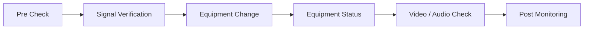

# 방송장비 작업 및 신규 채널 런칭 지원

## Overview
신규 방송 채널 런칭과 Encoder Firmware Upgrade 등 방송장비 변경 작업에서 작업 전후 신호 및 장비 상태를 확인하고 서비스가 정상적으로 유지되는지 검증했습니다.

## 신규 채널 런칭 지원
- 신규 채널 관련 방송장비 상태 확인
- 방송 신호 계측 Test
- Video / Audio 상태 확인
- Main / Backup 신호 확인
- 실제 송출 전후 이상 여부 확인

## Encoder Firmware Upgrade 지원
Encoder/Mux Web Interface 등을 이용해 작업 전 상태를 확인하고 Firmware 작업 후 장비 상태와 Video/Audio를 재검증했습니다. 변경 작업이 서비스에 영향을 주지 않았는지 후속 Monitoring을 수행했습니다.

## Experience
운영환경의 변경 작업은 실행 자체보다 **사전 상태 확인, 변경, 사후 Validation, 지속 Monitoring**이 함께 이루어져야 한다는 운영 원칙을 경험했습니다.
