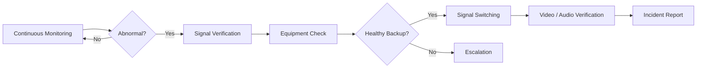

# IPTV 방송 서비스 방송송출 관제 및 서비스 연속성 운영

## Project Overview
Broadcast Operations Engineering 소속으로 IPTV 방송 서비스 성수 상황실 방송 운영 환경에서 방송 신호와 송출장비 상태를 상시 점검하고, 이상 징후 발생 시 서비스 영향을 최소화하기 위한 초동 대응을 수행했습니다. 지상파 Main/Backup, STB Video/Audio, TMR, PP/RF IRD, WFM 등 방송서비스를 구성하는 여러 장비와 신호 상태를 함께 확인했습니다.

## Monitoring Scope
| 영역 | 주요 확인 내용 |
| --- | --- |
| 방송 신호 | Main / Backup, 순단, Signal Loss |
| STB | Video / Audio, 주음성 / 부음성 |
| TMR | 장비 상태 및 Error 여부 |
| PP / RF IRD | Backup 및 RF 신호 상태 |
| WFM | Jitter / Timing / Alignment |
| Network 연계 | Ring Open 및 작업 영향 여부 |

## Incident Response
장애 또는 작업에 따른 이상 상태가 확인되면 실제 방송 상태와 장비 상태를 비교하여 영향 범위를 확인하고, 필요 시 정상 Backup 신호로 절체한 뒤 서비스 정상 여부를 재확인하고 담당자에게 상황을 보고했습니다.

## Engineering Experience
실시간 서비스에서는 장애 자체뿐 아니라 **Detection → Verification → Failover → Recovery → Reporting**의 운영 사이클이 중요하다는 점을 경험했습니다. 이후 Linux/PMS와 Cloud Platform 운영에서 사용하는 Monitoring, High Availability, Failover, Incident Response 개념으로 이어진 초기 운영 경험입니다.
