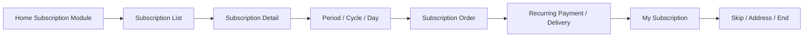
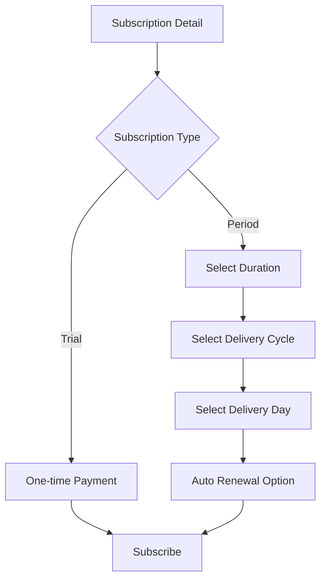
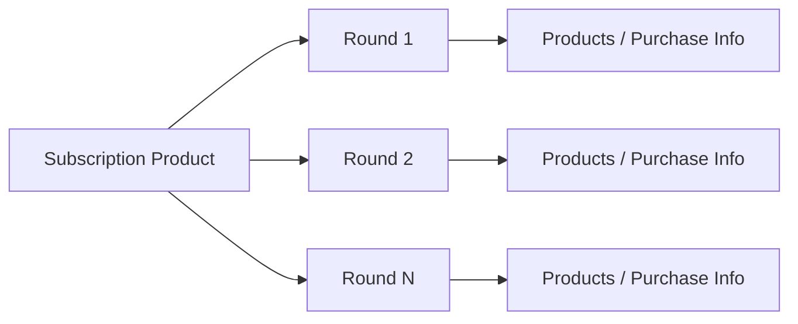
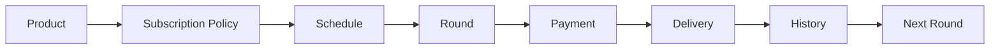

# 온라인 식품 커머스 서비스 식품관 온라인 식품몰 정기구독 고도화

## Project Overview

| 항목 | 내용 |
| --- | --- |
| 수행기간 | 2021.12 ~ 2022.03 |
| 소속 | Commerce Application Development |
| 대상 서비스 | 온라인 식품 커머스 서비스 식품관 온라인 식품몰 |
| 직책 | 선임 / 프로 |
| 역할 | Front End / Back End 개발, 테스트, 배포, 오류 수정 |
| 서비스 영역 | 정기구독 Commerce |

온라인 식품 커머스 서비스 식품관 온라인 식품몰의 **정기구독 서비스 고도화** 프로젝트에 참여하여 Front End와 Back End 기능을 개발하고 단위테스트, 통합테스트, 배포 및 오류 수정까지 수행했다.

정기구독은 일반 단건 주문과 달리 이용기간, 배송주기, 배송요일, 자동결제, 회차별 상품, 구독 건너뛰기 및 종료 등 반복 주문의 상태를 지속적으로 관리해야 하는 서비스다. 프로젝트에서는 이러한 구독 생명주기가 Web/Mobile 화면과 관리 기능에서 일관되게 동작하도록 기능을 구현하고 검증했다.

## 01. Service Scope

기획자료에서 확인되는 정기구독 개편 범위는 다음과 같다.

- 홈 메인 정기구독 모듈
- 정기구독 메인
- 정기구독 상세
- 이용기간 설정
- 배송주기 설정
- 배송요일 설정
- 자동연장
- 회차별 배송상품
- 지난 회차 / 구매정보
- 나의 구독권 관리
- 한 회 건너뛰기
- 구독 종료 / 재신청
- 배송지 변경
- Admin 정기구독 옵션
- Admin 회차별 상품 관리
- Admin 정기구독 주문관리

## 02. Home & Subscription Main

홈 메인에 정기구독 상품을 노출하고 정기구독 메인으로 이동할 수 있는 전시 구조가 기획되었다.

정기구독 메인에서는 상품별로 다음 정보를 제공한다.

- 구독상품 이미지
- 상품명
- 가격 / 할인정보
- 구독 Tag
- 최초 수령 가능일
- 현재 구독 여부
- 회차 정보
- 나의 구독권 관리 이동

PC와 Mobile 모두를 고려한 화면 구성이 적용되었으며 실제 제공된 화면에서도 정기구독 상품 카드와 간편결제 안내, 구독권 관리 진입 UI를 확인할 수 있다.

## 03. Subscription Detail

정기구독 상세에서는 일반 상품 상세와 달리 **구독 조건을 설정하고 반복 배송을 신청하는 흐름**을 제공한다.

### 주요 설정값

| 구분 | 기능 |
| --- | --- |
| 이용기간 | 1회 맛보기 / 기간형 구독 |
| 배송주기 | 1주 / 2주 / 3주 / 1달 / 2달 등 |
| 배송요일 | 월 ~ 일 선택 |
| 자동연장 | 이용기간 만료 후 자동연장 |
| 결제 | 배송일을 기준으로 정기결제 |

1회 맛보기 선택 시 주기/요일 및 자동연장 옵션을 다르게 처리하는 등 선택값에 따라 화면과 Business Rule이 달라지는 구조가 포함된다.

## 04. Round-based Delivery Products

정기구독의 핵심 기능 중 하나는 **회차별 배송상품 관리 및 표시**다.

상품 상세 화면에서는 1회차, 2회차, 3회차처럼 배송 회차별 구성상품과 구매정보를 제공한다. 실제 제공된 화면에서는 18~23회차 등 여러 배송 회차와 각 회차의 구성품 및 한글 표시사항 이미지가 노출되는 것을 확인할 수 있다.

기획상 이미 등록되어 있더라도 미래 회차 상품은 노출하지 않는 등의 전시 조건도 포함된다.

## 05. Subscription Management

마이페이지의 구독권 관리에서는 현재 구독중인 상품과 과거 구독상품을 구분하고 구독 상태에 따른 기능을 제공한다.

### 관리 기능

- 최초 신청일 확인
- 첫 발송일 확인
- 마지막 발송일 확인
- 현재까지 수령한 회차 확인
- 한 회 건너뛰기
- 구독 종료
- 배송지 변경
- 과거 구독상품 다시 신청

한 회 건너뛰기는 해당 회차의 결제와 배송을 생략하고 다음 회차부터 다시 발송하는 Business Rule을 갖는다.

## 06. Admin / Operation

관리자 영역에서는 정기구독 상품의 옵션과 회차 정보를 운영할 수 있도록 기능이 구성되었다.

- 일반상품의 정기구독 설정
- 이용기간
- 배송주기
- 배송요일
- 자동연장 여부
- 배송비
- 정기구독 대상상품 조회
- 회차별 배송상품 등록
- 상품구매정보 안내
- 정기구독 주문관리
- 최초수령 회차 기준 조회
- 과거 회차 취소 제한

Front 서비스와 Admin의 데이터가 연결되어야 하므로 단순 UI 개발이 아니라 상품/회차/주문 상태의 일관성이 중요한 영역이었다.

## 07. Development Responsibilities

개인 작업기록에 명시된 수행범위는 다음과 같다.

### Front End

- 정기구독 관련 Web 화면 기능 개발
- PC / Mobile 화면 대응
- 화면 상태 및 사용자 Interaction 처리
- 회차별 상품정보 표시

### Back End

- 정기구독 서비스 관련 Server-side 기능 개발
- 화면과 구독/상품/회차 데이터 연계
- 반복 주문/구독 흐름에 필요한 Business Logic 연계

### Quality & Release

- 단위테스트
- 통합테스트
- 배포
- TMS 오류건 수정 및 안정화

개인 경력자료에는 **TMS 오류건 75/200 처리**가 기록되어 있어 프로젝트 통합 과정에서 발생한 오류를 다수 수정한 경험도 포함된다.

## 08. Development Evidence

제공된 당시 Mobile Web 캡처에서는 정기구독 화면과 Browser DevTools Source가 함께 확인된다. Source에는 개인 작업 식별 주석과 `2022.01.18`, `2022.02.07` 변경 주석이 남아 있어 실제 개발 시점과 정기구독 화면 수정 작업의 흔적을 확인할 수 있다.

또한 제공된 결과 화면에는 PC 정기구독 리스트, 구독 상세, 회차별 배송상품 및 메인 전시구좌가 포함되어 있어 개발 대상 서비스의 실제 UI 범위를 확인할 수 있다.

## 09. Technical Characteristics

이 프로젝트에서 중요했던 부분은 단순 CRUD가 아니라 **시간과 회차에 따라 상태가 변화하는 Commerce Service**를 다뤘다는 점이다.

일반 주문과 달리 하나의 신청이 여러 미래 주문/배송과 연결되므로 화면, 상품정보, 회차, 결제 및 사용자 구독 상태를 함께 고려해야 했다.

## 10. Experience Summary

교육과정에서 수행했던 Web 프로젝트 이후 실제 대규모 Commerce 서비스의 기능 개발에 참여한 프로젝트다. Front End와 Back End를 함께 개발하고 테스트·배포·오류 수정까지 수행하면서 실제 운영 서비스의 개발 프로세스를 경험했다.
