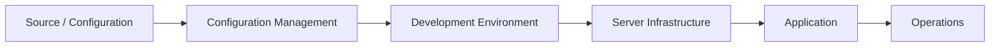
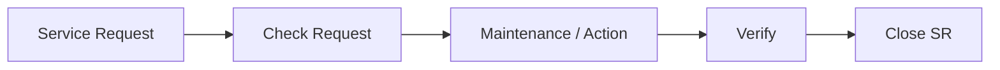

# SHP코퍼레이션 시스템 운영 및 개발

## Project Overview

| 항목 | 내용 |
| --- | --- |
| 수행기간 | 2022.05 ~ 2022.06 |
| 소속 | 지호아이앤씨 |
| 직책 | 선임 / 프로 |
| 업무 영역 | 스케줄관리 / HR-HUB |
| 업무 유형 | 운영, 개발, 유지보수, SR |

지호아이앤씨 재직 마지막 기간에 SHP코퍼레이션 관련 시스템의 운영 및 개발 업무를 수행했다.

현대백화점 프로젝트에서 Web Application 기능개발을 수행한 이후, 이 업무에서는 Application 운영뿐 아니라 형상관리, 서버 인프라 구축 및 개발환경 세팅까지 담당하면서 시스템 운영 영역으로 업무 범위를 확장했다.

## 01. Schedule Management System

스케줄관리 시스템의 **운영 및 개발** 업무를 수행했다.

### 수행업무

- 시스템 운영
- 기능 개발
- 형상관리
- 서버 인프라 구축
- 개발환경 세팅



짧은 투입기간이었지만 개발 Source만 다루는 것이 아니라 개발환경과 Server Infrastructure를 함께 구성하는 업무가 포함되어 있었다.

## 02. HR-HUB Operations

HR-HUB 시스템의 운영 업무를 수행했다.

### 수행업무

- 시스템 운영
- 유지 및 보수
- SR 처리



사용자 또는 업무 요구사항에 따른 SR을 확인하고 시스템 유지보수 업무를 수행했다.

## 03. Operations Experience

SHP코퍼레이션 업무는 약 1개월의 짧은 기간이지만 경력 흐름에서는 의미가 있다.

```text
Web Development
      ↓
Application Operations
      ↓
Configuration Management
      ↓
Development Environment
      ↓
Server Infrastructure
```

이전 현대백화점 프로젝트가 Commerce Application 개발 중심이었다면, SHP코퍼레이션에서는 운영과 개발환경/인프라 영역까지 직접 다루기 시작했다.

## 04. Scope Boundary

현재 확보된 개인 경력자료에서 확인되는 범위는 스케줄관리 시스템의 운영·개발/형상관리/서버 인프라 구축/개발환경 세팅과 HR-HUB의 운영/유지보수/SR 처리다.

사용 기술, 상세 Architecture, Server 제품, 배포방식 등은 자료에서 확인되지 않으므로 임의로 추가하지 않는다. 추후 당시 자료가 확보되면 이 문서를 확장할 수 있도록 프로젝트를 독립 문서로 관리한다.

## 05. Experience Summary

Application Developer에서 Cloud Engineer로 이동하기 직전에 수행한 운영 경험으로, 개발 Source뿐 아니라 실행환경과 Server Infrastructure까지 업무 범위를 넓힌 시기다. 이후 Cloud Engineering 영역에서 Cloud Infrastructure와 Platform Engineering을 담당하게 되는 경력 흐름 사이를 연결하는 프로젝트로 볼 수 있다.
