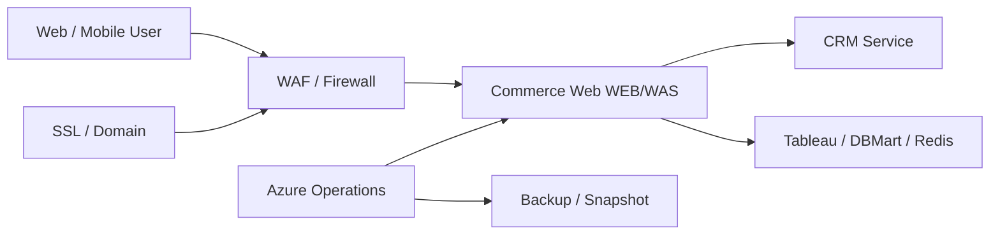
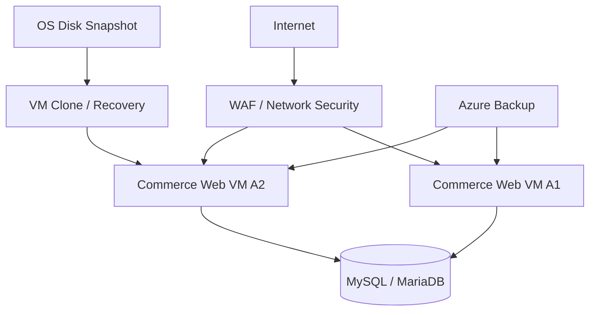
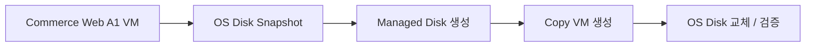
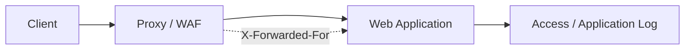

# Azure 기반 Commerce Infrastructure 구축·운영 및 서비스 안정화

## Project at a Glance

**기간:** 2023.04 ~ 2024.01  
**역할:** Azure Solution Architect / Cloud Infrastructure Technical Support

Commerce Service의 Commerce Web 및 연계 서비스 운영을 위한 Azure 인프라를 설계·구축하고, 구축 이후 실제 서비스 운영 과정에서 발생한 **VM, Network Security, SSL/Domain, Linux, Database 연결, Proxy/IP 전달, Backup** 이슈를 지속적으로 지원했습니다.

단순 VM 생성에 그치지 않고 초기 요구사항 정리와 Architecture 작성부터 Resource 배포, WEB/WAS 실행환경, 보안 구성, 운영 변경, 장애 분석까지 이어지는 **IaaS Lifecycle**을 경험한 프로젝트입니다.

## 01. Initial Requirement / Resource Assessment

초기 미팅에서 운영 대상 워크로드와 필요한 인프라를 정리했습니다.

- Commerce Web WEB/WAS 2대
- CRM Service 발송 솔루션 WEB/WAS
- Tableau Server
- DBMart(MariaDB)
- Redis
- Tracking Server 예비 환경
- 총 7대 수준의 서버 Resource 요구사항 검토
- Azure Subscription 생성 및 초기 Resource 배포 일정 조율
- Commerce Web을 우선 구축 대상으로 선정하여 고객 작업 일정과 Infrastructure 배포 일정을 조정
- Apache / PHP 등 Application Runtime 설치 범위 검토

## 02. Azure Infrastructure Architecture / Build

- Azure VM 기반 WEB/WAS 운영환경 구축
- Network Security 요구사항에 따른 Firewall/WAF 구성 검토 및 변경 지원
- Architecture Diagram 작성 및 변경사항 관리
- Azure Resource 견적/구성 검토 과정에서 Firewall 및 고정 IP 요구사항 반영 지원
- 개발/운영 환경 특성을 고려한 Resource 구성 및 운영방안 검토
- Linux Server의 Apache / PHP / MySQL 관련 실행환경 확인
- Linux 사용자/그룹 및 Directory Permission 운영 가이드 작성

## 03. VM Clone / Snapshot 기반 운영 작업

실제 운영 요청에 따라 기존 Commerce Web VM을 기준으로 복제 환경을 구성했습니다.

- 기존 VM OS Disk Snapshot 수행
- Snapshot 기반 Disk 생성
- 복제 VM 생성
- 복제 VM의 OS Disk 교체 및 기동 검증
- VM 내부 Application Runtime 및 Directory 구조 확인
- 운영 변경 전 Snapshot/Backup을 활용한 복구 관점 검토

## 04. SSL / Domain / Web Service Operations

- 서비스 HTTPS 적용을 위한 SSL Certificate 등록 지원
- PC/Mobile 등 복수 Domain의 Certificate 운영 지원
- Mobile Domain SSL 등록 요청 대응
- Domain 및 HTTPS 적용 이후 서비스 접근상태 검증
- 인증서와 Web Server 설정 간 연결관계 확인

## 05. Client IP / Reverse Proxy Troubleshooting

모바일 서비스에서 실제 사용자 IP 대신 Proxy IP가 기록되는 문제가 발생하여 Request 전달구조를 분석했습니다.

- PC 서비스에서는 실제 Client IP가 정상 기록되지만 Mobile 서비스에서는 Proxy IP가 남는 현상 확인
- PC/Mobile Application 구성 차이 비교 필요성 제시
- HTTP Request의 `X-Forwarded-For` Header를 이용한 실제 Client IP 전달방식 검토
- Infrastructure 설정만으로 단정하지 않고 Application Source/Request Header까지 함께 확인하도록 Troubleshooting 방향 제시

이 경험은 이후 Kubernetes Forward/Reverse Proxy, Application Gateway, Private Network 문제를 분석하는 기반이 되었습니다.

## 06. Database / Application Connectivity Validation

- Commerce Web VM 간 MySQL 접속 테스트
- Application Database Connection 설정 확인
- DB 연결용 Test User 생성/삭제를 통한 접근 검증
- PHP/Application Runtime에서 Database Connectivity 확인
- MariaDB/MySQL을 포함한 Application ↔ Database 연결구조 운영 지원

## 07. Backup / Recovery / Operations

- Azure VM OS Backup 요구사항 검토 및 고객 문의 대응
- Snapshot을 이용한 VM 복제/복구 작업
- 운영 Server Directory 및 Application Runtime 확인
- 고객의 개발환경 증설/변경 요청에 따른 Resource 검토
- Managed Service 및 Monitoring 적용 가능 범위 관련 기술지원

## 08. Engineering Deliverables

- Azure Infrastructure Architecture Diagram
- Azure Resource 구성/견적 검토자료
- 구축 결과보고서
- Linux SSH/계정/Directory Permission 운영 가이드
- SSL/Domain 적용 및 운영지원 기록
- VM Snapshot/Clone 작업 기록
- Database Connectivity Test 기록
- Network/Proxy Troubleshooting 기술지원 기록

## 09. Outcome / Career Significance

이 프로젝트를 통해 Azure IaaS를 단순 구축하는 수준에서 벗어나 **서비스 운영에 필요한 Compute → Network Security → Runtime → Database → SSL/Domain → Backup → Troubleshooting**을 연속적으로 다뤘습니다.

특히 장기간 고객 운영을 지원하면서 초기 Architecture와 실제 운영환경 사이에서 발생하는 변경 요청을 처리했고, Infrastructure 문제와 Application 문제의 경계를 구분하며 원인을 좁히는 경험을 축적했습니다.

## 10. Technology

Microsoft Azure / Azure Virtual Machines / Azure Firewall / WAF / Azure Backup / Managed Disk / Snapshot / Linux / Apache / PHP / MySQL / MariaDB / Redis / SSL/TLS / DNS / HTTP / X-Forwarded-For
