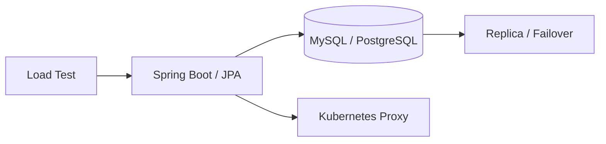

# KB헬스케어 B2B/B2C 구축 기술지원

## Backend / Infrastructure Validation

## 01. Project Overview
B2B/B2C 서비스 구축 과정에서 Backend와 Infrastructure 영역의 기술지원을 담당했습니다. Database 이중화/Failover, JPA Replica, Kubernetes Proxy, 부하 테스트 등 **Application과 Platform 경계에서 발생하는 문제를 검증하고 개발자 가이드로 정리**했습니다.

## 02. Database High Availability
- MySQL / PostgreSQL 이중화 구성 검토
- Primary 장애 상황을 가정한 Failover 테스트
- 애플리케이션이 장애 전환 이후 정상적으로 DB에 연결되는지 검증
- JPA 기반 Read Replica 구성 및 동작 확인
- DB 연결/조회 패턴과 성능 영향 검토

## 03. Kubernetes / Network Troubleshooting
- Kubernetes 환경의 Forward / Reverse Proxy 동작 분석
- 서비스 접근 과정에서 발생하는 Proxy 이슈 재현 및 원인 확인
- 개발팀이 동일 문제를 확인할 수 있도록 점검 절차와 매뉴얼 작성

## 04. Backend Performance Validation
- Spring Boot Thread / Scheduler 기반 부하 테스트 코드 작성
- 반복 요청을 발생시켜 서비스/DB 동작 검증
- JPA / MyBatis 및 데이터 접근 구간의 동작 확인 지원

## 05. Result
- DB Failover 및 Replica 동작을 실제 애플리케이션 관점에서 검증했습니다.
- Kubernetes Proxy 관련 이슈를 분석하고 재사용 가능한 개발자 가이드로 문서화했습니다.
- Backend 개발 경험을 Kubernetes/Database 운영 기술지원으로 확장했습니다.

## 06. Technology
Spring Boot / JPA / MyBatis / MySQL / PostgreSQL / Cosmos DB / Kubernetes

## 07. Validation Approach

Infrastructure 설정이 정상이라는 사실만으로 애플리케이션의 정상 동작을 판단하지 않고 **Application 관점에서 장애전환과 연결상태를 검증**했습니다.

DB Failover에서는 Primary 장애 이후 Replica/새 Primary로 연결이 전환되는지 애플리케이션에서 확인했고, JPA Replica 구성에서는 Read/Write 연결과 실제 Query 동작을 검증했습니다. Kubernetes Proxy 문제 역시 Network 설정만 보는 대신 요청이 Application까지 전달되는 경로를 재현했습니다.

## 08. Troubleshooting / Documentation

- MySQL/PostgreSQL 장애전환 시나리오 구성 및 검증
- JPA Replica 연결 구성과 Application 동작 확인
- Forward/Reverse Proxy 요청경로 분석
- Spring Boot 기반 반복 요청/부하 테스트 코드 작성
- 재현 가능한 점검절차를 개발자 매뉴얼 형태로 문서화

## 09. Career Significance

Backend 개발 경험을 기반으로 **Database HA, Kubernetes Network, Application Performance를 함께 보는 Cloud Technical Support 역량**을 확장한 프로젝트입니다.
