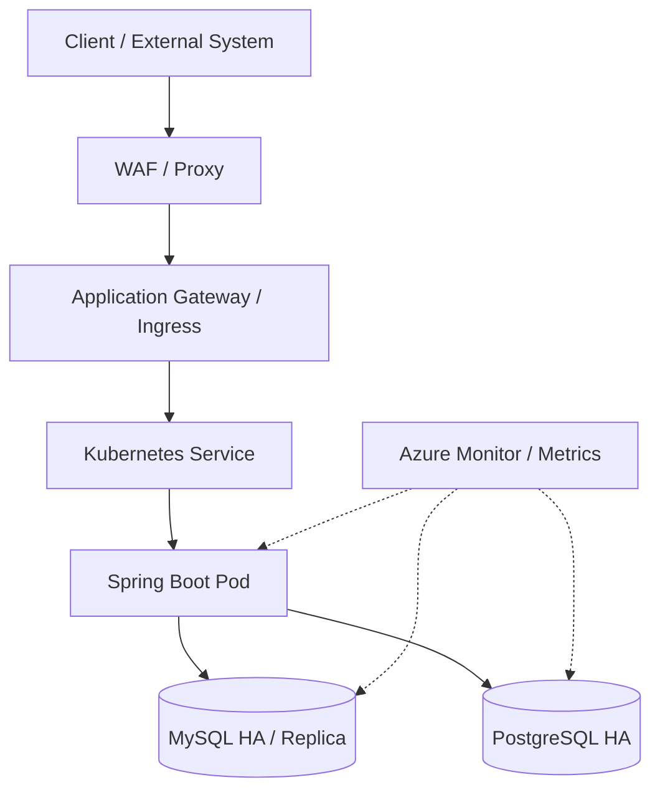
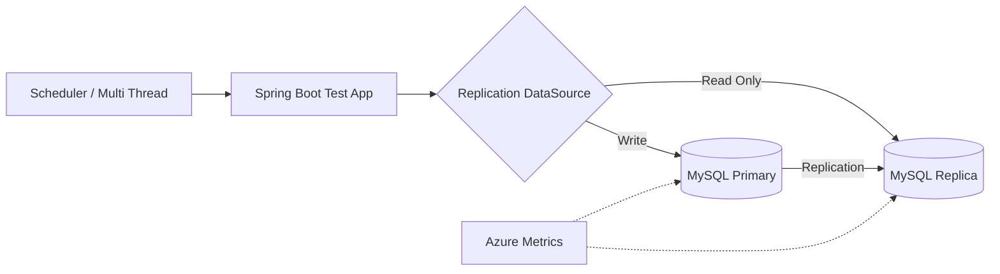
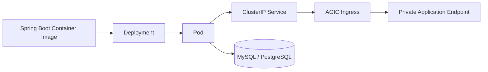
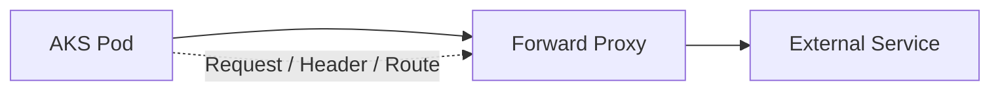
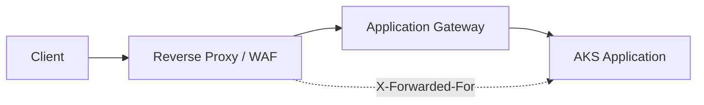

# 헬스케어 플랫폼 고객 B2B/B2C 통합 플랫폼 구축 기술지원

## Project at a Glance

**기간:** 2023.08 ~ 2024.01  
**역할:** Backend Engineer / Cloud·Kubernetes Technical Support

헬스케어 플랫폼 고객 B2B/B2C 통합 플랫폼 구축 과정에 참여하여 고객 환경에 상주하며 **AKS Application 배포, Database HA/Replica 기능검증, Forward/Reverse Proxy Troubleshooting, WAF 적용지원, Spring Boot 기반 검증 Application 개발 및 운영 가이드 작성**을 수행했습니다.

Infrastructure 구성 자체만 확인하는 방식이 아니라 실제 Application을 직접 만들어 AKS에 배포하고, 장애/Failover 상황에서 Application과 Database가 어떻게 동작하는지를 검증한 것이 핵심입니다.

## 01. On-site Platform Technical Support

- 헬스케어 플랫폼 고객 고객 환경 상주 기술지원
- 1차 상주: 2023.08 ~ 2023.10
- 2차 상주: 2023.11 ~ 2024.01
- WAF 설치 및 서비스 연계 지원
- AKS Test용 Ingress / Service / Pod 배포
- Forward Proxy / Reverse Proxy 장애 분석
- Database HA 및 Application 연결 검증
- 운영/개발 환경에서 발생한 Platform 이슈 재현 및 기술지원

## 02. MySQL Active/Standby / Replica Validation

MySQL의 HA 구성이 실제 Application에서 정상 동작하는지 검증하기 위해 Spring Boot 기반 Test Application을 구성했습니다.

- Master/Slave(Primary/Replica) Replication 구성 검증
- Replication DataSource 구성
  - Primary: Write
  - Replica: Read Only
- Scheduler + Multi Thread를 이용한 자동 Insert/Select Test 구현
- Insert/Select 실행속도를 조정할 수 있도록 Test Logic 구성
- Azure Portal Metrics를 통해 Primary/Replica Read/Write 동작 확인
- Replica 간 Load Balancing 동작 확인
- Primary 장애를 가정한 Failover Test
- Server/Application Log 기반 장애전환 결과 확인
- MySQL Load Balancing Test

## 03. PostgreSQL High Availability Validation

- PostgreSQL Active/Standby 구조 검증
- PostgreSQL Availability Zone 기반 가용성 Test
- Primary/Replica 연결구조 확인
- Connection Pool 동작 검증
- 장애/전환 상황에서 Spring Boot Application 연결상태 확인
- MySQL과 PostgreSQL의 Failover/Application Connection 차이를 비교하며 검증

## 04. AKS Sample Application Engineering

Database HA를 Infrastructure 관점에서만 확인하지 않고 실제 Kubernetes Workload를 만들어 검증했습니다.

- 검증 전용 Namespace 구성
- Spring Boot + MySQL Sample Application Container 배포
- Spring Boot + PostgreSQL Sample Application Container 배포
- Kubernetes Pod / Deployment YAML 작성
- ClusterIP Service 구성
- Azure Application Gateway Ingress Controller 기반 Ingress 구성
- Private IP 기반 Ingress Route 검증
- Health Probe Path 적용 및 Application Health 확인
- `kubectl apply`, Pod Log 확인 등 반복 검증절차 문서화

## 05. Forward Proxy Troubleshooting

- AKS Workload의 외부 통신 경로 분석
- Forward Proxy 서비스 흐름 확인
- Application 요청이 Proxy를 거쳐 외부 Endpoint로 전달되는 구간별 점검
- Network 설정과 Application 요청을 함께 확인하여 문제 구간을 분리
- 운영자가 재사용할 수 있도록 Forward Proxy 서비스 Flow Guide 작성

## 06. Reverse Proxy / X-Forwarded-For Troubleshooting

- Reverse Proxy를 통과한 요청의 실제 Client IP 전달구조 분석
- Spring Boot에서 `X-Forwarded-For` Header 처리 검토
- Proxy → Application Gateway → Kubernetes → Application까지 요청경로 분석
- Forward/Reverse Proxy를 구분하여 장애 원인을 설명하는 운영 가이드 작성

## 07. WAF / Network / AKS Integration

- 고객 환경 WAF 설치 지원
- AKS Application과 WAF/Proxy 간 연결 검증
- Hub/Spoke Network 및 Firewall/AKS Subnet 구조 학습·검증
- AKS Outbound 방식(Load Balancer / NAT / UDR) 검토
- AGIC 구성 및 Application Gateway 연계 검증
- Network Layer와 Kubernetes Layer 사이의 장애영역을 구분해 Troubleshooting

## 08. Performance / Load Validation

- Spring Boot 기반 반복 요청/DB 처리 Test Code 개발
- Scheduler / Multi Thread 기반 부하 발생
- Insert/Select 처리량 및 DB Replica 동작 관찰
- Azure Portal Metric을 활용한 DB Read/Write 상태 확인
- Connection Pool 및 Database Failover 상황에서 Application 동작 확인

## 09. Documentation / Deliverables

직접 검증한 내용을 개발자와 운영자가 재사용할 수 있도록 문서화했습니다.

- MySQL Replica / Load Balancer 구성 개발자 가이드
- PostgreSQL Replica 구성 개발자 가이드
- AKS Forward Proxy 서비스 Flow 운영 가이드
- AKS Reverse Proxy 서비스 Flow 운영 가이드
- B2C 구성 점검/평가 자료 작성 지원
- Landing Zone 구성 점검/평가 자료 작성 지원
- AKS Sample Application 배포 절차
- Database HA / Failover 기능검증 기록

## 10. Engineering Approach

이 프로젝트에서 중요한 점은 **설정값만 확인하지 않고 직접 Application을 만들어 Platform 동작을 증명했다는 것**입니다.

`Database HA 구성 → Spring Boot Test Logic → Container Image → AKS Deployment → Service/Ingress → 장애 발생 → Application Log/Metric 확인`의 전체 흐름을 직접 연결해 검증했습니다.

이를 통해 Backend 개발 경험을 Azure/Kubernetes Infrastructure Troubleshooting에 활용하는 방식이 정립됐고, 이후 AKS·Network·Identity·Data Platform이 결합된 복합 문제를 다루는 기반이 되었습니다.

## 11. Outcome / Career Significance

- MySQL/PostgreSQL HA와 Failover를 실제 Application 관점에서 검증
- Kubernetes Sample Workload를 직접 개발·배포하여 Platform 검증 자동화
- Forward/Reverse Proxy 장애를 Network와 Application 양쪽에서 분석
- WAF / Application Gateway / AKS / Database가 결합된 서비스 경로에 대한 이해 확보
- 반복 검증 결과를 개발자/운영 가이드로 표준화
- Backend Engineer 경험을 Cloud Platform / Kubernetes Technical Support 영역으로 확장

## 12. Technology

Microsoft Azure / AKS / Kubernetes / Azure Application Gateway / AGIC / WAF / Azure Monitor / Spring Boot / Java / JPA / MyBatis / MySQL / PostgreSQL / Docker / Ingress / Service / Deployment / Forward Proxy / Reverse Proxy / X-Forwarded-For
