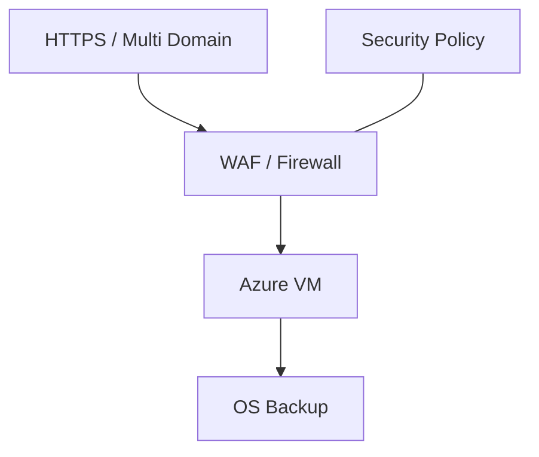

# 밀버스 Azure 인프라 환경 구축

## Azure Infrastructure Scope

## 01. Project Overview
기존 서비스 환경을 Azure에서 운영할 수 있도록 **VM 중심 IaaS, WAF, Firewall, HTTPS 인증서, Backup 및 보안정책**을 포함한 인프라 구성과 배포를 지원했습니다. 구축 이후 고객이 운영 구성을 확인할 수 있도록 결과서와 기술 질의응답까지 담당했습니다.

## 02. Infrastructure Design / Build
- Azure VM 기반 Application 운영 환경 설계·배포
- WAF / Firewall을 포함한 Network Security 구성
- 서비스 Domain 및 HTTPS 인증서 적용
- 다중 Domain 운영을 위한 인증서/서비스 연결 검토
- VM OS Backup 구성 및 복구 관점의 운영정책 검토

## 03. Security / Operations
- 고객 보안 요구사항에 따른 접근 및 Network 정책 적용
- 구축 Resource의 설정값과 서비스 연결 상태 검증
- 배포 결과서 작성 및 고객 기술 질의 대응

## 04. Result
온프레미스 중심 서비스의 Azure 전환을 지원하고, 서비스 운영에 필요한 Network Security와 Backup을 함께 구성하여 Azure IaaS 구축부터 운영 인수까지 경험했습니다.

## 05. Technology
Azure Virtual Machines / WAF / Azure Firewall / HTTPS / Certificate / Azure Backup / Azure IaaS

## 06. Architecture / Operations Perspective

VM만 배포하는 IaaS 작업이 아니라 외부 서비스가 실제 운영되기 위해 필요한 **Network Security → HTTPS/Domain → Compute → Backup → 운영 인수**를 하나의 범위로 검토했습니다.

WAF/Firewall은 서비스 접근경로와 보안 요구사항을 기준으로 검토하고, HTTPS와 Multi-Domain 구성에서는 인증서와 서비스 Endpoint 연결을 함께 확인했습니다. VM OS Backup을 포함하여 구축 이후 장애/복구 관점도 운영 항목에 포함했습니다.

## 07. Deliverables

- Azure IaaS Resource 구성/배포
- WAF/Firewall 및 접근정책 검토
- HTTPS/Domain 연결 지원
- VM OS Backup 구성
- 보안정책 적용 지원
- 구축 결과서 및 고객 기술 질의 대응
