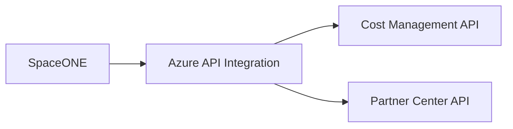

# Azure SpaceONE API 개발 기술지원

## API Integration Scope

## 01. Project Overview
SpaceONE에서 Azure 비용 및 파트너 관련 정보를 활용할 수 있도록 **Azure Cost Management API와 Partner Center API 연동 개발**을 수행했습니다. Azure 관리 데이터를 외부 플랫폼에서 조회·활용하기 위한 REST API 구조와 인증/응답 데이터를 검토한 초기 Azure API 개발 경험입니다.

## 02. Responsibilities
- Azure Cost Management API 조사 및 호출 방식 검토
- 비용 데이터 조회를 위한 API 요청/응답 구조 분석
- Azure Partner Center API 연동 개발
- 외부 플랫폼에서 활용 가능한 형태로 Azure API 데이터 연계 지원
- API 호출 오류와 인증/파라미터 문제 확인

## 03. Implementation
- Azure 관리 API 문서를 기준으로 필요한 Endpoint와 요청 Parameter를 정리했습니다.
- Cost Management 데이터의 조회 범위와 응답 구조를 분석하고 서비스에서 사용할 수 있도록 연동했습니다.
- Partner Center API의 인증 및 데이터 조회 흐름을 검토하여 API 통합을 지원했습니다.

## 04. Result
Azure의 비용/파트너 관리 데이터를 외부 Cloud Management Platform에서 사용할 수 있도록 API 연동을 구현했으며, 이후 Azure Infra·Platform 업무로 확장되는 기반 경험을 확보했습니다.

## 05. Technology
Azure Cost Management API / Azure Partner Center API / REST API / Azure

## 05. API Integration Scope

Cloud 운영 플랫폼에서 Azure 비용/파트너 정보를 활용할 수 있도록 Azure API를 Application에서 소비하는 연동 영역을 담당했습니다.

- Azure Cost Management API의 요청/응답 구조 검토 및 연동 개발
- 비용 조회에 필요한 Azure 인증/Scope 개념 확인
- Partner Center API 연동 개발
- 외부 Cloud API 응답을 내부 서비스에서 사용할 수 있는 형태로 연결

## 06. Career Significance

Azure Resource를 Portal에서 운영하는 수준을 넘어 **Azure Management API를 코드에서 활용하는 경험**을 확보했으며, 이후 Fabric REST API/자동화 및 Azure Platform Engineering 업무로 이어지는 초기 API Automation 경험입니다.
