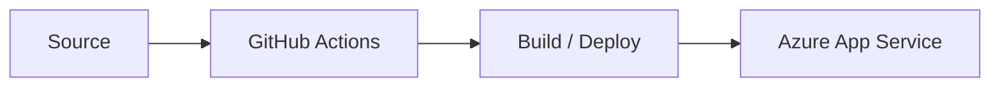

# 제조·SCM 고객 GSCM Apps & DevOps 서비스 구축

## DevOps Pipeline

## 01. Project Overview
GSCM 애플리케이션을 Azure App Service에 반복 가능하게 배포할 수 있도록 **GitHub Actions 기반 CI/CD Pipeline**을 구성하고 애플리케이션 Repository와 Azure 배포 대상 간 연계를 지원했습니다.

## 02. Responsibilities
- GitHub Repository와 GitHub Actions Workflow 구성 검토
- Build/Deploy 단계 정의 및 Azure App Service 배포 연계
- 배포에 필요한 환경 변수와 인증정보 적용 지원
- Workflow 실행 결과 확인 및 배포 오류 대응

## 03. Implementation
Source 변경을 기준으로 Workflow가 실행되고, Build 산출물이 Azure App Service까지 전달되는 자동 배포 흐름을 구성했습니다. 수작업 배포 대신 Repository 기반으로 변경 이력과 배포 과정을 관리할 수 있도록 CI/CD 패턴을 적용했습니다.

## 04. Result
GitHub Actions와 Azure App Service를 연결한 자동 배포 기반을 구축하여 애플리케이션 변경사항의 반복 배포 절차를 단순화했습니다.

## 05. Technology
GitHub Actions / Azure App Service / CI/CD / Git / Azure

## 05. Deployment Automation Detail

Source Repository 변경을 Azure App Service 배포로 연결하기 위해 GitHub Actions Workflow를 구성했습니다. Build와 Deploy 단계를 분리하고 Azure 배포에 필요한 인증/환경값을 Pipeline에서 관리할 수 있도록 지원했습니다.

## 06. Delivery Scope

- GitHub Actions Workflow 구성
- Source 변경 기반 자동 Build/Deploy 흐름 구성
- Azure App Service Deployment 연계
- 환경별 설정 및 배포 확인 절차 지원
- 개발팀이 반복적으로 사용할 수 있는 CI/CD 실행방식 정리

## 07. Career Significance

수동 Azure 배포에서 **Repository 중심 자동 배포**로 운영방식을 확장한 초기 DevOps 경험이며, 이후 Jenkins와 GitLab CI/CD, Helm/ArgoCD 기반 GitOps로 이어지는 경력 흐름의 시작점입니다.
