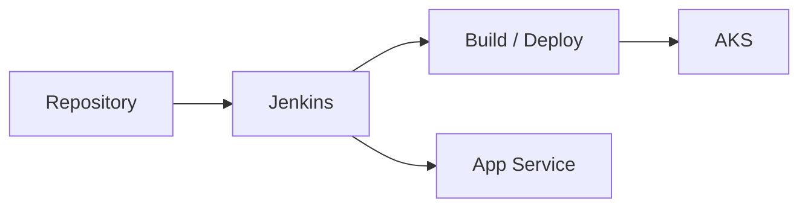

# AIA생명 Jenkins CI/CD 기반 AKS 환경 구축

## CI/CD Flow

## 01. Project Overview
AKS 및 Azure PaaS 애플리케이션의 개발·배포 자동화를 위해 **Jenkins CI/CD 환경과 Pipeline을 구성**하고 Repository 연동, AKS 배포 Architecture, App Service CI/CD 및 고객 교육을 지원했습니다.

## 02. Responsibilities
- Jenkins 기반 CI/CD 구조 및 Pipeline 단계 설계
- Source Repository 연동과 Credential/환경 구성 지원
- AKS Cluster를 대상으로 하는 Container 배포 Architecture 검토
- Azure App Service CI/CD 구성
- Azure Functions 등 Azure Application 서비스의 배포 방식 지원
- 고객 개발/운영팀 대상 구성 가이드 및 교육
- 삼성 SDS 협력 제안서 작성 기술지원

## 03. Delivery Flow
`Source Repository → Jenkins Build → Artifact/Container → Azure Runtime(AKS/App Service)` 흐름을 기준으로 Build와 Deploy 단계를 분리하고, 개발팀이 반복적으로 사용할 수 있는 배포 절차를 구성했습니다.

## 04. Result
Jenkins를 중심으로 AKS/Azure 서비스의 배포 자동화 기반을 구축하고 고객 운영팀이 이후 배포 프로세스를 이해하고 운영할 수 있도록 기술 이전을 지원했습니다.

## 05. Technology
Jenkins / AKS / Kubernetes / Azure App Service / Azure Functions / CI/CD

## 06. Pipeline Design Perspective

Jenkins Job 하나를 구성하는 것보다 개발팀이 Source 변경부터 Azure Runtime 배포까지 전체 흐름을 이해할 수 있도록 **Source → Build → Artifact/Container → Deploy → Runtime** 단계로 Pipeline을 설명하고 구성했습니다.

AKS와 App Service는 배포 대상의 특성이 다르기 때문에 동일 Pipeline을 그대로 적용하지 않고 Runtime별 배포방식을 구분했습니다. Repository Credential, Build 환경, Azure 인증, 배포 Target을 각각 점검할 수 있도록 구성했습니다.

## 07. Customer Enablement

- Jenkins Pipeline 구성과 실행 흐름 설명
- Repository 연결 및 Credential 구성 가이드
- AKS Container 배포 Architecture 설명
- App Service CI/CD 구성 실습/지원
- Azure Functions 등 Application Service 배포 방식 안내
- 고객 개발/운영 인력이 이후 직접 Pipeline을 확인할 수 있도록 기술 이전

## 08. Career Significance

Azure PaaS 개발지원에서 **Kubernetes와 CI/CD를 결합한 Application Platform 지원**으로 담당 범위를 확장한 프로젝트이며, 이후 GitLab/Helm/ArgoCD 기반 AKS GitOps 업무의 선행 경험이 되었습니다.
