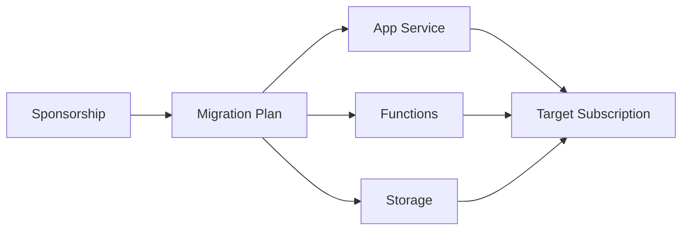

# 가제트코리아 Azure Sponsorship 구독 이전

## Subscription Migration Flow

## 01. Project Overview
Azure Sponsorship 구독 만료에 따라 운영 중인 서비스를 새로운 구독으로 이전해야 하는 상황에서 **App Service, Azure Functions, Storage 등 주요 Resource의 영향도를 분석하고 서비스 중단을 최소화하는 이전 작업**을 지원했습니다.

## 02. Responsibilities
- 기존 Sponsorship Subscription의 Resource Inventory 확인
- Resource별 Subscription 이동 가능 여부 및 Dependency 검토
- App Service / Functions / Storage 등 이전 대상 선정
- 이전 전 서비스 영향도와 비상 대응 절차 정리
- Resource 이동 후 Application 연결과 서비스 정상 여부 확인
- 고객용 이전 절차/주의사항 가이드 작성

## 03. Operational Focus
구독 이전은 Resource 자체의 이동뿐 아니라 Identity, Endpoint, 설정값 및 종속 Resource 영향을 함께 확인해야 하므로 사전 점검과 이전 후 Validation을 중심으로 수행했습니다.

## 04. Result
주요 Azure 서비스를 새로운 구독으로 이전하고 서비스 정상 동작을 검증하여 Sponsorship 만료에 따른 운영 리스크를 줄였습니다.

## 05. Technology
Azure Subscription / Azure App Service / Azure Functions / Azure Storage / Azure Resource Migration

## 06. Migration Method

구독 만료라는 시간 제약 아래에서 Resource를 일괄 이동하는 방식보다 **서비스별 이동 가능 여부와 의존성을 먼저 확인**하는 방식으로 접근했습니다. App Service, Functions, Storage의 구성과 연결정보가 Target Subscription에서 유지되는지 확인하고, 서비스 영향도를 기준으로 이전 순서를 정리했습니다.

## 07. Validation / Handover

- Source/Target Subscription과 Resource Scope 확인
- App Service / Functions / Storage 이전 영향도 점검
- 이전 전후 Application 설정과 Resource 연결 확인
- 장애 발생 시 되돌리거나 재구성할 수 있는 비상 대응 절차 정리
- 고객에게 Migration 절차와 확인 포인트 전달
- Architecture Optimization 결과/후속 검토사항 공유

## 08. Career Significance

신규 구축이 아닌 **운영 중 Cloud Resource의 Subscription Lifecycle과 Migration Risk를 다룬 경험**으로, Azure Resource 간 의존성과 서비스 연속성을 고려하는 운영 관점을 확장했습니다.
