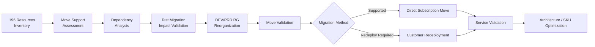
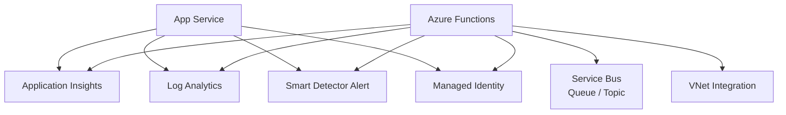
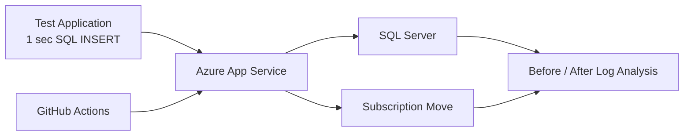

# 가제트코리아 Azure Sponsorship → CSP Subscription Migration

## 01. Project Overview
Azure Sponsorship 구독 만료에 대응하여 운영 중인 Azure Resource를 CSP 구독으로 이전하기 위해 **Resource Assessment, Dependency 분석, 사전 Migration Test, Resource Group 재구성, Subscription Move, 서비스 정상화 및 Architecture Optimization**을 수행했습니다.

Primary SA로 배정되어 2024-07-30부터 기술지원을 시작했고, 08-07~08-14 고객사 상주 지원 후 08-23 Architecture Optimization 결과 보고까지 수행했습니다.

## 02. Migration Lifecycle

## 03. Resource Assessment
- 총 **196개 Resource** Inventory 및 이동 가능 여부 검토
- 사용/미사용 Resource 구분 및 Optimization 후보 식별
- Resource별 Subscription Move 지원 여부 확인
- Application Registration, Managed Identity 영향도 확인
- NAT Gateway Public IP 이동 Test 및 질의사항 정리
- 이동 전에 Target Subscription에 선행 생성해야 하는 Resource 식별

## 04. Dependency Analysis
App Service Plan의 Subscription Move 과정에서 종속성 문제가 확인되어 Application 단위가 아닌 연결 Resource까지 확장해 분석했습니다.

Dependency를 해제한 뒤 Resource Group 이동 Validation을 수행했고 실제 RG Move 성공을 확인했습니다.

## 05. Downtime / Service Impact Validation
운영 App Service를 바로 이동하기 전에 Subscription Migration이 Application과 DB Transaction에 미치는 영향을 확인하기 위한 Test Workload를 구성했습니다.

- SQL Server Test 환경 생성
- **1초마다 SQL INSERT Query를 수행하는 Project Code 작성**
- Azure App Service 배포
- GitHub Actions CI/CD 구성
- Subscription Move 전후 Log를 통해 Downtime/Service Impact를 확인할 수 있는 검증 구조 마련

## 06. Migration Execution
- DEV/PRD Resource Group 분리 및 Resource 재그룹화/통합
- Resource Group 및 Subscription Move 유효성 검사
- 실패 시 Dependency 분석 → 원인 제거 → Validation 재수행 절차 적용
- 총 196개 Resource 중 **20개 Resource Direct Move 완료**
- 나머지 Resource는 고객사 Redeployment 방식으로 분리
- Migration 이후 서비스 정상화 확인

## 07. On-site / Operational Support
- 2024-08-07 ~ 08-14 고객사 상주 기술지원
- 운영계 배포 서비스 정상화 Check
- 운영계 App Service Plan 확인
- Database SKU 검토
- Migration 관련 문의 대응
- 2024-08-23 Architecture Optimization 결과 온라인 보고

## 08. Technical Decision Pattern
`Move 가능 여부`만 확인하지 않고 **Dependency 해제 가능성 → 서비스 영향도 → Direct Move와 Redeployment 분리 → 사후 정상화** 순으로 판단했습니다. 이를 통해 Azure Resource Migration을 단순 Portal 작업이 아니라 Application Continuity 관점에서 수행했습니다.

## 09. Result
- 196개 Resource에 대한 Migration Assessment 완료
- Resource Dependency와 Move 제약사항 식별
- 20개 Resource Subscription Direct Move 완료
- 나머지 Resource의 Redeployment 범위 분리
- Migration 후 운영 서비스 정상화 확인
- Architecture / App Service Plan / Database SKU 후속 Optimization 지원

## 10. Career Significance
운영 중인 Azure 서비스의 **Subscription Lifecycle, Resource Dependency, Downtime Risk, Migration Validation 및 서비스 연속성**을 실제 고객 환경에서 다룬 Delivery 경험입니다. 신규 구축뿐 아니라 기존 Cloud Estate를 안전하게 변경하는 운영·Migration 역량을 확보한 프로젝트입니다.
