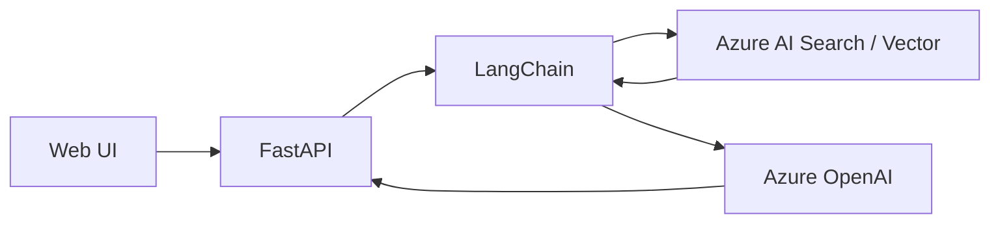

# GenAI360 생성형 AI Azure 기술지원

## RAG Architecture

## 01. Project Overview
사내/고객 개발에서 재사용할 수 있는 Azure 생성형 AI 개발 패턴을 정리하기 위해 **LangChain 기반 RAG, FastAPI Backend, Azure AI Search Vector Search, Azure OpenAI 연동 구조**를 설계·구현하고 기술 가이드와 샘플을 제공했습니다.

## 02. Architecture
`Client / Web UI → FastAPI → LangChain RAG → Azure AI Search(Vector) → Azure OpenAI` 흐름을 기준으로 검색과 생성 단계를 분리했습니다.

## 03. Responsibilities
- LangChain 기반 RAG Framework 설계 및 개발
- FastAPI 기반 Backend API 개발
- Web UI 구조 설계 및 기능 흐름 리딩
- Azure AI Search Index / Vector Search 구조 검토
- VectorDB 및 Cosine Metric 기반 검색 방식 검토
- Azure OpenAI 호출 및 RAG 응답 흐름 구현
- 기술 가이드 작성과 사내 공유 세션 진행

## 04. Reusability
특정 PoC에만 종속되는 코드를 만들기보다 후속 AI 프로젝트에서 재사용할 수 있도록 검색/LLM 호출 구조와 샘플 코드를 모듈화하는 방향으로 정리했습니다.

## 05. Result
RAG 기반 Azure OpenAI 활용의 참조 구조와 샘플을 제공하여 생성형 AI 개발 시 사용할 수 있는 내부 기술 기준을 마련했습니다.

## 06. Technology
Python / FastAPI / LangChain / RAG / Azure OpenAI / Azure AI Search / Vector Search / Cosine Similarity

## 07. Detailed Engineering Scope

RAG를 하나의 Prompt 예제로 다루지 않고 `검색 → Context 구성 → LLM 호출 → 응답` 단계로 분리했습니다. Azure AI Search의 Vector Search를 Retrieval 계층으로 두고 LangChain에서 검색 결과와 Azure OpenAI 호출 흐름을 연결했습니다.

FastAPI는 UI와 AI/검색 Resource 사이의 Backend 계층으로 사용하여 Endpoint와 AI 호출 로직을 분리했습니다. 이를 통해 후속 프로젝트에서 UI가 변경되더라도 RAG/Search 로직을 재사용할 수 있는 형태를 지향했습니다.

## 08. Technical Topics Covered

- Embedding/Vector Search 기반 Retrieval 구조
- Cosine Similarity 등 Vector 검색 Metric 검토
- Azure AI Search Index와 Vector Field 구성 관점 검토
- LangChain을 이용한 Retrieval/Generation 흐름 구성
- FastAPI Endpoint와 AI Service 호출 분리
- Azure OpenAI 기반 응답 생성
- 내부 기술가이드 및 재사용 가능한 Sample Code 작성

## 09. Career Significance

이 프로젝트는 기존 Azure Application/Infra 지원 경험에서 **생성형 AI Application Architecture와 RAG Platform 영역으로 역할이 확장된 시점**입니다. 이후 삼성증권 Enterprise AI와 아모레 Azure AI Platform 업무로 이어지는 기술적 연결점이 되었습니다.
