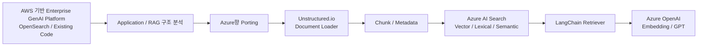
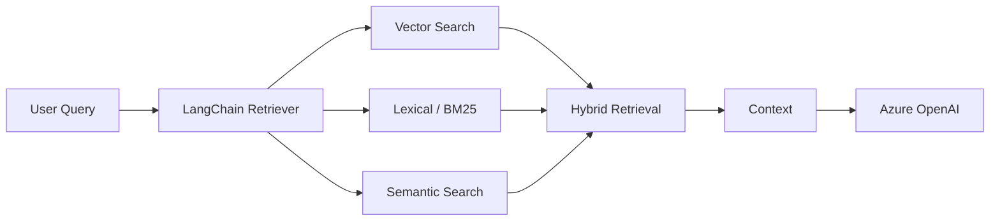

# Enterprise GenAI Platform — AWS 기반 생성형 AI 플랫폼의 Azure 전환 기술지원

## 01. Project Context
Enterprise GenAI Platform은 기존 AWS 환경에서 구현되어 있던 생성형 AI/RAG 플랫폼을 Azure에서도 제공할 수 있도록 기술 구조와 Application Architecture를 검토하고 Azure향 구현을 지원한 업무입니다. 초기 논의에서 MTC의 지원 범위는 Network/VM/Server/권한과 함께 **AI Studio, Azure AI Search, Azure OpenAI** 영역으로 정의됐고, 개발 과정에서는 Application Architecture와 RAG/Retriever 구현을 담당했습니다.

단순 Azure OpenAI 샘플 작성이 아니라 기존 AWS OpenSearch/Bedrock 중심 구조를 분석한 뒤 **Azure OpenAI + Azure AI Search를 사용하는 Azure향 RAG 구조로 치환하고 실제 Retriever/Search 코드를 검증하는 작업**으로 확장됐습니다.

## 02. Migration / Porting Direction

- AWS에서 이미 구현된 Enterprise GenAI Platform 코드의 Azure 적용 가능성 검토
- AWS OpenSearch와 Azure AI Search 기능 차이 검토
- Azure 환경에서 재현 가능한 Application Architecture 설계
- Public 중심 구조를 Private 연결 구조로 전환하기 위한 Architecture 검토
- Azure DevOps를 활용한 CI/CD Architecture 검토/구현 지원

## 03. Application Architecture
- Application Architecture 담당
- FastAPI와 LangChain을 AI/RAG Backend 계층으로 검토
- Document Loader → Chunking → Embedding → Vector Store → Retriever → LLM 흐름 정리
- Azure OpenAI Embedding/GPT 모델 연결 구조 검토
- OpenSearch 기반 Vector Store에서 Azure AI Search 기반 구조로 확장
- Spring Boot/Vue.js 기반 사용자 계층과 FastAPI AI Backend 간 역할 분리 검토

## 04. Document Loading / Chunking
RAG 품질을 단순 모델 호출 문제가 아니라 **문서 로딩과 Chunking 품질부터 검증**하는 방향으로 진행했습니다.

- LangChain Document Loader에 `unstructured.io`를 사용하는 방식 구현/검토
- PDF 등 문서를 Document Object로 변환하고 Metadata/Source 정보를 유지하는 방식 검토
- 고정 크기, 페이지, 목차, 문맥 변화 기준 Chunking 방식 논의
- 이미지/표를 포함한 Multi-modal 문서의 Chunking 및 Metadata 처리 검토
- 이미지 Base64 자체를 검색하기보다 LLM을 이용해 Text/Summary 형태로 변환하는 접근 검토
- Category Metadata를 이용한 검색 필터링 가능성 검토

## 05. Azure AI Search / Retriever Engineering
내부 리뷰 과정에서 **AzureAISearchRetriever 구현**을 담당했고, Azure AI Search를 단순 Vector DB로 사용하는 수준을 넘어 검색 방식별 동작을 비교했습니다.

- Azure AI Search Index 및 Vector Field 구성 검토
- AzureAISearchRetriever 구현
- LangChain Retriever와 Azure AI Search 연계
- Semantic Search 구현/검증
- Vector Search 및 유사도 검색 검토
- Lexical Search(BM25)와 Vector Search 결합 검토
- Hybrid Search와 검색 가중치 검토
- Semantic / Lexical / Ensemble 방식 비교
- DB Query Field + Text + Numeric Field를 조합한 Index 구성 가능성 검토
- 다양한 Query를 이용한 Retriever 결과 품질 검증 방향 수립

## 06. Azure Infrastructure / Private Architecture Support
Application 개발과 함께 Azure향 Architecture 초안에도 참여했습니다.

- Azure OpenAI
- Azure AI Search
- OpenSearch VM
- FastAPI VM
- VPN Gateway
- Private Endpoint
- Azure VM/Bastion 관련 구성 검토
- AWS S3 데이터와 Azure 측 Resource 간 VPN 연계 시나리오 검토
- Azure OpenAI/Cosmos DB 등 PaaS Private Endpoint 구조 검토

## 07. DevOps / Collaboration
- Application Architecture 작성
- Azure DevOps CI/CD 구현 지원
- Azure DevOps Board 기반 Scrum/Issue 관리 방식 검토
- 개발 History 및 Issue 정리
- Infra Architecture 담당자와 Azure To-Be Architecture 공동 설계
- 내부 Review Meeting을 통한 Retriever/Search 구현 방향 조정
- 최종 코드 및 기술 내용 정리/공유

## 08. Technical Decision Points
### OpenSearch를 그대로 복제하지 않고 Azure AI Search를 검토
기존 AWS 기능을 이름만 바꿔 Azure로 옮기지 않고, OpenSearch에서 사용하던 검색 기능을 Azure AI Search의 Vector/Semantic/Lexical 기능으로 어떻게 대응할지 검토했습니다.

### RAG 품질을 Retriever 이전 단계까지 확장
검색 결과가 좋지 않을 경우 LLM Prompt만 조정하는 대신 Loader, Chunking, Metadata, Retriever, Search Mode를 각각 분리하여 확인하는 방향으로 접근했습니다.

### Azure 기술 종속 표현보다 RAG 개념 중심으로 정리
내부 Review에서는 특정 Azure Product 이름만 나열하기보다 Document Loader, Retriever, Vector/Lexical/Semantic Search 등 재사용 가능한 RAG 개념으로 구조를 정리했습니다.

## 09. Result / Career Significance
- AWS 기반 Enterprise GenAI Platform의 Azure향 Application Architecture 및 Porting 방향 수립 지원
- Unstructured.io 기반 Document Loading/Chunking 검토
- Azure AI Search Retriever 및 Semantic/Hybrid Search 구현 경험 확보
- Azure OpenAI와 Azure AI Search를 결합한 RAG Reference Pattern 구체화
- Azure DevOps와 Private Architecture까지 연결하여 AI Application을 Platform 관점에서 검토

이 경험은 이후 금융권 고객의 금융권 생성형 AI Platform과 엔터프라이즈 고객 Azure AI/Data Platform 업무로 이어지는 **Application Architecture → Enterprise AI Platform Engineering 전환 구간**으로 기록합니다.

## 10. Technology
Python / FastAPI / LangChain / Unstructured.io / Azure OpenAI / Azure AI Search / OpenSearch / Vector Search / Semantic Search / Lexical Search / Hybrid Search / Azure DevOps / VPN Gateway / Private Endpoint
