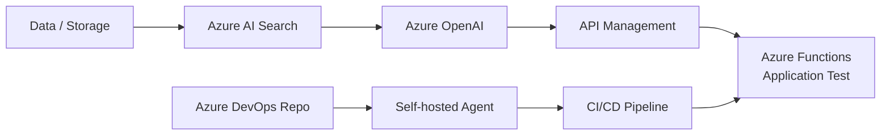
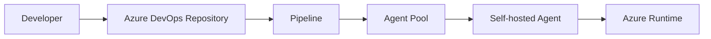

# 미디어·IT 고객 AI 서비스 Azure 전환 제안 기술지원

> **Engagement Type:** Pre-Sales / Proposal / Technical Documentation & Validation  
> **Scope Boundary:** 실제 고객 환경 구축·운영을 수행한 Delivery 프로젝트가 아니라 제안 준비 단계에서 기술 검토와 HOL 작성까지 수행했습니다.

## 01. Project Overview
미디어·IT 고객 AI 서비스의 Azure 전환 제안 준비 과정에서 Azure AI/Application/DevOps 구성방안을 검토하고, 개발·배포 과정을 재현할 수 있도록 **Azure DevOps 기반 AOAI CI/CD 구축 HOL을 직접 작성**했습니다.

2025-01-13 초안 이후 Azure OpenAI 설정, APIM 설정, Application Test 환경, 작업환경/Version 정보 등을 단계적으로 보강했고 2025-02-03 문서명을 기존 `미디어·IT 고객 인프라 구성 메뉴얼`에서 **`Azure DevOps 기반 AOAI CI/CD 구축 HOL`**로 정리했습니다.

## 02. Proposed Technical Flow

## 03. Azure OpenAI / AI Search
- Azure OpenAI Model 생성 절차 정리
- Data Upload 및 Azure Storage 활용 절차 정리
- Azure AI Search를 통한 Azure OpenAI Service 호출 흐름 검토
- AI Search / AOAI 연계를 단계별 HOL 형태로 문서화

## 04. API Management
- Azure OpenAI 연결 Secret/Key 구성 절차 작성
- APIM Backend 등록 절차 작성
- APIM API 등록 및 Backend 호출 구조 정리
- AI Backend를 API 계층을 통해 호출하는 구성방안 문서화

## 05. Application Test — Azure Functions
- Python 3.10 / Azure Functions Core Tools / VS Code 기반 Local 개발환경 정리
- Local Azure Function 실행 절차 작성
- Azure Function Trigger 배포 절차 작성
- 외부 DNS를 이용한 Function 호출 Test 절차 작성

## 06. Azure DevOps CI/CD
- Azure DevOps Organization 및 Repository 구성
- Self-hosted Agent 환경 구성
- Agent Pool 구성 및 Agent Online 상태 확인
- Pipeline 구성 및 배포 Test 절차 작성
- CI/CD 구성 과정의 Troubleshooting 항목 문서화

## 07. Documentation / Deliverable
직접 작성한 HOL은 단순 Architecture 소개가 아니라 개발자가 동일한 환경을 따라 구성할 수 있도록 설치 Tool, Version, Azure Resource 설정, Application Test, Agent/Agent Pool 및 Pipeline 순서까지 단계화했습니다.

문서 개정 과정:
- 2025-01-13: 초안 작성
- 2025-01-14: Azure OpenAI / APIM 설정 추가
- 2025-01-15: Application Test 환경 구성 추가
- 2025-01-20: 작업환경 및 Version 정보 추가
- 2025-01-22: Feedback 반영 및 내용 정제
- 2025-02-03: `Azure DevOps 기반 AOAI CI/CD 구축 HOL`로 문서 목적 명확화

## 08. Scope Clarification / Result
제안 준비와 기술 문서 작성, 사전 검증까지 수행했으며 **실제 미디어·IT 고객 고객 환경의 Azure 전환 구축을 수행한 것으로 기록하지 않습니다.** 결과보다 중요한 경력 포인트는 Azure AI + API + Serverless + DevOps를 하나의 재현 가능한 구축 절차로 설계하고 문서화한 경험입니다.

## 09. Technology
Azure OpenAI / Azure AI Search / Azure API Management / Azure Functions / Azure Storage / Azure DevOps / Self-hosted Agent / Python / Azure CLI / Git / VS Code

> Terraform은 작성 문서의 작업환경/준비 도구로 기재되어 있으나, 실제 고객 구축을 수행한 프로젝트가 아니므로 Production IaC 수행경력으로는 기록하지 않습니다.
