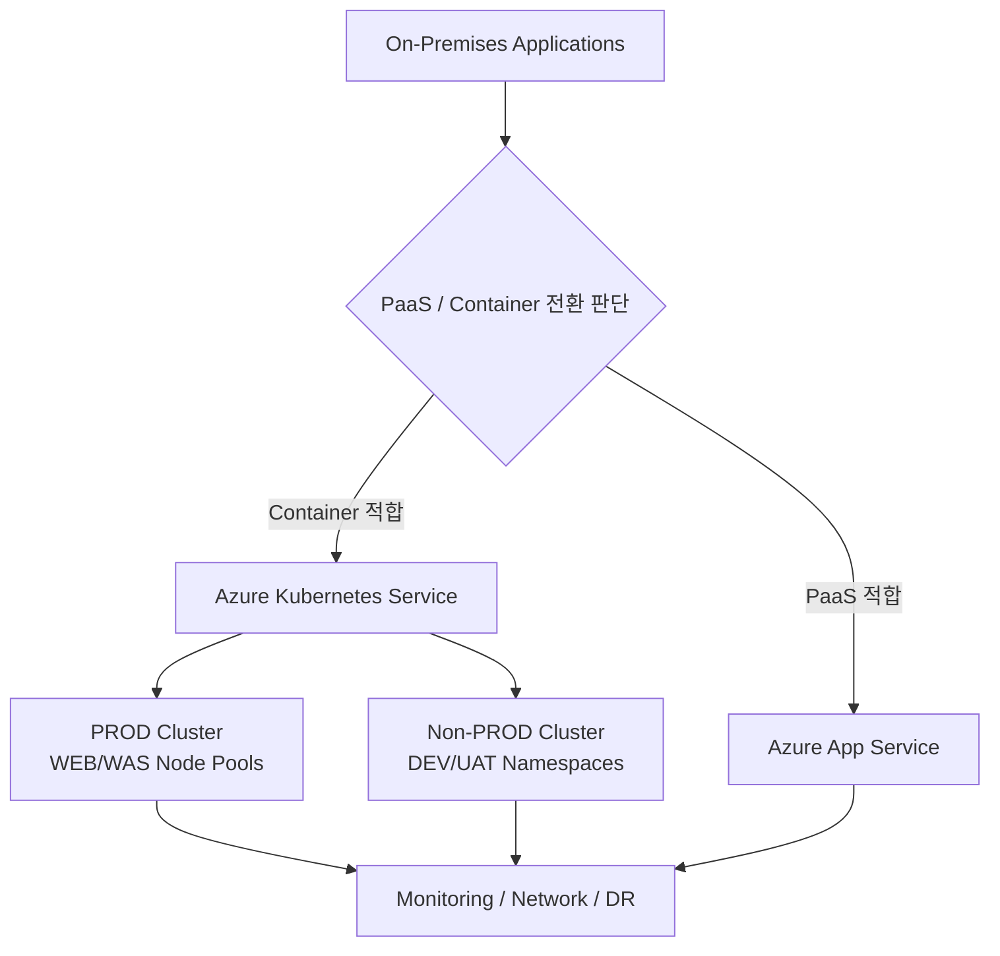
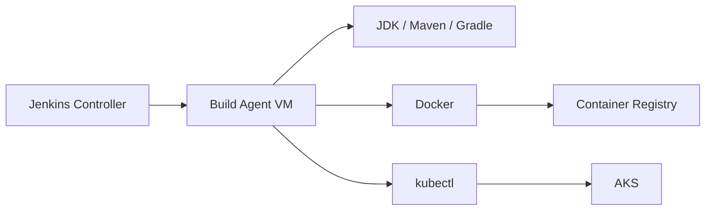

# Application Cloud 전환 기술제안 및 Azure Architecture 검증

> **Engagement Type:** Pre-Sales / RFP / Cloud Migration Proposal  
> **Collaboration:** 대형 SI 파트너  
> **Scope Boundary:** 제안·Architecture 설계·기술검증 단계까지 수행했으며 실제 구축 Delivery에는 참여하지 않았습니다.

## 01. Project Overview
대형 SI 파트너와 공동으로 보험 Application 클라우드 전환 2차 사업 제안에 참여하여 RFP 요구사항을 분석하고, On-Premises Application을 Azure PaaS/Container 환경으로 전환하기 위한 **To-Be Architecture와 Application Modernization 방안**을 검토했습니다.

## 02. Proposal Scope
- 전환 대상 11개 Application + ODS DB + Security + DR 전체 To-Be 구성 검토
- Application별 To-Be Architecture / Guide / Design 작성
- 서버 Spec을 기준으로 Cloud To-Be Spec 산정 관점 검토
- Application 분석을 통한 AKS / Azure App Service 전환 방법론 제시
- 고객/SDS 질의사항 정리 및 제안 장표 작성

## 03. Target Architecture

## 04. VM → AKS Application Modernization Review
- ConfigMap / Secret 기반 환경설정 전환
- Kubernetes Service / DNS 기반 Service Discovery
- LoadBalancer / ClusterIP / NodePort 등 Service Exposure 검토
- PersistentVolume / PersistentVolumeClaim 기반 Storage 전환
- Ingress / API Gateway 구조 검토
- stdout/stderr + Azure Monitor / Log Analytics / Prometheus / Grafana 기반 Logging/Monitoring
- Dockerfile 작성 및 ACR Image Push를 포함한 Container Build 흐름
- Jenkins/Azure DevOps/GitHub Actions 등 CI/CD 변경 포인트 검토
- Horizontal Pod Autoscaler 적용 관점 검토

## 05. Network / DR / Data Review
- ExpressRoute 1G → 10G 대역폭 증설 필요성 검토
- 은행/카드사 등 대외계 연결 방안 및 End-to-End Network Flow 검토
- 전환 대상 시스템별 Network 연결 흐름 작성
- DR Architecture, Redis Cache, PostgreSQL 관련 제안 검토
- Reliability / Performance Efficiency / Cost Management 관점 Architecture 원칙 정리

## 06. Proposal Deliverables
- 제안서 26~31 Page 담당 영역 작성 완료
- 대형 SI 파트너 추가 요청 장표 작성
- 대형 SI 파트너 제안 발표 장표 검토 및 Governing Message/AKS 도입 장점 등 수정
- 대형 SI 파트너 본사에서 제안서 작성 및 제출 검토
- 프로젝트 버전별 배포 확인 여부 문서 작성

## 07. Technical Validation — Jenkins Build Agent
제안 과정에서 향후 Container Build/Deploy 환경을 검증하기 위해 Jenkins Build Agent용 VM을 준비하고 다음 Toolchain을 구성·확인했습니다.

- Jenkins Node/Build Agent 구성 검토
- JDK / Maven / Gradle 개발환경 구성
- Docker / kubectl 설치 및 실행환경 확인

## 08. Result / Scope Clarification
제안 단계에서 Azure 전환 Architecture, Application Modernization 고려사항, 제안서 및 기술검증을 수행했습니다. **실제 구축 프로젝트 Delivery로 이어진 수행 경력으로 기록하지 않고 Pre-Sales/Proposal 경험으로 분류합니다.**

## 09. Career Significance
대규모 On-Premises Application을 Azure PaaS/AKS로 전환할 때 필요한 Application, Network, Data, DR, CI/CD 고려사항을 RFP 단계에서 구조화한 경험입니다. 이후 AKS/GitOps Platform 업무에서 활용되는 Containerization 및 운영 관점의 선행 경험으로 남았습니다.
