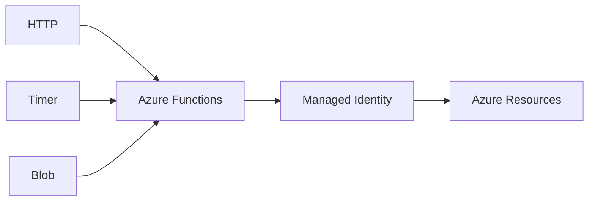

# 포스코이앤씨 Azure Functions 개발·배포 기술가이드

## Azure Functions Trigger Map

## 01. Project Overview
고객 개발팀이 Azure Functions를 직접 개발·배포하고 운영할 수 있도록 **Trigger 유형별 샘플 코드, Managed Identity 인증 패턴, Hands-On Lab**을 구성했습니다. 단순 제품 설명이 아니라 실제 코드와 실습을 통해 개발팀의 자립 운영을 지원한 기술가이드 프로젝트입니다.

## 02. Sample Development
- HTTP Trigger 기반 요청/응답 Functions 샘플 개발
- Timer Trigger 기반 Schedule 실행 샘플 개발
- Blob Trigger 기반 Storage Event 처리 샘플 개발
- Java / Python 환경에서 Functions 개발·실행 방식 검증

## 03. Identity / Security
- Connection String/Key 의존도를 낮추기 위한 Managed Identity 방식 검토
- Azure Resource 접근 시 필요한 Identity와 RBAC 구조 설명
- 개발 환경과 Azure 배포 환경의 인증 차이 정리

## 04. Enablement
- 고객 개발팀용 Hands-On Lab 구성
- 개발/배포 절차와 확인 포인트를 기술 문서로 정리
- 실습 과정에서 발생하는 개발환경/배포 오류 지원

## 05. Result
고객 개발팀이 Azure Functions의 주요 Trigger 패턴과 Managed Identity 연동 방식을 직접 구현할 수 있도록 샘플과 실습 기반 가이드를 제공했습니다.

## 06. Technology
Azure Functions / Java / Python / Managed Identity / Azure RBAC / Azure Storage

## 07. Guide Design

제품 기능을 설명하는 문서보다 개발자가 직접 실행해 볼 수 있는 Sample 중심으로 구성했습니다. HTTP/Timer/Blob Trigger를 각각 분리하여 Event Source에 따른 실행모델 차이를 확인하고, Azure Resource 연동에서는 Credential을 코드에 직접 포함하는 방식과 Managed Identity 방식의 차이를 설명했습니다.

## 08. Hands-On Structure

`Local Development → Trigger 실행 → Azure 배포 → Managed Identity → Azure Resource 접근 → Log/Result 확인` 흐름으로 실습을 구성하여 개발환경과 Azure Runtime의 차이를 이해할 수 있도록 지원했습니다.

## 09. Deliverables

- HTTP Trigger Sample
- Timer Trigger Sample
- Blob Trigger Sample
- Java/Python 개발 및 실행 예제
- Managed Identity 연동 예제
- Azure 배포/검증 Hands-On Guide
- 고객 개발팀 실습 및 오류 대응
