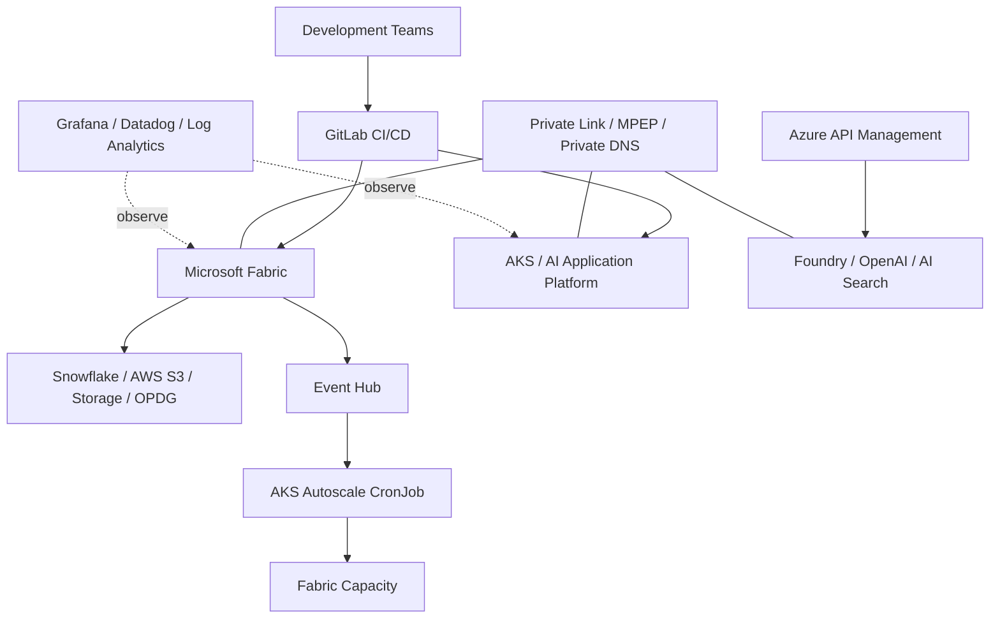

## Architecture at a Glance

## 01 OVERVIEW

Microsoft Fabric 기술지원을 시작으로 Enterprise AI/Data Platform 프로젝트의 Azure Part PL 역할까지 담당 범위를 확대하여 Azure AI, Data Platform, AKS, Private Network, Security Governance, CI/CD 및 운영 자동화를 지원한 장기 프로젝트입니다.

## 02 RESPONSIBILITIES

- Azure AI / AKS / Microsoft Fabric 영역 Architecture 및 운영방안 검토
- 고객 개발팀 기술지원 및 장애 대응
- Network / Identity / RBAC / Private Connectivity 구성 검토
- 고객사 인프라·네트워크·보안 담당자 및 Microsoft와 기술 협업

## 03 MICROSOFT FABRIC

- Capacity / Workspace 및 DEV·QA·PRD 환경 구축·운영
- GitLab CI/CD + Fabric REST API + Service Principal 기반 CI/CD 구축
- Private Link / MPEP / Private DNS 기반 Azure Resource Private Connectivity 구성
- Event Hub + AKS CronJob 기반 Capacity Dynamic Autoscale 구현
- Admin Activity Events API + Notebook + Pipeline 기반 Audit Log 자동수집
- Datadog 로그 연계 및 운영 로그 송수신
- Snowflake / AWS S3 / Azure Storage / OPDG 데이터 연계
- Data Agent 권한 / Query Log / 접근통제 등 보안 요구사항 검토

## 04 AKS / DEVOPS

- Enterprise AI/Data Platform / AI Application Platform Application, Batch, CronJob 서비스 구축·운영
- GitLab CI/CD + Docker + Helm + ArgoCD 기반 GitOps 구성
- Workload Identity + Azure RBAC 기반 Azure Resource 연계
- Grafana / Log Analytics 기반 Container Log 모니터링
- Scheduling, Taint/Toleration, Image Pull, Resource, Network 및 인증 장애 분석

## 05 RESULT

Fabric CI/CD와 Private Connectivity, Capacity 자동화, Audit Logging, Multi-Cloud Data Integration을 운영 환경에 적용했으며, Azure Part PL로서 Azure 서비스 도입과 운영 과정의 기술 의사결정을 지원하고 있습니다.

## 06 PLATFORM ENGINEERING VIEW

이 프로젝트는 단일 Azure 서비스 운영이 아니라 **Cloud / AI / Data / Kubernetes / Network / Security / DevOps를 하나의 Enterprise Platform 관점에서 연결하여 다룬 경험**입니다. Microsoft Fabric 기술지원으로 시작했지만 실제 구축·자동화·운영·보안 검토와 Azure 영역 기술 의사결정 지원까지 담당 범위가 확대되었습니다.

### Azure AI Platform

- Azure OpenAI / Azure AI Search / Microsoft Foundry 기술지원
- APIM 기반 다수 Subscription의 Foundry 연결 지원
- Private Endpoint / Private DNS 기반 Private 통신 구성
- Workload Identity / Managed Identity 기반 인증 패턴 검토 및 샘플 제공
- Quota, API 호출, Network / Identity 관련 서비스 이슈 대응

### Security / Network / Identity

- Private Endpoint / Private Link / MPEP / Private DNS 기반 연결 구성
- Firewall 및 Private Network 통신 검토
- Service Principal / Managed Identity / Workload Identity / Azure RBAC 기반 권한 구성
- 보안성 검토 요구사항을 실제 플랫폼 통제와 로그 수집 구조로 전환

### Technical Leadership

- Azure Part PL로 신규 Azure 서비스 도입방안 및 운영방안 검토
- 개발팀 Azure 기술지원 및 장애 분석
- 고객 인프라 / 네트워크 / 보안 조직과 구성 협의
- Microsoft와 제품 이슈, 권한, 라이선스 및 기능 제약 협의
- 반복 이슈를 가이드 / 샘플 / 자동화 방식으로 전환

## 10. Detailed Workstream Index

이 프로젝트는 단일 Azure Resource 구축이 아니라 여러 Platform Workstream을 동시에 담당한 장기 운영/고도화 프로젝트입니다. 상세 구현은 동일 `careerId: azure-ai-platform-engineer`의 Project Record로 분리하여 Home → Career → Projects에서 자동 연결합니다.

### Microsoft Fabric Platform
- Capacity / Workspace 및 DEV·QA·PRD 환경 운영
- Fabric REST API + GitLab 기반 CI/CD
- Private Link / MPEP / Private DNS 기반 Azure Resource 연결
- Admin Activity API 기반 Audit Log 수집 자동화
- Query/Execution History 기반 보안 감사 데이터 수집
- Event Hub + AKS CronJob 기반 Capacity Dynamic Autoscale
- 429/Throttling 및 Capacity 운영 이슈 분석

### Data Integration
- AWS S3 Shortcut / Pipeline Copy
- Snowflake 연계
- Azure Storage Private 연결
- OPDG 기반 Hybrid Connectivity
- 인증 방식과 Network/Firewall/MPEP 상태 검증

### Azure AI Platform
- Microsoft Foundry / Azure OpenAI / AI Search 기술지원
- APIM 기반 다수 Subscription의 AI Backend 연결
- Private Endpoint / Private DNS 기반 Private 통신
- Workload Identity / Managed Identity / RBAC 기반 인증 패턴
- 반복적인 연결/권한 문의를 줄이기 위한 Self-Service 검증 방식 지원

### AKS / AI Application Platform
- Application / Batch / CronJob 포함 신규 서비스 구성
- GitLab CI/CD → Docker/ACR → Helm → ArgoCD 배포체계
- Workload Identity + Azure RBAC
- ServiceAccount / HPA / Taint·Toleration / Resource Scheduling 검토
- Grafana / Log Analytics 기반 Container Log 운영

### Security / Governance
- 계정/권한, 접근통제, DEV·QA·PRD 분리 요구 검토
- Audit Log 장기보존 요구 대응
- Data Agent 권한 및 Prompt/Query 감사 방식 검토
- Microsoft와 Purview DSPM for AI 및 제품 제약 협의
- 최종 Query Log 수집 방식으로 운영방향 구체화

## 11. Role Expansion
초기 투입 목적은 Microsoft Fabric 기술지원이었지만, 실제 프로젝트 진행 과정에서 Azure AI, AKS, Network, Identity, CI/CD, Security 요구가 연결되면서 담당 범위가 확대되었습니다. 이후 Enterprise AI/Data Platform의 **Azure Part PL** 역할로 Azure 영역의 기술 검토, 개발팀 지원, 고객 인프라/네트워크/보안 조직 협의 및 Microsoft 기술 협업까지 수행했습니다.

## 12. Engineering Deliverables
- Fabric CI/CD 및 운영 가이드
- Workload Identity / Azure AI Search 연결 샘플
- Fabric AWS S3 / Storage / OPDG 연계 가이드
- Audit Log 수집 Notebook/Pipeline
- Fabric Capacity Dynamic Autoscale Python/CronJob
- AKS 신규 서비스 Helm Values / Kubernetes Resource 구성
- Grafana/Log Analytics Query 점검
- 장애 분석 및 운영 Runbook/기술 문서

## 20 FULL CAREER RECORD

Career 화면과 Project 상세 화면 모두에서 엔터프라이즈 고객 수행 범위를 축약 없이 확인할 수 있도록 동일한 원천 경력 기록을 포함합니다.

### 1. Enterprise Customer — Azure AI / Data Platform 구축 및 운영 고도화

**기간:** 2025.07 ~ 현재  
**소속:** Azure AI Platform Engineer  
**역할:** Azure AI Platform Engineer / Azure Part PL / Azure SME / Microsoft Fabric·AKS 담당

Microsoft Fabric 기술지원을 목적으로 프로젝트에 투입되었으며, 프로젝트 진행 과정에서 Azure AI, AKS, Network, Identity, Security, CI/CD 및 운영 자동화 영역으로 담당 범위가 확대되었습니다. 현재는 **Enterprise AI/Data Platform 프로젝트 Azure Part PL**로 Azure 영역의 기술 검토와 운영방안 수립을 지원하고, Microsoft Fabric 플랫폼과 Enterprise AI/Data Platform/AI Application Platform의 AKS 서비스 구축·운영을 함께 담당하고 있습니다.

단일 Azure Resource의 구축·운영에 국한되지 않고 **Azure AI / Microsoft Fabric / AKS / Private Network / Identity & RBAC / DevOps / Security Governance / Observability / Multi-Cloud Data Integration / FinOps Automation**을 하나의 Enterprise Platform 관점에서 연결하여 업무를 수행했습니다.

#### 담당 역할 — Azure Part PL / Azure SME

- Enterprise AI/Data Platform 프로젝트 Azure 파트 담당 및 Azure 영역 기술 검토·업무 조율
- Azure AI / AKS / Microsoft Fabric 등 Azure 서비스 Architecture 및 운영방안 검토
- 신규 Azure 서비스 도입 시 Network, Identity, RBAC, Private Connectivity, Security, 운영방안 검토
- 개발팀의 Azure 기술지원 및 구축·운영 과정에서 발생하는 복합 장애 분석
- 고객사 인프라·네트워크·보안 담당자와 Azure 구성 및 보안 요구사항 협의
- Microsoft와 Fabric/Azure 제품 이슈, 기능 제약, 권한·라이선스 및 신규 기능 관련 기술 협업
- 반복되는 기술 문의를 가이드, 샘플 코드, Runbook 및 자동화 방식으로 전환

#### Enterprise AI/Data Platform 프로젝트 [Main] — Microsoft Fabric / Azure AI / Platform Engineering

**역할:** Azure Part PL / Microsoft Fabric 담당

Microsoft Fabric을 중심으로 Azure AI/Data Platform 구축 및 운영을 지원하고, Azure Resource 간 Private Connectivity, CI/CD, 데이터 연계, Capacity 운영 자동화, Audit/Query Logging 및 Monitoring 환경을 구성했습니다.

##### Microsoft Fabric Platform 구축·운영

- Microsoft Fabric Capacity / Workspace 구축 및 DEV / QA / PRD 환경 분리·운영
- Workspace / Item 권한과 Fabric Admin 권한 범위를 검토하고 운영 권한 모델 지원
- Fabric Environment의 Python Library 설정 및 Publish/Runtime 관련 이슈 대응
- Fabric Capacity 운영 중 발생하는 429 / Throttling, Network, Identity, 권한 및 Runtime 문제 분석
- 신규 Fabric 기능 및 Data Agent의 적용 가능성, 권한 모델, 운영방식 기술 검토

##### Microsoft Fabric CI/CD 구축

- **GitLab CI/CD + Fabric REST API + Service Principal** 기반 Fabric 배포 자동화 구성
- Notebook 등 Fabric Artifact의 소스 관리 및 환경별 배포 흐름 구성
- Service Principal 인증과 Workspace 권한을 기반으로 API 배포 경로 구성
- DEV / QA / PRD 환경별 배포 및 운영 구조 검토
- Publish 과정에서 발생한 404 오류를 분석하고 Artifact/명칭 오타 수정 후 정상 배포 확인
- 반복 가능한 Fabric 배포 프로세스를 구성하여 수동 배포 의존도를 줄일 수 있는 기반 마련

##### Fabric Private Connectivity / Network

- **Fabric Private Link / Managed Private Endpoint(MPEP) / Private DNS** 기반 Azure Resource Private Connectivity 구성
- Fabric ↔ Azure Storage 등 Azure Resource 간 Private 통신 경로 구성 및 MPEP 승인 상태 검증
- Storage Firewall / Private Link / DNS Resolution 등 연결 조건 검토
- Private 환경에서 발생한 `blob.core.windows.net` DNS Resolve 실패를 분석하고 진단 코드 추가
- Fabric Notebook/Runtime에서 Azure Resource 접근 시 Network와 Identity 문제를 분리하여 분석
- AKS / Event Hub 연계 과정에서 AMQP 5671 통신 제한을 확인하고 **WebSocket 443** 방식으로 전환하여 연결 검증

##### Fabric Capacity Dynamic Autoscale / FinOps Automation

- **Event Hub + AKS CronJob** 기반 Microsoft Fabric Capacity Dynamic Autoscale 개발 및 운영 적용
- 기존 Schedule 기반 Capacity 제어와 Utilization 기반 Dynamic Autoscale을 결합한 Hybrid 운영방식 설계
- 업무 시작 시 Schedule 정책으로 Baseline SKU를 적용하고, 업무시간에는 Dynamic Window에서 사용률 기반 Autoscale이 제어권을 갖도록 구성
- STG 기준 평일 **08:15 ~ 17:45** Dynamic Window를 적용하여 기존 Schedule CronJob과 제어구간 분리
- Rolling Utilization 값을 기준으로 Scale Up / Scale Down 조건 판단 로직 구현
- STG 환경 선적용 및 모니터링 후 PRD 환경으로 확대 적용
- PRD `apprdaifabric` Capacity에서 F32 상태와 Rolling 평균을 분석하여 **SCALE_DOWN → F16** 실제 동작 검증
- 기존 Schedule CronJob과 Dynamic CronJob의 충돌 여부를 운영환경에서 모니터링
- 월요일 08:00 Schedule 동작과 Capacity Control CronJob의 실행시간 충돌 가능성을 분석하고 실행시간 분리 방안 검토
- 실제 사용량에 따라 Capacity SKU를 자동 조정할 수 있는 운영체계를 구성하여 **FinOps 관점의 Capacity 운영 자동화** 지원

##### Fabric Audit Log 자동수집

- 보안 요구사항의 사용자 활동 추적을 위해 **Fabric Admin Activity Events API(`activityevents`) + Notebook + Pipeline** 기반 Audit Log 일일 자동수집 구현
- Service Principal 기반 API 인증 및 Fabric Admin/API 접근권한 구성 검토
- 초기 `403 API not accessible` 오류 발생 시 API 접근권한 및 Admin 설정 점검
- 날짜 파라미터 형식으로 발생한 `400 BadRequest`를 수정하여 정상 호출 확인
- Continuation 기반 다중 페이지 수집을 구현하고 수천 건 단위 Activity Event 수집 검증
- 초기 JSON 저장에서 고객 운영 요구에 따라 **CSV 적재 방식으로 전환**하고 기존 JSON을 유지하지 않는 구조로 정리
- `target_date(yyyy-MM-dd)` 파라미터를 지원하고 값이 없을 경우 **KST 기준 D-1**을 자동 수집하도록 구성
- Fabric Notebook → Pipeline → Azure Storage 적재 흐름을 구성하여 일일 자동화 기반 마련
- Storage 적재 과정에서 Authorization, Tenant ID, DNS Resolution 문제를 분석하고 DNS 테스트 로직 추가
- Audit Log 장기 보존 요구와 Storage 보존정책 검토 지원

##### Security Governance / Data Agent / Query Log

- 고객 보안성 검토 요구사항을 **계정·권한 / 접근통제 / Audit Log / DEV·QA·PRD 환경분리 / Data Agent 권한·처리 로그**로 분해하여 기술 검토
- Fabric 계정 생성·수명주기는 Microsoft Entra ID 관리 영역과 구분하고 Fabric 내 Workspace/Item 권한 및 운영통제를 검토
- 조회/변경/다운로드 등 사용자 활동 Audit 요구와 2~3년 장기 보존 요구에 대응할 수 있는 수집 구조 검토
- Data Agent Prompt/Interaction 감사 가능성을 위해 Microsoft와 **Purview DSPM for AI Audit** 및 `Capture interactions...` 기능 검토
- Purview 접근권한, Fabric Admin 필요 여부, 라이선스 및 Prompt Logging 비용 확인
- 제품상 요구사항을 직접 충족하는 감사 API가 제한적인 점을 확인하고 대체 수집방안 검토
- 고객 및 Microsoft와 협의하여 Data Agent Prompt 감사 대신 **Query Log 수집 방식**으로 운영방향 전환
- Query Log를 별도 수집하여 사용자 질의 이력을 추적할 수 있도록 구성 방향 정리
- 보안 요구사항을 단순 문서 검토로 끝내지 않고 실제 Audit/Query Log 수집 및 운영 권한 모델로 구체화

##### Query / Execution History 운영 자동화

- Fabric 실행 이력 수집 Stored Procedure의 시간 기준을 운영 요구에 맞게 개선
- 기존 UTC 기반 `usp_export_exec_requests_history`에서 **KST 기준 수집용 Stored Procedure**로 확장
- KST 날짜 범위를 UTC로 변환하여 00:00~24:00 기준의 일별 실행 이력을 정확히 조회하도록 구성
- NULL 입력 시 KST 기준 기본 날짜가 적용되도록 처리
- 과거 특정 일자 재수집, 파라미터 오타, 장시간 실행(Duration 40h+) 데이터 등 운영 이슈 점검
- 실행 이력의 날짜 표시 및 정렬 요구사항 검토

##### Multi-Cloud / Hybrid Data Integration

- Fabric Pipeline / Copy Activity 기반 **Snowflake / AWS S3 / Azure Storage** 데이터 연계 검토 및 구성
- Fabric Lakehouse ↔ AWS S3 Shortcut 연결 및 Pipeline 데이터 Copy 방식 기술지원
- Azure Storage Private 연결 시 MPEP, Firewall, 인증 및 DNS 상태 검증
- **OPDG(On-premises Data Gateway)** 기반 Hybrid Connectivity 구성 및 외부 Data Source 연결 검증
- OPDG → Azure Storage 연결 시 Service Principal 인증의 `Invalid connection credentials (400)` 문제 분석
- Organization 인증 방식으로 전환하여 실제 연결 성공 확인
- Snowflake 연계 과정에서 발생한 EOF/login-request 오류 등 외부 Data Source 연결 문제 점검
- Cloud / On-prem / Multi-Cloud Data Source의 인증·Network·Gateway 조건을 함께 검토

##### Microsoft Foundry / APIM Private Platform

- **Azure API Management 기반 10개 Azure Subscription의 Microsoft Foundry 연결 지원**
- Subscription별 AI Backend 연결 및 API 접근 구조 기술지원
- **Private Endpoint / Private DNS Zone** 기반 Microsoft Foundry Private 통신 구성 검토 및 지원
- Azure AI Search / Azure OpenAI / Foundry 연계 시 Network, Identity, RBAC 조건 검토
- Workload Identity 기반 Azure AI Search 연결 샘플 코드를 검토·작성하여 개발팀에 제공
- 모델 배포 Forbidden/접속 불가, API 호출, Quota 등 Azure AI 서비스 운영 이슈 대응
- 반복적인 Azure Resource 연결/권한 문제를 개발자가 직접 검증할 수 있도록 FastAPI 기반 Self-Service 검증 도구 및 샘플 제공

##### Observability / Monitoring

- Fabric 운영 로그의 **Datadog 연계 및 로그 송수신** 구현·검증
- Grafana / Log Analytics 기반 AKS Container Log 모니터링 구성 및 Query 점검
- ContainerLogV2 Dashboard에서 환경별 변수 전달 및 LabelValue 조회 문제 분석
- STG Dashboard의 Resource Group / Cluster / Log Analytics Workspace 선택 구조를 점검하여 정상 조회 확인
- PRD Kusto Query의 SyntaxError 및 빈 LabelValue 원인 추적
- Azure Monitor / Log Analytics / Datadog / Grafana를 활용하여 Platform과 Application 운영 가시성 지원

#### AI Application Platform 프로젝트 — 신규 AKS Service Platform 구축

**역할:** AKS / Azure 담당

AI Application Platform 프로젝트의 Application / Batch / CronJob을 포함한 **총 7개 신규 서비스**를 기존 AKS 환경에 구성하고, CI/CD와 Azure Resource 및 Microsoft Fabric 연계를 담당했습니다.

##### AKS / Kubernetes Resource 구성

- Application / Batch / CronJob 포함 총 7개 신규 AKS 서비스 구성
- Kubernetes Deployment / Service / Job / CronJob / ServiceAccount Resource 구성
- HPA(autoscaling/v2), replicas 조건 및 서비스별 Resource 설정 검토
- DEV / QA / PRD 환경별 Helm Values 및 Kubernetes 설정 관리
- CronJob의 schedule, suspend, concurrencyPolicy, backoffLimit, activeDeadlineSeconds 등 운영 설정 검토
- Application과 Batch/CronJob 유형에 따른 ServiceAccount 및 Kubernetes Resource 생성 구조 확인

##### CI/CD / GitOps

- **GitLab CI/CD + Docker + Azure Container Registry + Helm + ArgoCD** 기반 Build/Deploy 환경 구성
- GitLab Pipeline의 Project/Helm Repository/환경변수와 Helm Chart 연결 구조 검토
- Docker Build → ACR Push → Image Tag → Helm Values → ArgoCD Sync → AKS 배포 경로 점검
- 환경별 Helm Values와 ArgoCD Application 구성 검토
- QA/QA2/QA3 등 환경별 Application 표시 및 Sync 문제 분석
- Ingress / Application Gateway Private 구성과 환경별 Host/WAF/Certificate 설정 검토

##### Workload Identity / Azure Resource 연계

- **Workload Identity + Azure RBAC** 기반 AKS ↔ Azure Storage 인증·권한 구성
- ServiceAccount 생성 조건과 Workload Identity Annotation 구조 검토
- AKS ↔ Microsoft Fabric / OPDG 연계방식 기술 검토 및 적용 지원
- Application과 ServiceAccount가 ArgoCD에서 별도 Resource로 표시되는 구조 확인

##### AKS / CI/CD Troubleshooting

- ACR Image 존재 여부 및 Tag 불일치로 발생한 **ImagePullBackOff / Image NotFound** 분석
- GitLab Pipeline에서 전달된 Image Tag와 Helm Values/Repository 경로 점검
- Deployment fullname 변경으로 발생한 **`spec.selector immutable`** 오류 분석 및 기존 Resource 재생성 방향 검토
- ArgoCD가 Helm Repository 접근 시 발생한 `context deadline exceeded` 문제에서 GitLab/Helm Domain 차이와 Network 경로 분석
- GitLab 인증 변경 이후 발생한 **HTTP Basic Access denied** 문제에서 Token/Repository 권한 및 인증방식 점검
- Gradle Wrapper 부재로 발생한 `GradleWrapperMain ClassNotFound` 및 Build 구조 점검
- `untolerated taint`, `Insufficient cpu`, Preemption 관련 Pod Scheduling 이벤트를 분석하여 Node Taint/Toleration과 Resource 조건 점검
- STG Batch가 Spring Boot Banner 이후 종료되는 문제에서 CronJob/Job/Pod Event와 환경별 Values를 비교하고 `status: stg → qa` 수정 후 정상 실행 확인
- ServiceAccount/HPA/CronJob이 ArgoCD에서 표시되는 방식과 실제 Helm Template 조건 검토

##### AKS Monitoring

- Grafana / Log Analytics 기반 AKS 서비스 및 Container Log 모니터링
- ContainerLogV2 기반 Dashboard Query와 환경변수/Label 필터링 문제 점검
- Kubernetes Event / Pod Log / ArgoCD Sync 상태 / GitLab Pipeline을 함께 확인하여 배포 및 Runtime 문제 분석

#### Engineering Guides / Documentation / Operational Support

- Fabric CI/CD 구성 및 운영 가이드 작성
- Fabric AWS S3 Shortcut / Pipeline Copy 연계 가이드 작성
- Workload Identity 기반 Azure AI Search 연결 샘플 및 인증 가이드 제공
- OPDG 설치·업그레이드 및 Data Source 연결 가이드 지원
- Fabric Audit Log 수집 Notebook / Pipeline 및 운영 절차 문서화
- Fabric Capacity Dynamic Autoscale 운영 Runbook 및 Schedule/Dynamic 제어방식 정리
- Azure / AKS / Fabric의 Network, Identity, Security, CI/CD 관련 반복 이슈에 대한 기술 문서 및 Troubleshooting 기록 축적
- 고객 개발팀이 직접 설정과 연결 상태를 검증할 수 있는 Self-Service 방식 지원

#### 주요 성과

- Microsoft Fabric 단일 기술지원으로 투입된 이후 **Enterprise AI/Data Platform Azure Part PL / Azure SME**로 역할 확대
- GitLab CI/CD + Fabric REST API + Service Principal 기반 **Microsoft Fabric CI/CD 구축**
- Event Hub + AKS CronJob 기반 **Fabric Capacity Dynamic Autoscale 개발 및 PRD 운영 적용**
- Schedule + Utilization Hybrid 제어를 통해 고객사의 **FinOps 기반 Capacity 자동 Scale Up/Down 운영체계** 구축
- Fabric Private Link / MPEP / Private DNS 기반 **Azure Resource Private Connectivity** 구성
- Fabric Admin Activity Events API + Notebook + Pipeline 기반 **Audit Log 일일 자동수집** 구현
- Audit/Query Log 및 Data Agent 권한을 포함한 **Fabric Security Governance 요구사항을 운영 가능한 수집 구조로 구체화**
- Fabric 운영 로그의 **Datadog 연계** 및 Grafana/Log Analytics 기반 AKS 모니터링 지원
- Snowflake / AWS S3 / Azure Storage / OPDG 등 **Multi-Cloud·Hybrid Data Source 연계**
- APIM 기반 **10개 Azure Subscription의 Microsoft Foundry 연결 및 Private 통신 지원**
- AI Application Platform 프로젝트의 Application / Batch / CronJob **총 7개 신규 AKS 서비스 구축**
- GitLab CI/CD + Docker + Helm + ArgoCD 기반 AKS GitOps 배포환경 구성 및 운영
- Workload Identity + Azure RBAC 기반 AKS ↔ Azure Resource 인증·권한 연계
- Fabric 429, DNS, Private Network, ArgoCD, Image Pull, Immutable Selector, Pod Scheduling 등 **Cloud/Data/Kubernetes/Network/Identity가 결합된 복합 장애 분석 및 대응**

#### 기술 환경

**Azure / AI**  
Microsoft Azure, Microsoft Fabric, Microsoft Foundry, Azure OpenAI, Azure AI Search, Azure API Management, Azure Storage, Event Hub

**AKS / DevOps**  
AKS, Kubernetes, Docker, Azure Container Registry, GitLab CI/CD, ArgoCD, Helm

**Network / Security**  
Private Endpoint, Private Link, Managed Private Endpoint(MPEP), Private DNS Zone, VNet, Firewall, Managed Identity, Workload Identity, Service Principal, Azure RBAC, Microsoft Entra ID

**Data / Monitoring**  
Snowflake, AWS S3, Azure Storage, OPDG, Fabric Pipeline, Copy Activity, Grafana, Datadog, Azure Monitor, Log Analytics, ContainerLogV2

**Development / Automation**  
Python, FastAPI, REST API, Fabric Notebook, Stored Procedure, Kusto Query

