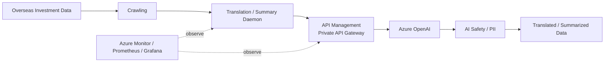
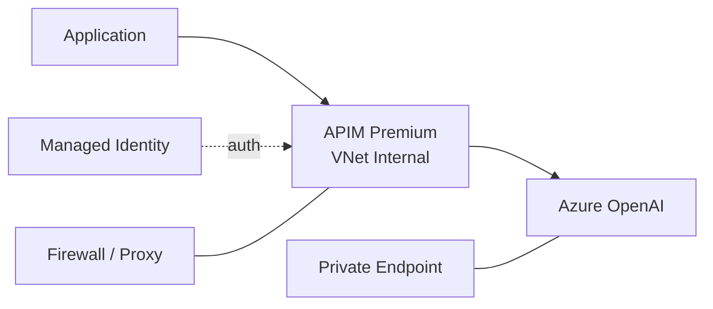

# 금융 투자정보 생성형 AI 번역·요약 플랫폼 구축

## 01. Project Overview
금융권의 해외 투자정보를 생성형 AI로 번역·요약하는 금융권 AI 서비스 구축 프로젝트에서 **Azure AI, Application, API Gateway, Private Network, Security/Safety 및 운영구조 기술지원**을 수행했습니다.

2025년 1~2월 제안/기술협상 및 착수 준비 단계부터 Azure Architecture와 요구사항을 검토했고, **2025-03-04 정식 착수 이후 실제 구축 프로젝트로 이어진 Delivery 경력**입니다. 제안만 수행한 보험 Application/생성형 AI 서비스과 구분합니다.

## 02. Service / Availability Requirements
사전 요구사항 검토에서 서비스별 가용성 구조를 다음과 같이 구분했습니다.

- Crawling Server: Active / Standby
- Translation & Summary Daemon: Active / Standby
- Dashboard: Active / Active
- 운영계 Azure OpenAI PTU 사용량 및 DEV/PRD 사용방식 검토
- 금융권 운영환경의 Zone 이중화와 DR 고려
- 운영 전환 전 보안요건 및 금융권 승인 절차를 고려한 Architecture 검토

## 03. Enterprise AI Request Architecture

## 04. Azure OpenAI / AI Platform
- Azure OpenAI Resource/Model 구성 지원
- GPT 계열 Model 및 PTU Capacity 운영방안 검토
- 초기 PTU 산정 및 수집주기/처리량에 따른 Capacity 최적화 검토
- Azure OpenAI Private Endpoint 구성
- DEV/PRD 환경에서의 Model 사용방식 협의
- AI Backend 호출 오류 및 Network/Authentication 경로 점검

## 05. API Management
AI Endpoint를 Application에서 직접 노출하기보다 **APIM을 AI Gateway 계층으로 사용하는 구조**를 지원했습니다.

- API Management Premium SKU 검토/배포
- VNet Internal 기반 Private API Gateway 구조
- Azure OpenAI Backend 등록
- API / Backend Route 구성
- Header/Policy 기반 접근제어 검토
- Managed Identity 기반 Backend 인증 패턴 지원
- API 호출/로그 정책 및 Monitoring 연계 검토

## 06. Private Network / Enterprise Connectivity
금융권 내부망에서 Azure PaaS를 사용하기 위한 Network 경로를 함께 검토했습니다.

- VNet / Subnet 및 IP 대역 검토
- 전용선 연결 일정과 Azure Tenant/Subscription 준비상태에 따른 Project Risk 식별
- Azure Firewall 및 Proxy 정책 반영 검토
- Squid Forward Proxy 사전 배포/접속 Test
- Azure Portal 접근경로 검토
- Azure OpenAI 등 PaaS Resource Private Endpoint 적용
- 외부/대외계 연결과 Private DNS/Endpoint 경로 검토
- 온프레미스 보안 솔루션 연동 요구사항 검토

## 07. CI/CD Decision — Azure DevOps → Jenkins
초기에는 Azure DevOps 기반 CI/CD도 검토했으나, 고객 환경과 국내 리전/설치형 운영 조건을 고려한 기술협의 과정에서 **Jenkins 기반 CI/CD 방향으로 변경**했습니다.

- Azure DevOps Cloud/Server 적용 가능성 검토
- 금융권 내부환경의 운영 제약 검토
- Jenkins Master/Agent 구성방안 검토
- Application Build/Deploy 환경 요구사항 정리

이는 특정 Tool을 고정적으로 적용하기보다 **고객의 Network/Security/운영 제약에 맞춰 Delivery Architecture를 조정한 사례**로 기록합니다.

## 08. AI Security / Safety
- Azure AI Content Safety 적용 검토/구성 지원
- PII/개인 민감정보 감지 요구사항 검토
- Prompt Shield 관련 기능 지원
- 생성형 AI 적대적 공격 대응 요구사항 검토
- Private Endpoint + Identity + API Policy를 결합한 접근통제 구조 지원

## 09. Monitoring / Operations
- Prometheus / Grafana 기반 Monitoring 요구사항 검토
- Azure Monitor/Application Insights 등 Azure Native Monitoring 대안 비교
- APIM Log Policy 적용
- Azure OpenAI PTU 상태/조건을 확인하기 위한 Alert 검토
- Application/AI/Infrastructure Monitoring 영역 분리

## 10. Pre-Start Technical Validation
정식 착수 전부터 실제 구축 리스크를 줄이기 위한 사전 기술검증을 수행했습니다.

- Squid Proxy를 통한 Azure Portal 접근 Test
- APIM Premium 배포 Test
- Golden Image / RHEL 운영방식 검토
- Storage Account Redundancy(GRS/ZRS) 검토
- TLS Version 요구사항 확인
- Azure Function 사용 여부 및 VM 구성과의 비용/운영 차이 검토
- 운영계 이중화/Zone 구성 검토
- 전용선 및 Tenant 계약 지연에 따른 일정 Risk 식별

## 11. Developer Enablement / Deliverables
- Azure OpenAI / APIM / Private Endpoint 구성 가이드
- Managed Identity 기반 서비스 연동 패턴
- AI Safety/PII 연동 검토자료
- Network Traffic Flow 및 Private Connectivity 검토
- 개발팀이 사용할 수 있는 API/Authentication Sample 및 기술 가이드
- 수행계획/WBS/Architecture 기술검토 지원

## 12. Architecture Decisions
### Private-by-default AI Access
금융권 서비스 특성상 Azure OpenAI Endpoint를 Public API처럼 직접 노출하지 않고 Private Endpoint와 APIM을 중심으로 호출경로를 통제했습니다.

### AI Gateway Separation
Application 코드에서 Backend Endpoint, Authentication, Header Validation, Policy를 분리하기 위해 APIM을 Gateway 계층으로 두는 방향을 적용했습니다.

### Tool Selection by Customer Constraint
CI/CD는 Azure DevOps 자체가 목표가 아니라 고객 내부망과 운영정책에 맞는 배포체계를 만드는 것이 목표였으므로, 검토 결과 Jenkins 기반 구조로 전환했습니다.

## 13. Result / Career Significance
Azure OpenAI만 배포한 프로젝트가 아니라 **AI Model → APIM → Private Network → Identity → AI Safety → Monitoring → CI/CD**를 하나의 Enterprise AI 운영구조로 연결한 경험입니다. 이후 Enterprise AI/Data Platform에서 Azure AI Platform/Fabric/AKS를 함께 담당하는 Platform Engineering 역할로 확장되는 기반이 됐습니다.

## 14. Technology
Azure OpenAI / Azure API Management Premium / Azure Functions / Private Endpoint / VNet / Azure Firewall / Squid Proxy / Managed Identity / Jenkins / Azure Monitor / Prometheus / Grafana / Content Safety / PII / Prompt Shield
