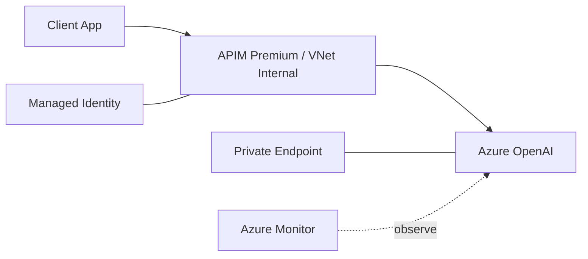

# 삼성증권 해외 투자정보 번역/요약 서비스 구축

## Enterprise AI Request Flow

## 01. Project Overview
해외 투자정보를 생성형 AI로 번역·요약하는 서비스 구축 과정에서 **Azure OpenAI, API Management, Private Network, Managed Identity, AI Safety 및 Monitoring** 영역을 담당했습니다. 금융권 환경을 고려하여 AI API를 직접 노출하지 않고 APIM을 중심으로 인증·접근통제·Backend 연결을 구성했습니다.

## 02. Azure OpenAI / Network
- DEV / PRD Azure OpenAI Resource 및 Model Deployment 지원
- Azure OpenAI Private Endpoint 구성
- Public 접근을 최소화하는 Private Network 구조 검토
- 모델/API 호출 오류 및 Network 연결 상태 확인

## 03. API Management
- API Management Premium SKU 구성
- VNet Internal 방식으로 APIM 배치
- Azure OpenAI URL/Key를 Backend로 등록
- Managed Identity 기반 Backend 인증 방식 구성 지원
- Inbound Processing Policy에서 Header Key 검증 및 접근 제한 적용
- AI API 호출 경로를 APIM으로 표준화

## 04. AI Security / Safety
- Azure AI Content Safety 구성
- PII 관련 Azure AI Services 검토/구성
- Prompt Shield 기능 개발 지원
- Private Network + Managed Identity 기반 서비스 연결 지원

## 05. Monitoring
- API Management Log Policy 적용
- Azure Monitor 기반 PTU 관련 조건부 Alert 구성
- Application Insights 로깅 구성 검토 후 고객 요구사항에 따라 제외

## 06. Developer Enablement
- APIM / Content Safety / AI Services의 Managed Identity 연동 샘플 제공
- 고객 개발팀이 직접 연동할 수 있도록 인증/호출 방식 기술 가이드 작성

## 07. Result
Azure OpenAI를 중심으로 Private Network, APIM, Managed Identity, Safety Service를 결합한 AI API 운영 구조를 구성하고 개발팀이 동일한 인증 패턴을 적용할 수 있도록 표준 가이드를 제공했습니다.

## 08. Technology
Azure OpenAI / Azure API Management / Private Endpoint / VNet Internal / Managed Identity / Azure Monitor / Content Safety / Prompt Shield

## 09. Architecture Decisions

금융권 환경에서 Azure OpenAI Endpoint를 Application이 직접 호출하도록 두기보다 **APIM을 AI Gateway 계층으로 사용**했습니다. 이를 통해 Backend Endpoint, 인증, Header 검증, 접근정책 및 Monitoring을 Application 코드와 분리했습니다.

Private Endpoint와 APIM VNet Internal 구성을 함께 적용하여 Network 경로와 API 정책을 별도 통제하고, Backend 인증은 Managed Identity 중심으로 검토하여 Key 직접 사용을 줄이는 방향을 지원했습니다.

## 10. Engineering Deliverables

- Azure OpenAI DEV/PRD 배포 및 Private Endpoint 구성 지원
- APIM Premium / VNet Internal 구성과 Backend 연결 기준
- Managed Identity 기반 AI Backend 인증 샘플
- APIM Inbound Policy / Header 검증 가이드
- Content Safety / PII / Prompt Shield 개발 연동 지원
- PTU 운영상태 확인을 위한 Azure Monitor Alert 구성
- 고객 개발팀이 재사용할 수 있는 인증/호출 샘플 및 기술 문서

## 11. Role Boundary

Application Architect로서 AI Application 로직만 개발한 것이 아니라 **AI Model Endpoint, APIM, Private Network, Identity, Safety, Monitoring 사이의 연결을 검토하고 개발팀이 실제 사용할 수 있는 형태로 전달하는 역할**을 수행했습니다.
