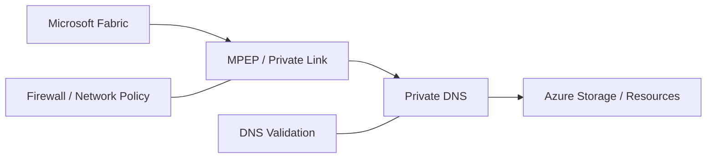
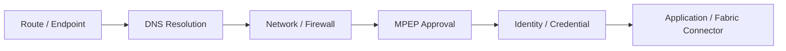

# AMOREPACIFIC Fabric Private Connectivity / MPEP 구축

## Private Connectivity Map

## 01. Overview
Microsoft Fabric에서 Azure Storage 등 고객 Azure Resource로 접근할 때 Public Network를 우회하고 **Private Link / Managed Private Endpoint(MPEP) / Private DNS**를 이용하도록 연결 구조를 검토·구성했습니다.

## 02. Responsibilities
- Fabric ↔ Azure Resource 간 Private Connectivity 요구사항 분석
- Workspace/Resource별 MPEP 생성 및 대상 Resource 승인 흐름 확인
- Azure Storage Firewall / Private Endpoint / DNS 구성 점검
- 고객 네트워크·보안 담당자와 통신 허용 범위 협의
- 연결 실패 시 DNS, Firewall, Endpoint 승인, 인증정보를 계층별로 분석

## 03. Validation / Troubleshooting
- Private Link/Firewall Deny 상황에서 접근 경로와 승인 상태를 확인했습니다.
- Storage Endpoint DNS Resolve 실패 시 Notebook/AKS 등 실행 위치에서 DNS Resolution을 분리 테스트했습니다.
- OPDG 및 Fabric 연결 구성에서는 인증방식별 동작 차이를 검증했고, Azure Blob 연결에서 Service Principal 방식의 credential 오류를 확인한 뒤 Organization 인증 방식으로 전환하여 정상 연결을 확인했습니다.

## 04. Result
Fabric Data Platform이 고객의 Private Network 정책 안에서 Azure Storage 등 데이터 소스와 통신할 수 있도록 연결 패턴을 검증하고 운영 이슈 대응 절차를 확보했습니다.

## 05. Connectivity Validation Model

Private 환경의 연결 실패를 단순한 "방화벽 문제"로 처리하지 않고 아래 계층으로 분리하여 확인했습니다.

1. **Endpoint** — 대상 Resource와 연결되는 Private Endpoint/MPEP가 존재하는지 확인
2. **DNS** — 실행 위치에서 대상 FQDN이 의도한 주소로 Resolve되는지 확인
3. **Network** — Storage Firewall, VNet/Private Link 정책 및 허용 경로 확인
4. **Approval** — Fabric에서 생성한 MPEP가 대상 Resource에서 승인되었는지 확인
5. **Identity** — Service Principal/Organization/Managed Identity 등 인증 주체와 RBAC 확인
6. **Connector** — Fabric/OPDG Connector가 해당 인증방식을 실제 지원하는지 확인

## 06. Representative Cases

### Storage DNS Resolution Failure

Fabric Notebook에서 Storage 접근 실패가 발생했을 때 Storage SDK 오류만 확인하지 않고 대상 `*.blob.core.windows.net`의 DNS Resolve 여부를 별도 테스트하는 코드를 추가하여 **DNS 문제와 Storage 권한 문제를 분리**했습니다.

### OPDG Azure Blob Credential 400

OPDG를 통한 Azure Blob 연결에서 `Invalid connection credentials (400)`이 발생했습니다. Service Principal 권한만 반복 변경하기보다 Connector의 인증방식 자체를 재검토했고, **Organization 인증으로 변경한 뒤 정상 연결**을 확인했습니다. 이후 IP/Firewall 허용과 MPEP 승인 상태를 함께 검증했습니다.

### Private Link / Firewall Deny

Public Network가 제한된 환경에서는 서비스 자체가 정상이어도 Fabric SaaS/PaaS 실행경로가 허용되지 않을 수 있으므로, MPEP 승인 여부와 대상 Resource의 Firewall/Private Link 정책을 함께 점검하는 운영 절차를 적용했습니다.

## 07. Engineering Outcome

이 작업을 통해 `Private Endpoint를 만들면 연결된다`는 단순 접근이 아니라 **DNS + Network + Endpoint + Identity + Connector Capability를 함께 검증하는 Private Connectivity Troubleshooting 패턴**을 정립했습니다. 이후 Fabric, Storage, Foundry, OPDG 등 다른 Azure 서비스 연결 검토에도 동일한 진단 순서를 재사용했습니다.
