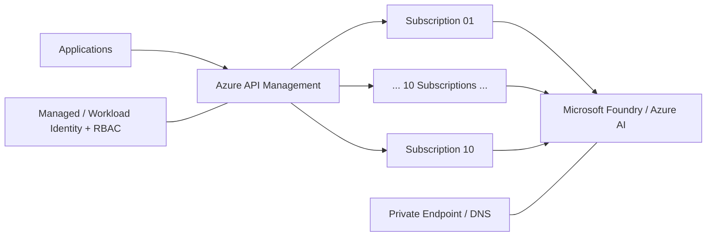
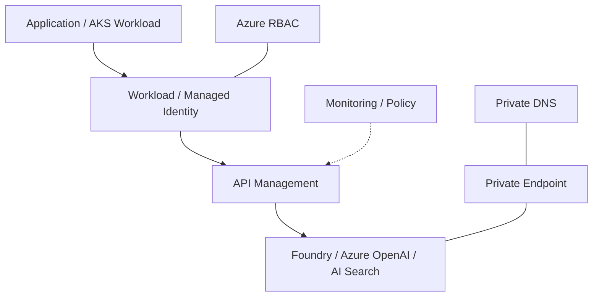

# Enterprise Customer Microsoft Foundry / APIM Private Platform 지원

## AI Platform Connectivity

## 01. Overview
Enterprise AI/Data Platform 및 AI 서비스 개발팀이 Microsoft Foundry/Azure AI 서비스를 Enterprise Private 환경에서 사용할 수 있도록 **APIM, Private Endpoint, Private DNS, Identity/RBAC** 관점의 기술지원을 수행했습니다.

## 02. Platform Support
- Microsoft Foundry Project/Resource 생성 및 접근 구성 지원
- Azure OpenAI / Azure AI Search 등 AI Resource 연결 검토
- APIM을 통한 AI Backend 연결 및 다수 Azure Subscription 연계 지원
- 10개 Azure Subscription의 Foundry 연결 요구사항 기술지원
- Private Endpoint / Private DNS Zone 기반 Foundry Private 통신 구성 검토

## 03. Identity / Developer Support
- Workload Identity 기반 AI Search 연결 샘플 코드 검토/제공
- Access Key 방식과 Identity 방식의 차이를 개발팀이 검증할 수 있도록 지원
- Resource RBAC와 Network 조건을 함께 확인하여 인증 실패 원인을 분리
- Model 배포 Forbidden/접속 불가/API 호출 문제 등 AI Platform 이슈 대응

## 04. Self-Service Validation
반복적으로 발생하는 Network/Identity 설정 문의를 줄이기 위해 Python/FastAPI와 Azure SDK를 활용한 검증 도구를 구성하여 AI Search Index CRUD, Storage/Redis/Foundry 연결성 및 권한 상태를 개발자가 직접 확인할 수 있도록 지원했습니다.

## 05. Result
AI 개발팀이 Private Network와 Identity 기반의 표준 패턴으로 Azure AI 서비스를 사용할 수 있도록 플랫폼 연결 기준과 개발 검증 방식을 제공했습니다.

## 06. Enterprise AI Platform Pattern

AI Resource를 Application이 직접 호출하는 방식보다 APIM과 Identity/Private Network를 플랫폼 계층으로 두는 방향을 지원했습니다.

이 구조에서는 API Endpoint만 확인하는 것이 아니라 `Network Reachability → DNS → Identity Token → RBAC → APIM Policy → Backend` 순으로 호출 실패를 분리했습니다.

## 07. Multi-Subscription Support

Enterprise AI/Data Platform에서 다수 Subscription에 분산된 AI Resource를 공통 플랫폼에서 사용할 수 있도록 **10개 Azure Subscription의 Microsoft Foundry 연결 요구사항**을 지원했습니다. Subscription별 Resource/권한/Private Endpoint 조건이 달라질 수 있으므로 공통 연결 패턴과 환경별 차이를 분리하여 검토했습니다.

## 08. Representative Troubleshooting

- Foundry/AI Resource 생성 또는 Model Deployment 단계의 Forbidden 오류에서 RBAC와 Resource Provider/정책 조건 분리
- AI Search 연결 시 Access Key 방식과 Workload Identity 방식 비교 검증
- Private Endpoint가 존재해도 호출되지 않는 경우 Private DNS Resolution과 실행 위치의 Network Path 확인
- 반복적인 개발팀 문의를 줄이기 위해 FastAPI + Azure SDK 기반 Self-Service Connectivity Validation 도구 구성
- AI Search CRUD, Storage, Redis, Foundry 연결을 개발자가 직접 검증할 수 있도록 점검 기능 구성

## 09. Engineering Outcome

개별 AI Resource 구축을 넘어 **Private Network + Identity + APIM + Developer Validation을 하나의 Enterprise AI Platform 운영 패턴으로 연결**했습니다. 이는 이후 신규 Azure AI 서비스 도입 시 Network/Identity/Security/운영방안을 함께 검토하는 Azure Part PL 업무의 기반이 되었습니다.
