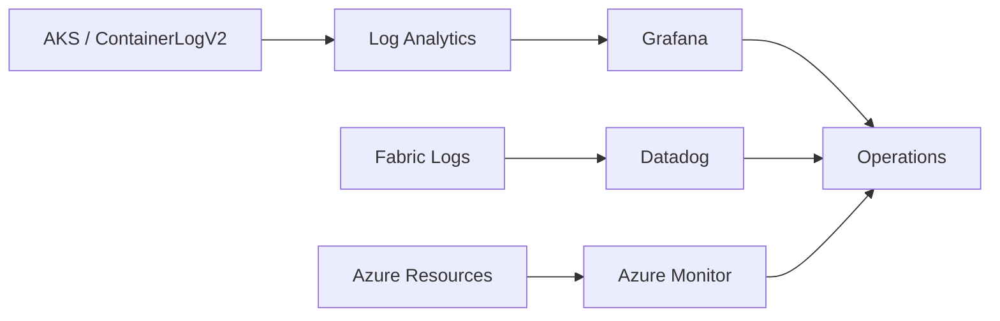

# AMOREPACIFIC Azure / AKS / Fabric Observability 운영

## Observability Flow

## 01. Overview
AKS Application/Batch와 Fabric 운영 상태를 확인하기 위해 **Grafana, Log Analytics, ContainerLogV2, Datadog, Azure Monitor**를 활용한 모니터링 및 로그 연계 업무를 수행했습니다.

## 02. AKS / Grafana
- STG/PRD AKS Container Log 조회 Dashboard 점검
- Resource Group / Cluster / Log Analytics Workspace / Label 기반 변수 구성 검토
- `ContainerLogV2` 기반 Pod/Label Query 수정
- PRD Dashboard의 `400 Bad Request / SyntaxError` 원인 분석
- `isnotempty(LabelValue)`, `distinct LabelValue` 등 Kusto Query 조건 보완

## 03. Fabric / Datadog
- Fabric 운영/Audit Log의 외부 모니터링 연계 검토
- Datadog으로 로그를 송수신하는 흐름 구성 지원
- Capacity 및 운영 이벤트를 관찰하여 Autoscale/장애 분석에 활용

## 04. Result
Azure/Fabric/AKS의 운영 데이터를 한 곳에서 확인할 수 있도록 로그 조회와 Dashboard Query를 정비하고, 장애 분석 시 Application·Kubernetes·Platform 로그를 함께 확인하는 운영 방식을 지원했습니다.

## 05. Grafana ContainerLogV2 Troubleshooting

STG/PRD 공통 Dashboard에서 상단 Variable Parameter가 비어 전달되면서 Label 기반 조회가 정상적으로 수행되지 않는 문제를 분석했습니다.

- Resource Group / Cluster / Log Analytics Workspace를 직접 선택하여 데이터 존재 여부 우선 확인
- `neoMetadataDashboard`에서 조회 경로를 단순화하여 Variable 문제와 Log 데이터 문제를 분리
- `ContainerLogV2`의 `ResourceId`, `PodNamespace`, `LabelsJson`, `LabelName`, `LabelValue`를 기준으로 Kusto Query 수정
- Grafana 시간 범위를 반영하도록 `$__timeFilter(TimeGenerated)` 적용
- 빈 Label 제거를 위해 `isnotempty(LabelValue)` 적용
- Dropdown 중복 제거를 위해 `distinct LabelValue` 적용
- PRD에서 발생한 `400 Bad Request / SyntaxError at ')'`를 Query Syntax 관점에서 별도 분석

STG는 수정 후 정상 조회를 확인했고, PRD는 LabelValue가 비어 있는 원인을 환경/데이터 차이 관점에서 추가 추적했습니다.

## 06. Fabric Audit → Datadog

Fabric 보안성 검토에서 수집한 Audit Log를 Storage에만 보관하는 것으로 끝내지 않고 운영자가 기존 Observability 도구에서 확인할 수 있도록 Datadog 연계를 검토·구현했습니다. 이를 통해 Audit 수집과 운영 모니터링을 분리하면서도 기존 운영체계에서 로그를 활용할 수 있도록 했습니다.

## 07. Observability as Troubleshooting Tool

모니터링을 Dashboard 구축 자체가 목적이 아니라 **장애 원인을 Application / Kubernetes / Azure Resource / Fabric Platform 계층으로 빠르게 분리하기 위한 수단**으로 사용했습니다. Pod Scheduling, Container Runtime, ArgoCD 배포, Fabric Capacity, API Throttling 등 서로 다른 계층의 문제를 분석할 때 각 계층의 로그와 이벤트를 교차 확인했습니다.
