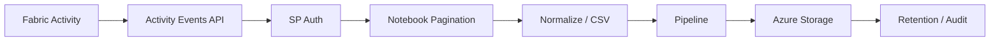

# Azure AI Platform Engineer - Enterprise Customer Fabric Audit Log 수집 자동화

## Collection Pipeline

## 01. Overview
보안성 검토에서 요구한 Fabric 사용자 활동 감사 데이터를 장기간 보존하기 위해 **Admin Activity Events API → Fabric Notebook → Pipeline → Azure Storage** 형태의 일일 수집 자동화를 구현했습니다.

## 02. Requirements
- 사용자 조회/변경/다운로드 등 Activity 추적
- 권한 변경 등 감사 데이터 장기 보존 요구 대응
- 운영자가 매일 수동 추출하지 않는 자동 수집
- Storage에 날짜 단위로 보관 가능한 파일 형태 제공

## 03. Authentication / Collection
- App Registration / Service Principal 기반 API 인증 구성
- Fabric Capacity/관리 권한 조건 확인
- `activityevents` API 호출 및 날짜 범위 Parameter 구성
- Continuation을 고려한 다중 Page Event 수집 구현
- 수천 건 단위 이벤트가 실제 수집되는 것을 검증

## 04. Troubleshooting
- 초기 `403 API not accessible` 오류에서 권한/관리 설정을 확인하여 접근 조건을 보완했습니다.
- 이후 `400 BadRequest`는 API 날짜 Parameter Format을 수정하여 해결했습니다.
- `Not authorized`, Invalid Tenant ID 등 인증 오류를 실행 로그 기준으로 분리 확인했습니다.
- Storage Endpoint DNS Resolve 실패에 대비해 DNS Test 코드를 추가하여 Network와 Application 오류를 구분할 수 있도록 했습니다.

## 05. Storage / Operation
- 초기 JSON 저장 방식에서 운영 요구에 따라 **CSV 저장 방식으로 전환**했습니다.
- 기존 JSON을 중복 유지하지 않고 CSV를 최종 산출물로 사용했습니다.
- `target_date(yyyy-MM-dd)`를 입력받고 값이 없으면 KST 기준 D-1 데이터를 수집하도록 구성했습니다.
- Notebook을 Pipeline에서 일일 실행할 수 있도록 운영 흐름을 정리했습니다.

## 06. Result
Fabric Audit Event를 API에서 자동 수집하여 Azure Storage에 일 단위로 적재하는 운영 기반을 구축했으며, 보안 감사/장기 보존 요구사항에 대응할 수 있는 데이터 수집 경로를 확보했습니다.
