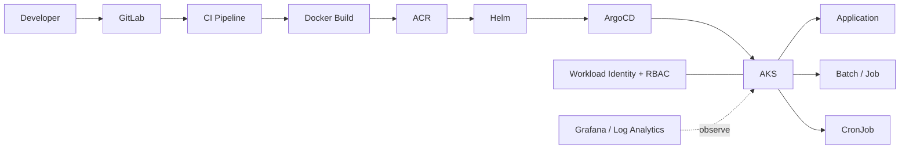

## GitOps Deployment Architecture

## Overview

AI Application Platform 프로젝트에서 Application / Batch / CronJob을 포함한 **총 7개 신규 서비스를 기존 AKS 플랫폼에 구성**하고, GitLab CI/CD → Container Image → Helm → ArgoCD로 이어지는 GitOps 배포체계와 Azure Resource 인증·권한 연계를 지원했습니다.

## Platform Build

- Deployment / Service / Job / CronJob / ServiceAccount 등 Kubernetes Resource 구성
- DEV / QA / PRD 환경별 Helm Values 관리
- GitLab CI/CD 기반 Build 및 Image Tag 전달 구조 구성
- Docker Image를 Azure Container Registry와 연계
- Helm Chart 기반 Kubernetes Manifest 관리
- ArgoCD Application 기반 GitOps 배포 및 Sync 운영
- Workload Identity + Azure RBAC 기반 Azure Storage 등 Resource 접근 구성
- Grafana / Log Analytics 기반 Container Log 및 서비스 모니터링

## Representative Troubleshooting

### ImagePullBackOff / Image Not Found

- ACR Image Pull 실패 이벤트 분석
- Repository / Tag 불일치 및 실제 Registry Image 존재 여부 확인
- CI Pipeline의 Image Tag 전달과 Helm Values 반영 경로 점검

### ArgoCD / GitLab Authentication & Network

- Helm Repository 접근 시 `context deadline exceeded` 분석
- ArgoCD가 접근하는 GitLab/Helm Repository Domain 차이 확인
- Private Network 및 방화벽 허용 경로 검토
- HTTP Basic Access Denied 발생 시 Token/Repository 권한 및 인증방식 점검

### Immutable Deployment Selector

- Deployment `spec.selector` 변경으로 Kubernetes immutable 오류 발생
- Helm fullname 변경에 따른 기존 Deployment와 신규 Manifest의 selector 불일치 분석
- Resource 재생성 필요성을 판단하여 배포 정상화 방향 제시

### Pod Scheduling

- `untolerated taint`, `Insufficient cpu` 이벤트 분석
- 프로젝트별 Node Taint와 Pod Toleration 관계 확인
- Preemption이 도움이 되지 않는 상황에서 Node Resource/Placement 조건 점검

### ServiceAccount / Workload Identity

- Helm `serviceAccount.create` 조건과 실제 생성 Resource 확인
- 일반 Application과 CronJob/Batch에서 ServiceAccount가 별도로 노출되는 이유 분석
- Workload Identity 사용 서비스의 ServiceAccount Annotation 및 Azure RBAC 연결 검토

### CronJob Runtime

- Spring Boot 배너 출력 후 종료되는 STG Batch 문제 분석
- CronJob/Job/Pod Event와 환경별 Values 비교
- 잘못된 status 값(stg → qa) 수정 후 정상 실행 확인

## Result

신규 서비스의 Kubernetes Resource 작성만 수행한 것이 아니라 **Build → Registry → Helm → ArgoCD → AKS → Azure Resource** 전체 배포경로를 기준으로 문제를 분석하고 운영 안정화를 지원했습니다. 이를 통해 Application, Batch, CronJob 유형이 혼재한 신규 서비스들을 기존 Enterprise AKS 환경에 편입했습니다.

## Detailed Build / Operations Record

### Environment & Helm Management

- DEV / QA / PRD별 `values-*.yaml`을 분리하여 Image Repository/Tag, Ingress, HPA, ServiceAccount, Environment 값을 관리
- GitLab Pipeline Variable의 `PROJECT_NAME`, `HELM_REPO`, `HELM_PATH`, 환경값과 ArgoCD Application 간 Naming 일치 여부 확인
- Application 서비스와 Batch/CronJob의 Kubernetes Resource Lifecycle 차이를 구분하여 Helm Template 검토
- `autoscaling.enabled=true`인 경우 Deployment의 `replicas`가 생성되지 않는 Template 조건과 HPA 동작 관계 확인

### ACR / Image Delivery

`ImagePullBackOff` 발생 시 Kubernetes 자체 문제로 한정하지 않고 **CI에서 생성된 Image → ACR Repository/Tag → Helm Values → Deployment Image** 경로를 역추적했습니다. 실제 `NotFound` 이벤트에서는 Registry에 요청된 Repository/Tag가 존재하는지부터 확인하여 인증 오류와 Image 부재를 구분했습니다.

### ArgoCD / GitLab Repository Access

- ArgoCD가 참조하는 GitLab Domain과 Helm Repository Domain이 다른 구성 확인
- `context deadline exceeded` 발생 시 ArgoCD Repo Server 관점의 Network Reachability 검토
- 방화벽 허용이 Public/Private 중 실제 필요한 경로에 적용됐는지 확인
- 인증 변경 후 `HTTP Basic Access denied` 발생 시 Personal/Project Token, Repository 권한 및 URL을 재검토
- Application이 ArgoCD에 나타나지 않는 경우 Project Name / Namespace / Helm Repository / Environment Variable 연결을 순차 점검

### Kubernetes Immutable Resource

`Deployment.apps ... spec.selector: Invalid value ... field is immutable` 오류에서는 Helm fullname 변경으로 기존 Deployment Selector와 신규 Manifest가 달라진 것을 확인했습니다. Selector는 In-place 수정할 수 없는 필드이므로 기존 Resource와 신규 Naming을 비교하고 **Deployment 재생성 필요 여부를 판단하는 방식**으로 해결 방향을 잡았습니다.

### Batch / CronJob

- `schedule`, `suspend`, `concurrencyPolicy`, `failedJobsHistoryLimit`, `backoffLimit`, `activeDeadlineSeconds` 등 Job 실행정책 확인
- STG에서 Spring Boot Banner 이후 종료되거나 Job을 찾지 못하는 문제에서 Pod Event와 Helm Values를 비교
- 환경값이 `stg`가 아니라 실제 Pipeline/Chart가 기대하는 `qa`여야 했던 사례를 확인하고 Values 수정 후 정상화
- `suspend: true/false`와 ArgoCD에서 표시되는 Job/CronJob 상태를 구분하여 운영자에게 설명

### Scheduling / Resource

`0/8 nodes are available` 이벤트에서 프로젝트별 Taint(`proj:*`), `CriticalAddonsOnly`, `Insufficient cpu`를 각각 분리했습니다. 단순 Node 증설 판단 전에 Pod의 Toleration과 대상 Node Pool 정책, Resource Request를 함께 확인했습니다.

### ServiceAccount / Workload Identity

ServiceAccount가 Application 화면에 별도 Resource로 표시되는 경우 Helm Template의 `.Values.serviceAccount.create` 조건과 실제 Workload Identity 사용 여부를 확인했습니다. ServiceAccount 생성 자체와 Azure Resource 접근 권한은 별개이므로 **Kubernetes ServiceAccount → Federated Identity → Azure Identity → Azure RBAC** 체인으로 검증했습니다.

## Operating Principle

AI Application Platform 운영에서는 배포 실패를 `Kubernetes 문제` 하나로 묶지 않고 아래 경계로 나누어 진단했습니다.

`Source/Pipeline → Docker/ACR → Helm → ArgoCD → Kubernetes Scheduler/Runtime → Workload Identity/RBAC → Azure/Fabric/Storage`

이 계층화 방식으로 Build, Registry, GitOps, Scheduling, Network, Identity 문제를 빠르게 분리할 수 있도록 했습니다.
