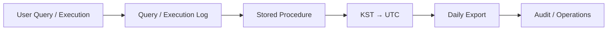

# Microsoft Fabric Query Log / Execution History 수집

## Query / Execution History Flow

## 01. Overview
Data Agent Prompt 감사 가능성을 검토한 뒤 제품/API 제약과 운영 비용을 고려하여 고객과 협의한 최종 방향에 따라 **Query Log 및 Execution History를 별도로 수집**하는 방식을 적용했습니다.

## 02. Security Decision
- Data Agent 처리 이력과 사용자 Query 추적 요구사항 검토
- Microsoft와 Purview DSPM for AI / Audit 및 Prompt Interaction Capture 가능 여부 협의
- Prompt Logging에 필요한 권한/라이선스/비용 및 감사 API 제공 여부 확인
- 고객과 협의하여 Prompt 원문 감사 대신 Query Log 수집 방식으로 운영 방향 확정

## 03. Execution History / Timezone
- 기존 `usp_export_exec_requests_history(@start,@end)` 흐름 검토
- KST 입력을 UTC 조회 범위로 변환하는 `usp_export_exec_requests_history_kst_test` 방식 검증
- 00:00/24:00 경계와 KST↔UTC 변환 로직 확인
- Parameter가 없을 경우 KST 기준 기본 수집 범위를 적용
- 과거 날짜 재수집과 장시간 실행 Query의 duration/정렬/표시를 검증

## 04. Result
제품에서 직접 제공하기 어려운 감사 요구를 Query/Execution History 기반의 현실적인 운영 통제로 전환하고, 한국 운영시간 기준으로 일관되게 조회·수집할 수 있도록 시간대 처리 방식을 정리했습니다.

## 05. Query Log Collection Design

보안 검토의 핵심은 단순히 SQL 실행 여부를 확인하는 것이 아니라 **누가, 언제, 어떤 Fabric Warehouse에서 어떤 Query를 실행했는지 운영 관점에서 재현할 수 있는가**였습니다. 이를 위해 `queryinsights.exec_requests_history`를 기준으로 중앙 수집 구조를 검증했습니다.

- 보안 감사용 Warehouse에서 다른 Warehouse의 `queryinsights.exec_requests_history`를 Cross Query하는 POC 수행
- `submit_time`, 실행 사용자, `program_name`, 실행 상태, SQL `command` 등 감사에 활용 가능한 컬럼 확인
- Workspace Monitoring/Eventhouse와 Warehouse Query Insight가 제공하는 정보의 차이를 비교
- Prompt/Response 원문이나 Client IP처럼 Query Insight에서 제공되지 않는 정보는 별도 한계로 분리
- 중앙 Query Log 수집 구조를 유지하면서 Workspace별 수집 로직을 확장하는 방향으로 정리

## 06. KST-based Execution History Export

운영자가 한국 날짜를 기준으로 조회할 수 있도록 Stored Procedure의 시간 처리 방식을 보완했습니다.

- KST `00:00 ~ 24:00` 입력을 UTC `전일 15:00 ~ 당일 15:00` 범위로 변환
- 기존 `usp_export_exec_requests_history(@start,@end)`와 별도로 KST 변환 검증용 Procedure 구성
- `submit_time`, `start_time`, `end_time`을 KST 표시 컬럼으로 변환
- 결과를 `start_time ASC` 기준으로 정렬하여 일자별 실행 흐름 확인
- Parameter 미입력 시 KST 기준 기본 수집일을 적용하는 자동화 방식 검토
- 특정 과거일자 재수집을 위한 Parameter 전달 방식 검증
- 40시간 이상 장기 실행 Query에서 duration 및 날짜 경계가 올바르게 표시되는지 확인

## 07. Technical Decision

Purview 기반 Prompt 감사는 기능 활성화, 권한, 라이선스 및 비용을 함께 고려해야 했고 Fabric에서 요구사항 전체를 직접 제공하는 단일 Audit API도 확인되지 않았습니다. 따라서 **제품 기능을 과도하게 확장하기보다 Query/Execution History를 운영 통제로 확보**하는 방향을 고객 및 Microsoft와 협의했습니다.

이 결정은 `제품이 제공하는 범위`, `보안팀이 실제 필요로 하는 감사정보`, `운영비용`, `장기 보관 가능성`을 분리하여 판단한 사례입니다.

## 08. Operational Value

Query Log는 Fabric Activity Audit과 역할이 다릅니다. Activity Audit이 Workspace/Item의 관리·사용 이벤트를 추적한다면 Query Log는 Warehouse에서 수행된 데이터 접근을 더 세부적으로 확인하는 보완 통제로 사용했습니다. 두 로그를 분리하여 수집함으로써 보안 요구사항을 하나의 제품 기능에 억지로 맞추지 않고 목적별 감사체계를 구성했습니다.
