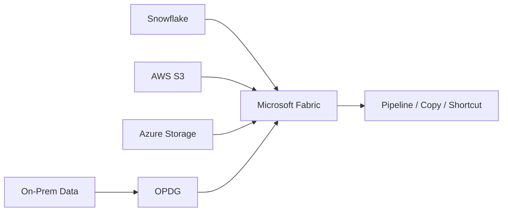

# Microsoft Fabric Multi-Cloud / Hybrid Data Integration

## Multi-Cloud / Hybrid Data Map

## 01. Overview
Microsoft Fabric을 중심으로 Azure 내부 데이터뿐 아니라 **Snowflake, AWS S3, Azure Storage, On-premises Data Gateway(OPDG)**를 연결하여 Multi-Cloud/Hybrid 데이터 연계 방식을 검토하고 실제 연결을 지원했습니다.

## 02. AWS / Storage
- Fabric Lakehouse와 AWS S3 연계방식 검토
- S3 Shortcut 연결 및 Pipeline Copy 가이드 작성
- Azure Storage 연결 시 Network/Identity/Firewall 조건 검토
- Fabric MPEP와 Storage Private 접근 경로 검증

## 03. OPDG / Hybrid Connectivity
- OPDG 기반 Azure Storage/외부 Data Source 연결 구성
- Gateway 인증방식과 Connection Credential 검증
- Service Principal 방식에서 발생한 `Invalid connection credentials(400)` 분석
- Organization 인증 방식으로 전환 후 정상 연결 확인
- IP/Firewall 허용 및 MPEP 승인 상태 점검

## 04. Snowflake
- Fabric ↔ Snowflake 연결 구성 및 데이터 이동 방식 검토
- Pipeline / Copy Activity 기반 연계 지원
- Login 과정의 EOF 등 연결 오류 확인 및 인증/Network 관점 점검

## 05. Result
Fabric을 데이터 허브로 사용하면서 Azure, AWS, Snowflake 및 On-premises 영역을 연결할 수 있는 실무 연계 패턴과 Troubleshooting 경험을 확보했습니다.

## 06. Integration Patterns

데이터 소스별로 동일한 연결방식을 강제하지 않고 Fabric이 제공하는 Connector/Copy/Shortcut과 고객 보안정책을 기준으로 패턴을 나누었습니다.

| Source | Integration focus | Validation focus |
|---|---|---|
| Azure Storage | Pipeline / Copy / Private access | MPEP, DNS, Firewall, Identity |
| AWS S3 | Shortcut / Copy | Credential, Path, Data movement |
| Snowflake | Connector / Pipeline | Authentication, Network, Login session |
| On-prem / restricted source | OPDG | Gateway, Credential type, Firewall |

## 07. OPDG Troubleshooting Detail

- Azure Blob Source Connection 생성 과정에서 `Invalid connection credentials` 400 오류 확인
- Storage Account Key/SP 권한만의 문제인지 Connector 인증방식 문제인지 분리
- Service Principal 방식의 실패를 재현한 뒤 Organization 인증으로 변경
- 인증방식 변경 후 Connection 생성 성공 확인
- 이후 Gateway가 접근하는 대상의 IP/Firewall 허용 및 MPEP 승인 상태를 추가 확인

이 사례는 Azure RBAC가 존재한다고 해서 모든 Fabric Connector에서 동일한 인증 흐름이 보장되는 것은 아니라는 점을 확인한 작업이었습니다.

## 08. Snowflake Connectivity

Snowflake 연결 과정에서는 Login Request 단계의 `EOF` 오류를 확인했습니다. 단순 Credential 오류로 단정하지 않고 인증 요청이 Snowflake까지 도달하는지, Network Session이 중간에서 종료되는지, Gateway/Connector 경로가 정상인지 확인하는 방향으로 문제를 분리했습니다.

## 09. Platform Perspective

이 업무의 목적은 Connector 하나를 붙이는 것이 아니라 **Fabric을 Azure 내부 데이터만 처리하는 플랫폼이 아니라 Multi-Cloud/Hybrid Data Hub로 운영할 수 있는지 검증하는 것**이었습니다. 따라서 연결 성공 여부와 함께 인증방식, Private Network, Gateway 운영, 장애 진단 방법까지 운영기준에 포함했습니다.
